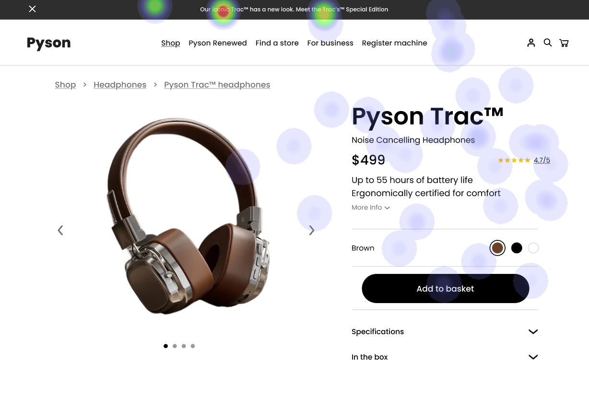
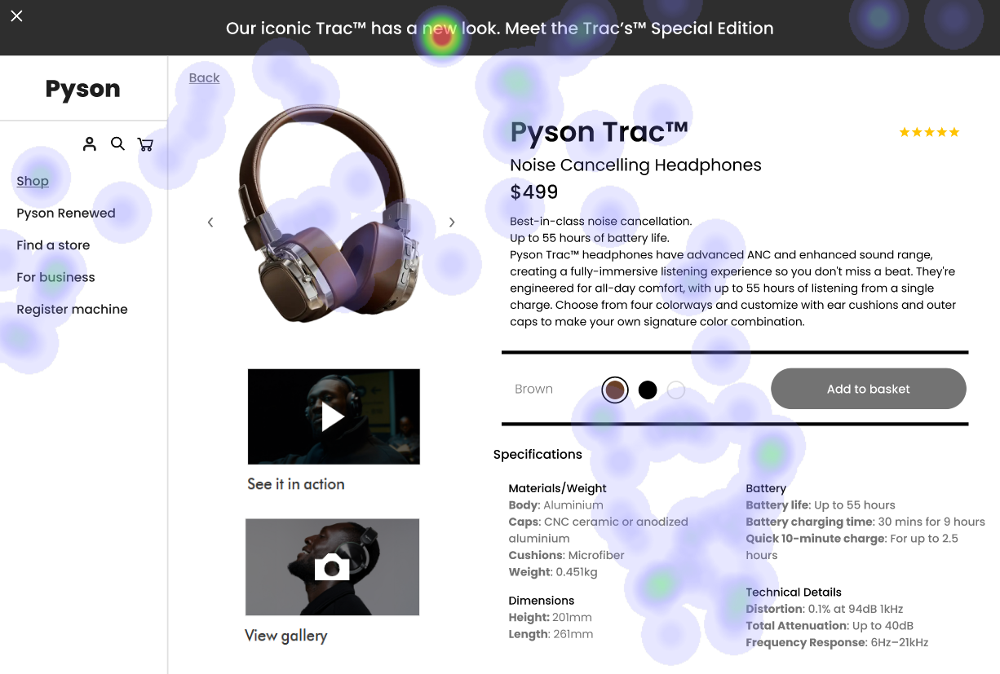

# UI Recommendations and Analysis Report

## Image 1

**Strengths:**
- **Product Title & Price prominently displayed.**  
  📊 Heatmap correlation: Heatmap shows bright green hotspots indicating user focus here, aligning with a strong visual hierarchy.

- **Large-centered product image.**  
  📊 Heatmap correlation: Consistent medium-high attention confirms users examine product details.

- **Key Features are noticeable.**  
  📊 Heatmap correlation: Moderate heat spots indicate users notice key selling points.

**Weaknesses:**
- **Navigation Breadcrumbs are underutilized.**
  - 🔍 Reason: Minimal heat signatures suggest users struggle with site orientation, which deviates from Nielsen's heuristic ensuring visibility of system status.
  - 📊 Heatmap correlation: Users barely noticed the breadcrumb trail.
  - 🔴 Severity: High
  - 💥 Impact: Low engagement with breadcrumbs possibly affecting navigation ease.
  - 💡 Recommendations: Increase breadcrumb prominence via bolder text or contrasting colors. Consider relocating them to a more visible area.

- **Color Selection Options are overlooked.**
  - 🔍 Reason: Lack of hierarchy and labeling doesn't follow principles of recognition rather than recall.
  - 📊 Heatmap correlation: Minimal attention received suggests discovery issues.
  - 🟠 Severity: Medium
  - 💥 Impact: Users may not engage with color options as intended.
  - 💡 Recommendations: Enhance the hierarchy by adding labels or text and ensuring adequate contrast. Include tooltips or ARIA labels for clarity.

**WCAG Standards:**
- Estimated Level AA compliance. Improvements needed for color selection labels, focus indicators, and enhancing keyboard navigation.

## Image 2

**Strengths:**
- **Clear Visual Hierarchy with prominent product information.**  
  📊 Heatmap correlation: Concentration on product name and price demonstrates logical hierarchy.

- **Product Visualization with multiple perspectives.**  
  📊 Heatmap correlation: Users attended to image galleries, validating comprehensive visualization.

**Weaknesses:**
- **Color Contrast may not meet WCAG standards.**
  - 🔍 Reason: Specifically, light purple text on a white background doesn't ensure readability according to WCAG contrast ratios.
  - 📊 Heatmap correlation: Users may avoid text inadvertently due to poor contrast.
  - 🔴 Severity: High
  - 💥 Impact: Hampers readability, affecting users with moderate vision impairments.
  - 💡 Recommendations: Enhance contrast by choosing darker text hues or changing the background to meet at least a 4.5:1 ratio.

- **Color Selection Interface requires labeling for accessibility.**
  - 🔍 Reason: Lacks ARIA labels which disregards accessibility best practices.
  - 📊 Heatmap correlation: Overlooked by users, indicating possible difficulty in color interaction.
  - 🟠 Severity: Medium
  - 💥 Impact: Reduces usability for keyboard-only and screen reader users.
  - 💡 Recommendations: Implement ARIA labels for color swatches and enhance focus indicators for better accessibility.

**WCAG Standards:**
- Current compliance achieves Level A but needs tweaks like alt text and improved contrast for Level AA.

## Image 3

**Strengths:**
- **Anchored Call-to-action button stands out effectively.**  
  📊 Heatmap correlation: Users likely prioritize the primary CTA due to concentrated visual focus.

- **Structured Content highly scannable.**  
  📊 Heatmap correlation: Logical breakdown reflects in user's focused gaze distribution.

**Weaknesses:**
- **Color Communication should be independent from visual perceptions.**
  - 🔍 Reason: Lacking distinct patterns or descriptions disregards needs of the visually impaired.
  - 📊 Heatmap correlation: Indicates neglect as color areas are ignored.
  - 🔴 Severity: High
  - 💥 Impact: Fails to accommodate users with color vision deficiencies.
  - 💡 Recommendations: Add textural patterns and text alternatives to clarify selections for all users.

- **Interactive Elements miss keyboard accessibility.**
  - 🔍 Reason: Focus indicators and keyboard navigation aren't fully implemented as per Nielsen's visibility standards.
  - 📊 Heatmap correlation: Heatmap reflects scant attention suggesting navigational challenges.
  - 🔴 Severity: High
  - 💥 Impact: Impacts users who rely on keyboard navigation, reducing site inclusivity.
  - 💡 Recommendations: Ensure all interactive controls are focusable and support tab navigation. Enhance focus visibility through CSS.

**WCAG Standards:**
- Functionality aligns mostly with Level A. To reach full Level AA, address text contrast and accessibility of color-dependent communication.

## Performance Metrics
- Total execution time: 93.69 seconds
- CrewAI analysis time: 37.90 seconds

