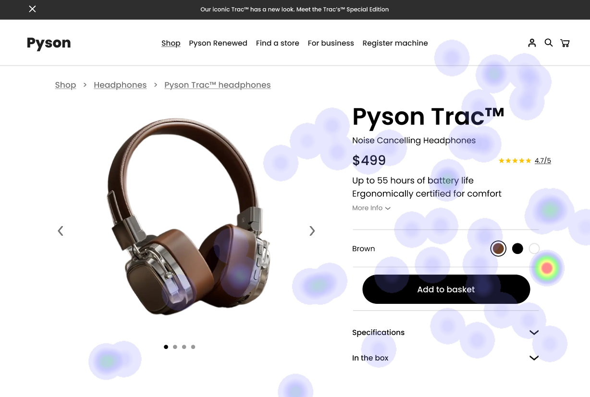

# UI Recommendations and Analysis Report

## Image 1

### Strengths 🌟
- **Product Price**
  - *Analysis:* High attention area shown by bright heatmap spots follows F-pattern reading convention.
  - *Heatmap Correlation:* Users naturally gravitate to clear and prominent pricing as indicated by Nielsen's visibility of system status heuristic.

- **Product Image**
  - *Analysis:* Significant concentration on the headphones aligns with clear visual hierarchy principles.
  - *Heatmap Correlation:* Users spend time examining product details, indicating the expectation is well met with a high-quality visualization.

- **Color Selection Options**
  - *Analysis:* Moderate attention aligns with conventional e-commerce patterns, clear feedback with highlighted selection.
  - *Heatmap Correlation:* Users notice and interact with this element, showing engagement in interactive areas.

### Weaknesses ⚠️
- **Navigation Breadcrumbs**
  - *Analysis:* Low attention indicated by minimal heatmap activity.
  - *Reason:* Lacks visual prominence despite proper positioning, risking violated support for Nielsen's user control and freedom heuristic.
  - *Heatmap Correlation:* Users may miss this navigation aid, reducing their ability to maintain orientation within the site.
  - *Severity:* Medium
  - *Impact:* Potentially confusing navigation experience and reduced site orientation.
  - *Recommendations:* Increase visual prominence of breadcrumbs through higher contrast or unique styling. Consider repositioning into a more attention-grabbing location.

- **More Info Button**
  - *Analysis:* Minimal heatmap activity indicates low visibility and underuse.
  - *Reason:* Violates Nielsen's recognition rather than recall heuristic, vital elements should not be overlooked.
  - *Heatmap Correlation:* Overlooking this functionality may lead users to miss out on important product information.
  - *Severity:* High
  - *Impact:* Key information being missed, thereby reducing user engagement and satisfaction.
  - *Recommendations:* Enhance button prominence with increased size, contrast, and/or positioning it next to high engagement areas like the product image or price.

### WCAG Standards ✅
- Estimated Level: AA. The interface shows attention to basic accessibility but needs enhancements to fully meet WCAG 2.1 AA standards, focusing on adding alt text, ensuring keyboard navigation, and improving color usage.

## Image 2

### Strengths 🌟
- **Product Navigation/Gallery**
  - *Analysis:* Clear image with navigation options follows e-commerce conventions.
  - *Heatmap Correlation:* Well-structured visual hierarchy supports user engagement effectively.

- **Specification Layout**
  - *Analysis:* Clean format with logical detail grouping, key information easily discoverable.
  - *Heatmap Correlation:* Engagement concentrated in areas delivering essential information efficiently.

### Weaknesses ⚠️
- **Color Selection Interface**
  - *Analysis:* Current selection indicator exists but lacks labels.
  - *Reason:* Currently relies on color alone to convey information, which is not accessible.
  - *Heatmap Correlation:* Potential oversight due to only moderate interaction levels in heatmap.
  - *Severity:* Medium
  - *Impact:* Excludes users with color blindness or visual impairments, reducing accessibility.
  - *Recommendations:* Add text labels and ARIA labels to ensure color options are accessible to all users.

- **Button Text**
  - *Analysis:* Add to basket button could benefit from higher contrast with background.
  - *Reason:* Low contrast affects visibility under different lighting conditions.
  - *Heatmap Correlation:* Might explain lower than expected interaction levels for a critical function.
  - *Severity:* High
  - *Impact:* Directly impacts conversion rates if users do not clearly see CTA buttons.
  - *Recommendations:* Increase contrast ratio to at least 4.5:1 while ensuring consistent typography and color.

### WCAG Standards ✅
- The interface appears to meet most Level AA requirements but would need adjustments for full compliance, especially around color selection accessibility and focus indicators.

## Image 3

### Strengths 🌟
- **Product Title & Price**
  - *Analysis:* High heatmap focus justified by natural scanning behavior.
  - *Heatmap Correlation:* Bright spots indicate successful delivery of essential product information.

- **Color Selection Area**
  - *Analysis:* Strong engagement correlating with user interaction pattern.
  - *Heatmap Correlation:* Clear hotspots indicate preference for interactive design elements.

### Weaknesses ⚠️
- **Gallery View Section**
  - *Analysis:* Lower engagement shown in heatmap due to understated design.
  - *Reason:* Insufficient visual cues and prominence may deter user exploration.
  - *Heatmap Correlation:* Less user focus and interaction in this area compared to other sections.
  - *Severity:* Low
  - *Impact:* Limits users' understanding and exploration of product variants and options.
  - *Recommendations:* Enhance visual prominence through additional cues (contrasting colors/icons) to draw attention.

- **Left Navigation Menu**
  - *Analysis:* Minimal attention due to poor visual hierarchy and contrast.
  - *Reason:* Does not stand out from the background and lacks compelling styling.
  - *Heatmap Correlation:* Users ignore this area, likely because it blends with other content.
  - *Severity:* Medium
  - *Impact:* Potentially underutilized navigation tools limiting efficient user movement through site.
  - *Recommendations:* Improve contrast and introduce a more distinct styling to separate navigation menu from main content.

### WCAG Standards ✅
- Current Level: AA (Partially). Needs improvement in color selection labeling, image alt texts, focus indicators, and better keyboard navigation.

## Performance Metrics
- Total execution time: 112.76 seconds
- CrewAI analysis time: 55.72 seconds

