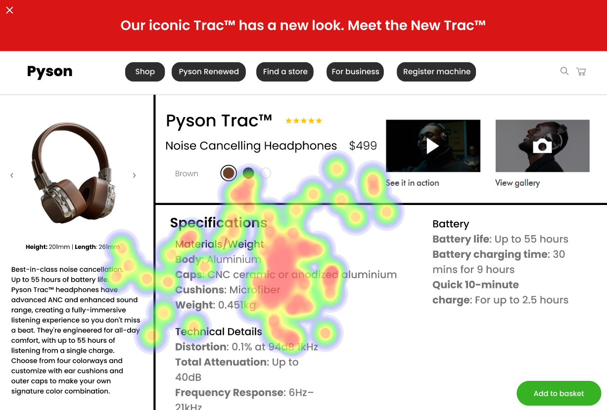

# UI Recommendations and Analysis Report

## Image 1

### Strengths
- **Product Image Focus**
  - 🖼️ Users focused heavily on the main product image, showing strong engagement with concentrated red/yellow heat around this area.
  
- **Price Point Display**
  - 💰 The pricing information received significant attention, denoted by notable heat concentration, indicating clarity and prominence.

### Weaknesses
- **Navigation Breadcrumbs**
  - 🛣️ **Reason:** Limited attention paid, causing inefficient wayfinding.
  - **Heatmap Correlation:** Minimal heat in breadcrumb area indicates poor visibility.
  - **Severity:** Medium
  - **Impact:** Improving breadcrumb visibility can enhance navigation efficiency.
  - **Recommendations:** Increase the font size and contrast of breadcrumbs, and consider repositioning for better visibility.

- **Color Selection Options**
  - 🎨 **Reason:** Low engagement despite being a key feature.
  - **Heatmap Correlation:** Minimal heat concentration around color options, suggesting suboptimal display.
  - **Severity:** High
  - **Impact:** Enhancing color selection visibility can improve customization engagement.
  - **Recommendations:** Add text labels or patterns to color options and improve their visual hierarchy with size or bolder borders.

- **Specifications Toggle**
  - 📋 **Reason:** Essential information hidden behind interaction.
  - **Heatmap Correlation:** Minimal engagement visible in the specs section.
  - **Severity:** High
  - **Impact:** Making specifications more accessible can facilitate informed purchase decisions.
  - **Recommendations:** Move key specifications higher up in the page layout with a collapsed/expanded state indicator.

### WCAG Standards
- Currently meets partial AA compliance. Improvements needed in color selection indicators, image alt text, keyboard navigation support, and adding ARIA labels.

## Image 2

### Strengths
- **Product Image**
  - 🖼️ The main product image receives a notable amount of attention indicating importance and interest with intense heatmap activity.

- **Price Point**
  - 💰 The $499 display is a strong hotspot, emphasizing correct information hierarchy and placement.

### Weaknesses
- **Navigation Menu**
  - 🗺️ **Reason:** Critical navigation elements show low user interaction.
  - **Heatmap Correlation:** Cold areas in the navigation section suggest potential discoverability issues.
  - **Severity:** Medium
  - **Impact:** Enhancing navigation visibility improves user experience.
  - **Recommendations:** Increase contrast and modify the layout for the top navigation items to stand out better.

- **Color Selection**
  - 🎨 **Reason:** Underemphasized feature leading to suboptimal interaction.
  - **Heatmap Correlation:** Minimal attention despite importance in customization.
  - **Severity:** High
  - **Impact:** Improving prominence will likely increase conversion through customization.
  - **Recommendations:** Ensure color selection buttons have clear labels and enhance visibility by increasing size or contrast.

### WCAG Standards
- Meeting partial AA compliance. Needs improvement in alternative text, color accessibility with labels, and ARIA implementation.

## Image 3

### Strengths
- **Product Image Focus**
  - 🖼️ Users are particularly attentive to the main product image, reflecting a strong product-driven focal point.

- **Price Point Visibility**
  - 💰 Strong attention is evident in the pricing area, synonymous with prompt visibility.

### Weaknesses
- **Navigation Elements**
  - 🗺️ **Reason:** Ineffective navigation due to low attention.
  - **Heatmap Correlation:** Minimal interaction indicated by cold navigation areas.
  - **Severity:** Medium
  - **Impact:** Addressing visibility can facilitate a smoother browsing experience.
  - **Recommendations:** Redesign navigation with higher contrast and show the current page indicator clearly.

- **Color Selection Options**
  - 🎨 **Reason:** Not adequately highlighted.
  - **Heatmap Correlation:** Relatively low attention indicating potential improvement needs.
  - **Severity:** High
  - **Impact:** Highlighting color options can increase user interaction and customization.
  - **Recommendations:** Introduce enhanced contrast and add text labels for each option to aid user understanding.

### WCAG Standards
- Likely AA compliance with areas of improvement needed in color selection visibility, image text alternatives, and comprehensive ARIA labels.

## Performance Metrics
- Total execution time: 82.48 seconds
- CrewAI analysis time: 32.32 seconds

