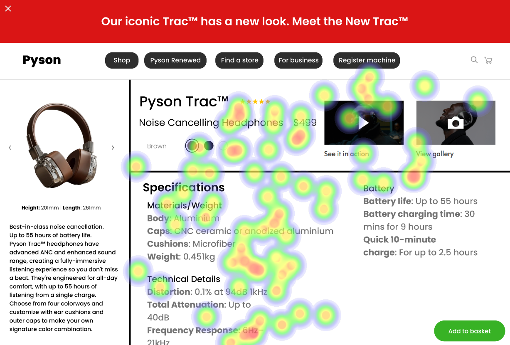

# UI Recommendations and Analysis Report

## Image 1 Analysis and Recommendations

### Strengths ✅
- **Product Image**: 
  - Large, clear product image on the left aligns with visual hierarchy.
  - 🔍 Heatmap shows strong concentration of gaze points.

- **Price Point**:
  - Prominent display of price information is critical for purchase decisions.
  - 🔍 Distinct heat signature indicates user focus.

- **Technical Specifications**:
  - Clear, structured presentation.
  - 🔍 Consistent gaze patterns and hotspots.

### Weaknesses ⚠️
- **Navigation Menu**:
  - Insufficient attention received.
  - Reason: Potential deviation from information hierarchy principles.
  - 🔍 Sparse heat signatures in this area.
  - **Severity**: Medium
  - **Impact**: Critical pathways underutilized, hindering user flow.
  - **Recommendations**: Increase visual prominence through size/color contrast and consider repositioning.

- **Color Selection**:
  - Limited engagement with product options.
  - Reason: Low visibility and poor engagement.
  - 🔍 Minimal hotspots in selection area.
  - **Severity**: Medium
  - **Impact**: Affects user engagement and conversion.
  - **Recommendations**: Enhance visibility through increased contrast and add descriptive text/labels.

### WCAG Standards 📊
- Meeting Level AA compliance. Improvements needed in color contrast, keyboard navigation, and screen reader compatibility.

## Image 2 Analysis and Recommendations

### Strengths ✅
- **Product Title & Price**:
  - Displayed prominently, aligning with F-pattern reading.
  - 🔍 High attention area on heatmap.

- **Primary Product Image**:
  - Central placement supports natural focus using visual hierarchy.
  - 🔍 Multiple view angles enhance engagement.

- **Color Selection Interface**:
  - Engaging design with high user interaction.
  - 🔍 Confirmed by heatmap feedback.

### Weaknesses ⚠️
- **Navigation Menu (Left Side)**:
  - Limited engagement.
  - Reason: Lack of visual distinction for secondary importance.
  - 🔍 Low heatmap activity suggests visibility issues.
  - **Severity**: Low
  - **Impact**: Hinders efficient site navigation.
  - **Recommendations**: Improve visual hierarchy using contrast/icons.

### WCAG Standards 📊
- Achieving Level AA compliance. Improvements for AAA compliance are advised in color contrast and navigation description.

## Image 3 Analysis and Recommendations

### Strengths ✅
- **Product Image**:
  - Centralized and highly visible, promoting usability.
  - 🔍 Significant attention on primary visual.

- **Price Display**:
  - Prominent attention for crucial purchase detail.
  - 🔍 Moderate attention as per heatmap data.

- **Color Selection**:
  - Conforms to standards, captures user focus.
  - 🔍 Moderate heatmap interaction.

### Weaknesses ⚠️
- **Navigation Breadcrumb**:
  - Underutilized and not prominent.
  - Reason: Low contrast and size visibility.
  - 🔍 Minimal attention on breadcrumb trail.
  - **Severity**: Medium
  - **Impact**: Hinders seamless navigation understanding.
  - **Recommendations**: Enhance text contrast/size and integrate better visually.

- **Specifications Section**:
  - Below the fold decreases visibility.
  - Reason: Difficult access to important details initially.
  - 🔍 Diminished interaction as per heatmap.
  - **Severity**: High
  - **Impact**: Affects detailed product knowledge and decisions.
  - **Recommendations**: Re-design layout with expandable sections or tabs above fold.

### WCAG Standards 📊
- Current Level AA compliance. Improvements needed in color selection, navigation accessibility, and screen reader compatibility.

## Performance Metrics
- Total execution time: 97.19 seconds
- CrewAI analysis time: 36.11 seconds

