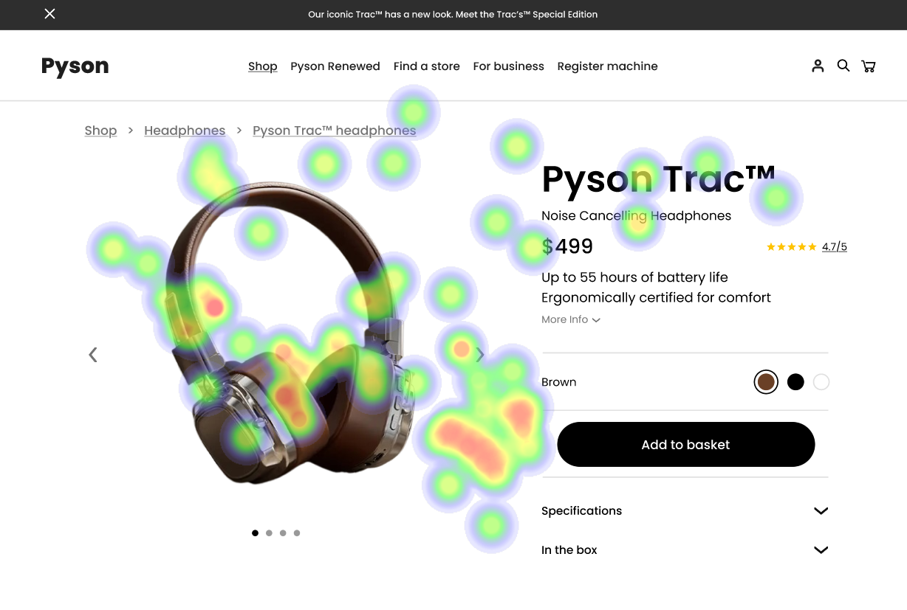

# UI Recommendations and Analysis Report

## Image 1: Analysis and Recommendations

### Strengths
- **Product Image Focus** 📸
  - Heatmap Correlation: Intense concentration of gaze data around the product image as shown by red/yellow hotspots indicates high user engagement.
  
- **Price Point Visibility** 💲
  - Heatmap Correlation: Moderate attention from users as indicated by green spots next to the clearly positioned price display.
  
- **Product Name and Navigation** 🏷
  - Heatmap Correlation: Visible attention spots around the branding and breadcrumb navigation, indicating clear information architecture.

### Weaknesses
- **Color Selection Controls** 🎨
  - Reason: Limited attention despite the functional importance, deviating from clear interactive element principles.
  - Heatmap Correlation: Minimal attention spots shown in this area.
  - Severity: High
  - Impact: Low engagement with color options can lead to missed opportunities in product customization.
  - Recommendations: 
    - Add labels or patterns to the color options to increase visibility and comply with accessibility guidelines.
    - Ensure these controls stand out with sufficient contrast.
  
- **Specifications Section** 📋
  - Reason: Low visibility and engagement for important product information.
  - Heatmap Correlation: Very few gaze points in this area.
  - Severity: Medium
  - Impact: Poor engagement with specifications can lead to incomplete understanding of product features.
  - Recommendations:
    - Redesign the specifications section to be more prominent.
    - Place key features in summarized bullet points on the main page or enhance the title’s visibility.

### WCAG Standards
The interface shows good basic usability but needs improvements to fully meet WCAG 2.1 AA standards. Key improvements include adding text labels or patterns to color options for accessibility, ensuring all functionality is keyboard accessible, and adding skip navigation links.

## Image 2: Analysis and Recommendations

### Strengths
- **Product Image Focus** 📸
  - Heatmap Correlation: Intense heat signature around the product image indicates high user engagement, following the visual hierarchy principle.
  
- **Price Point Placement** 💲
  - Heatmap Correlation: Moderate attention heat signature in this area under clear visibility and optimal positioning.
  
- **Color Selection Interface** 🎨
  - Heatmap Correlation: Shows user attention around the selection area for interactive elements with good contrast.

### Weaknesses
- **Navigation Elements** 🧭
  - Reason: Limited attention due to poor visual hierarchy.
  - Heatmap Correlation: Minimal user attention in these areas.
  - Severity: Low
  - Impact: Can lead to navigation confusion or missed opportunities for exploration beyond the product page.
  - Recommendations:
    - Improve the visual hierarchy by highlighting the navigation bar.
    - Provide visual feedback when it is interacted with.
  
- **Specification Section** 📋
  - Reason: Low user engagement despite important information.
  - Heatmap Correlation: Shows reduced attention in lower sections.
  - Severity: Medium
  - Impact: Critical product information may be overlooked.
  - Recommendations:
    - Reorganize technical specifications to ensure crucial details are more visible.
    - Preview essential specs above the fold.

### WCAG Standards
The UI demonstrates good basic usability but would benefit from additional accessibility enhancements. Needs improvement in ensuring all interactive elements are keyboard accessible and do not rely solely on color for communication.

## Image 3: Analysis and Recommendations

### Strengths
- **Product Image Focus** 📸
  - Heatmap Correlation: Dense concentration of attention points around the product image, highlighting strong visual hierarchy.
  
- **Price Point Visibility** 💲
  - Heatmap Correlation: Notable heat concentration around the price area with clear pricing information.
  
- **Color Selection Options** 🎨
  - Heatmap Correlation: Clear attention clusters around the color options as they draw natural attention.

### Weaknesses
- **Navigation Menu** 🧭
  - Reason: Receiving minimal focus despite importance.
  - Heatmap Correlation: Sparse heat distribution in the navigation area.
  - Severity: Low
  - Impact: Could lead to a lack of navigation effectiveness, impacting exploration.
  - Recommendations:
    - Increase the contrast and add interactive elements to make the navigation bars more visible and attractive.
  
- **Call-to-Action Button** 🛒
  - Reason: Surprisingly low attention for a primary conversion element.
  - Heatmap Correlation: Limited heat concentration around the CTA.
  - Severity: High
  - Impact: Direct impact on conversion rates if the 'Add to Basket' button remains overlooked.
  - Recommendations:
    - Increase contrast ratio to 4.5:1 for the button.
    - Place it near attention areas like product images or prices.
    - Consider adding animation or a tooltip.

### WCAG Standards
The UI currently meets WCAG 2.1 Level AA standards but improvements such as enhancing keyboard navigation visibility and providing alternative text for all visual elements are recommended to reach Level AAA compliance.

## Performance Metrics
- Total execution time: 96.48 seconds
- CrewAI analysis time: 41.50 seconds

