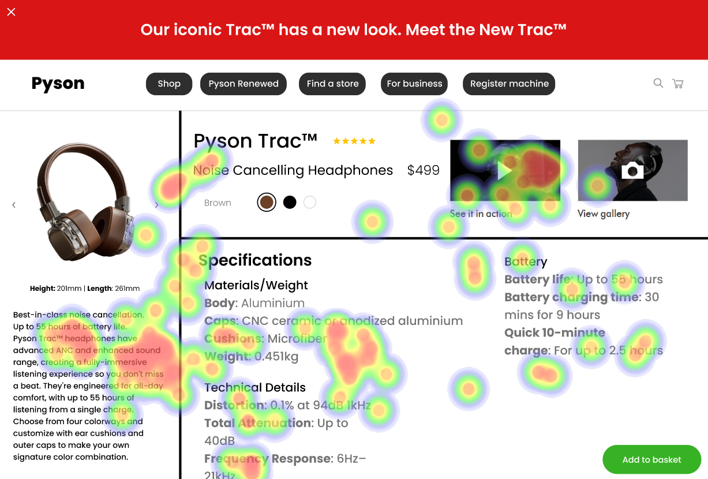
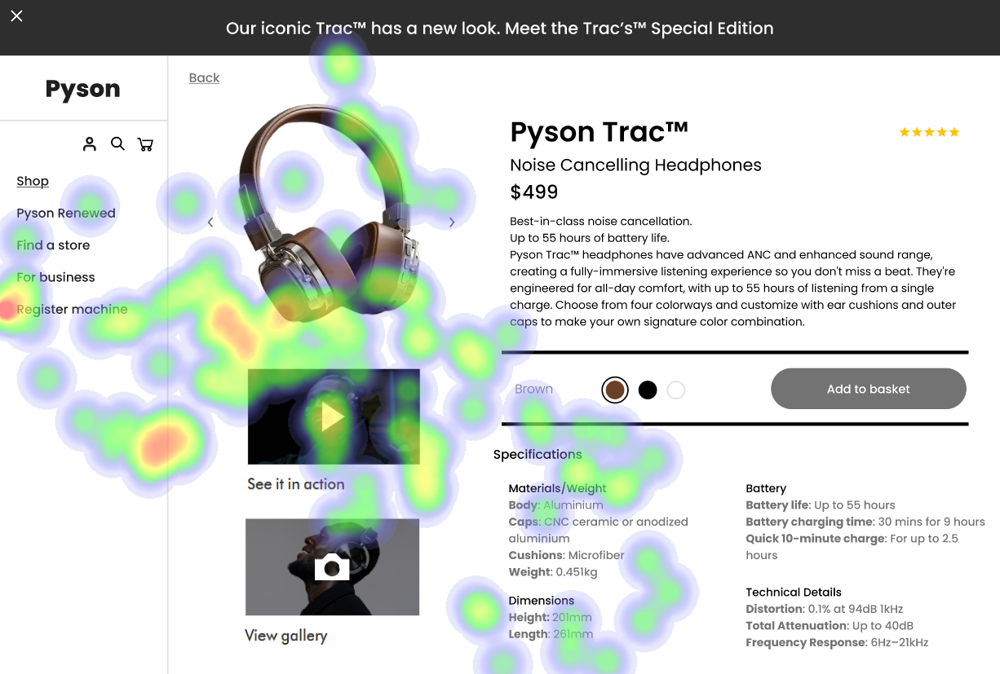
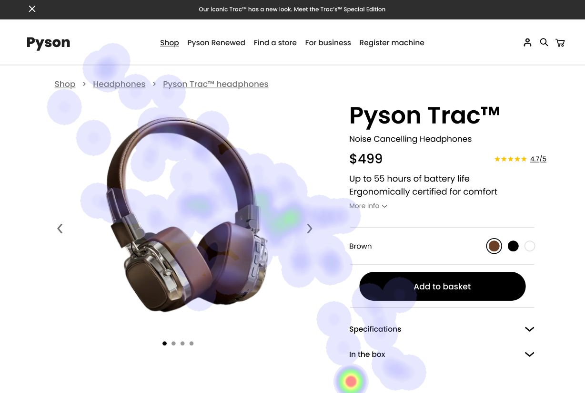

# UI Recommendations and Analysis Report

## Overview
This report compiles findings from UI evaluations across three different product images, highlighting strengths and weaknesses in alignment with WCAG 2.1 Level AA standards. Key areas of focus include contrast ratios, button visibility, and element placement to enhance user engagement and accessibility.

## Image 1

### Strengths
1. **Product Image Effectiveness**
   - **Observation**: High visual attention due to large size and central placement following the F-pattern.
   - **Heatmap Correlation**: Users focused heavily on the product image, confirming its effectiveness and relevance.

2. **Visibility of Product Title and Price**
   - **Observation**: Attracts significant attention due to bold typography and strategic placement.
   - **Heatmap Correlation**: High fixation on product name and price supports their critical role in user engagement.
   
3. **Call to Action (CTA) Button**
   - **Observation**: Effectively positioned with contrasting colors to draw attention.
   - **Heatmap Correlation**: Notable fixation indicates users recognize it as an actionable element.

### Weaknesses
1. **Text Contrast in Specification Section**
   - **Issue**: Low contrast hindering readability for users with visual impairments.
   - **Heatmap Correlation**: Lower fixation points suggest users might be skipping this due to readability issues.
   - **Recommendations**: Increase text contrast to a ratio of at least 4.5:1.

2. **Navigation Links Visibility**
   - **Issue**: Small size makes them easy to overlook.
   - **Heatmap Correlation**: Sparse attention indicates users are not engaging with these elements readily.
   - **Recommendations**: Enhance size and prominence using different colors or increased font size.

### Accessibility Standards
- The UI partially meets WCAG 2.1 Level AA standards, with specific text contrast issues potentially hindering accessibility.

## Image 2

### Strengths
1. **Product Image as a Focal Point**
   - **Observation**: Aligns with gestalt principles, drawing user interest.
   - **Heatmap Correlation**: High fixation confirms natural user draw to the item.

2. **Prominence of Product Name and Price**
   - **Observation**: Effective proximity and prominence capture user attention.
   - **Heatmap Correlation**: High engagement with crucial product details.

3. **Add to Basket Button**
   - **Observation**: Clear call-to-action with high visual contrast.
   - **Heatmap Correlation**: Significant user focus suggests effective conversion support.

### Weaknesses
1. **Low Contrast for Product Details**
   - **Issue**: Reduced readability might decrease engagement.
   - **Heatmap Correlation**: Moderate attention suggests difficulty in digesting content.
   - **Recommendations**: Enhance text-background contrast to a ratio of 4.5:1.

2. **Overloaded Sidebar**
   - **Issue**: Small icons and links complicate navigation.
   - **Heatmap Correlation**: Low attention correlates with cluttered presentation.
   - **Recommendations**: Reorganize content, increase icon size, improve element separation.

### Accessibility Standards
- The UI partially meets WCAG 2.1 Level AA standards with identified text contrast issues affecting overall accessibility.

## Image 3

### Strengths
1. **Product Image Placement**
   - **Observation**: Large size and central placement promote interaction, following the F-pattern.
   - **Heatmap Correlation**: High fixation confirms effectiveness.

2. **Effective Use of Product Name and Price**
   - **Observation**: Bold text and proximity to the image enhance visibility.
   - **Heatmap Correlation**: High focus underscores their layout importance.

3. **Breadcrumb Navigation**
   - **Observation**: Aids easy navigation with a clear hierarchy.
   - **Heatmap Correlation**: User focus indicates path guidance effectiveness.

### Weaknesses
1. **Low Contrast Button Design**
   - **Issue**: Poor visibility reduces interaction likelihood.
   - **Heatmap Correlation**: Less interest in button noted, suggesting a need for contrast adjustment.
   - **Recommendations**: Increase button contrast to improve interaction likelihood.

2. **Information Hierarchy Issues**
   - **Issue**: Blending text reduces readability and can frustrate users.
   - **Heatmap Correlation**: Limited focus on descriptive text indicates lack of engagement.
   - **Recommendations**: Redesign hierarchy to emphasize key details with clear separation.

### Accessibility Standards
- The UI partially meets WCAG 2.1 Level AA standards, with necessary improvements in contrast ratios for essential elements.

## Conclusion
Overall, the analyzed UIs show strong engagement with major visual elements such as product images and CTA buttons but need improvement in text contrast and element prominence to enhance accessibility and user experience. Continued refinement following WCAG guidelines is recommended to meet accessibility standards fully.

