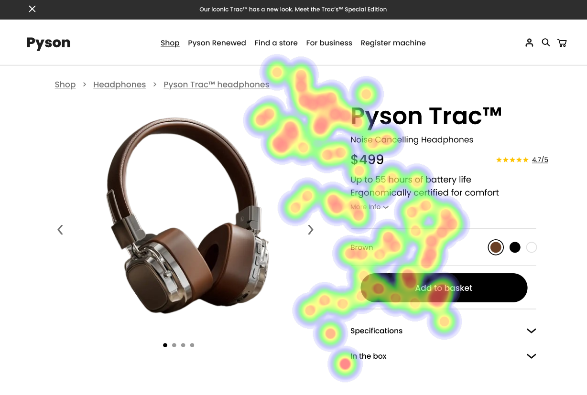

# UI Analysis and Recommendations Report

## Overview

This report evaluates the user interface (UI) elements of three product display images, focusing on strengths and weaknesses in terms of design and user experience. Key findings are correlated with user attention data provided by heatmap analyses. Recommendations are provided to enhance usability and accessibility, especially concerning WCAG standards.

## Image 1

### Strengths

- **Product Name and Price**
  - **Description:** Prominent placement near the top with larger, bold font.
  - **Effectiveness:** Aligns with Hick's Law by reducing decision time.
  - **Heatmap Correlation:** High fixation verifies strategic placement.
  
- **Add to Basket Button**
  - **Description:** Bright green color with good contrast against white background.
  - **Effectiveness:** Fitts' Law applied, facilitating visibility and interaction.
  - **Heatmap Correlation:** Significant attention highlights its effective prominence.

### Weaknesses

- **Low Text Contrast in Specifications Section**
  - **Issue:** Light gray text on a white background hinders readability.
  - **Heatmap Correlation:** Limited attention due to low visibility.
  - **Severity:** High
  - **Impact:** Causes frustration, undermines accessibility, risks exclusion for visually impaired users.
  - **Recommendations:** Enhance text contrast to meet WCAG 4.5:1 ratio using darker text shades.

### Compliance

- **WCAG Standards:** Does not comply with WCAG 2.1 Level AA in text contrast.

## Image 2

### Strengths

- **Product Image**
  - **Description:** Large, central placement in line with F-pattern.
  - **Heatmap Correlation:** High focus confirms visual dominance.

- **Product Name and Price**
  - **Description:** Positioned prominently with size and contrast.
  - **Heatmap Correlation:** High fixation confirms strategic effectiveness.

### Weaknesses

- **Low Contrast of Smaller Text**
  - **Issue:** 'More Info' and dropdown specifications lack visibility.
  - **Heatmap Correlation:** Sparse attention confirms readability issues.
  - **Severity:** Medium
  - **Impact:** Reduces engagement, potentially missing crucial information.
  - **Recommendations:** Improve contrast to meet WCAG standards. Prioritize as medium priority to enhance engagement.

### Compliance

- **WCAG Standards:** Mostly meets WCAG 2.1 Level AA, improve small text contrast for full compliance.

## Image 3

### Strengths

- **Product Image**
  - **Description:** Large, central alignment within F-pattern.
  - **Heatmap Correlation:** High fixation proves user attraction.

- **Product Name and Price**
  - **Description:** High contrast, strategic placement boosts visibility.
  - **Heatmap Correlation:** Focused attention confirms design success.
  
- **Add to Basket Button**
  - **Description:** Clearly labeled and well-positioned.
  - **Heatmap Correlation:** Significant user attention indicates key action recognition.

### Weaknesses

- **Low Text Contrast in Product Description**
  - **Issue:** Poor readability reduces user focus.
  - **Heatmap Correlation:** Low interaction due to contrast issues.
  - **Severity:** Medium
  - **Impact:** Enhancing contrast will improve user satisfaction.
  - **Recommendations:** Adjust text to meet WCAG 4.5:1 ratio.

- **Specification Section Visibility**
  - **Issue:** Less attention than expected.
  - **Heatmap Correlation:** Low gaze indicates low engagement.
  - **Severity:** Low
  - **Impact:** Important information may be overlooked.
  - **Recommendations:** Improve layout and prominence with highlights/icons. Low priority as it affects secondary actions.

### Compliance

- **WCAG Standards:** Partial compliance with WCAG 2.1 AA due to text contrast issues.

## Global Recommendations

1. **Enhance Text Contrast**:
   - Across all images, text contrast should meet or exceed WCAG 2.1 Level AA standards.
   - A minimum contrast ratio of 4.5:1 should be targeted for all text areas.

2. **Increase Engagement in Specification Sections**:
   - Consider repositioning or using visual cues (e.g., icons, highlights) to draw attention.

3. **Regular WCAG Compliance Review**:
   - Frequent audits to ensure all content maintains accessibility compliance.

These improvements will ensure an accessible and user-centered design, enhancing both usability and user engagement.

