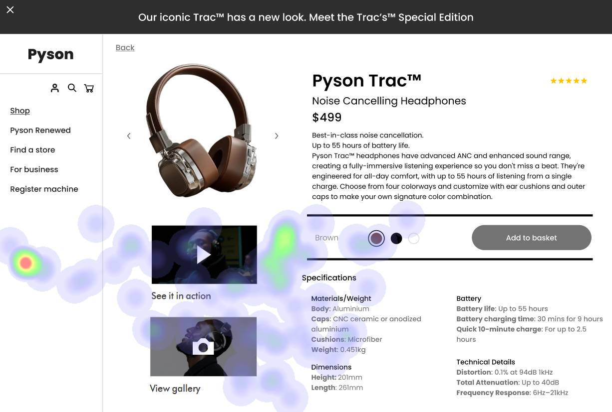

# UI Recommendations and Analysis Report

## Image 1
### Strengths
1. **Product Title and Price**
   - *Description*: Displayed in a prominent size and central placement, the product title and price align with user expectations for identifying products and recognizing their pricing.
   - *Heatmap Correlation*: High fixation on the title and price confirms their attractiveness and effectiveness in capturing user attention.

2. **Product Image**
   - *Description*: Its central placement and large size naturally attract attention, complementing the F-pattern scanning behavior typical among users.
   - *Heatmap Correlation*: High focus on the product image validates its role in visually conveying important product details.

### Weaknesses
1. **Low Contrast of Text Labels**
   - *Details*: The 'See it in action' and 'View gallery' labels next to interactive elements have low contrast.
   - *Reason*: Poor discernibility can lead to users missing important content and actions.
   - *Heatmap Correlation*: While images receive attention, the text labels do not, indicating ineffective attention capture.
   - *Severity*: High
   - *Impact*: Users might overlook these links due to weak visibility, resulting in less interaction.
   - *Recommendations*: Increase contrast or employ stronger visual markers to enhance visibility.

2. **Specifications Section Design**
   - *Details*: Dense text layout and a lack of visual hierarchy could deter users.
   - *Reason*: The overwhelming presentation of text may cause users to skip important details.
   - *Heatmap Correlation*: Scattered attention in this area suggests difficulty in absorbing information.
   - *Severity*: Medium
   - *Impact*: Users may overlook critical product information, impacting decision-making.
   - *Recommendations*: Break text into bulleted points and use headers with increased spacing for better readability.

### WCAG Standards Compliance
The UI partially meets WCAG 2.1 standards at the A level. While most text is readable, elements like 'See it in action' lack sufficient contrast, falling short of the AA requirement for a contrast ratio of 4.5:1 for normal text.

## Image 2
### Strengths
1. **Product Image**
   - *Description*: A large and centrally placed image effectively draws user attention, serving as a focal point.
   - *Heatmap Correlation*: High fixation on this area confirms its effectiveness in engaging users.

2. **Product Name and Price**
   - *Description*: Presented in larger font and bold style, making essential information easy to locate and read.
   - *Heatmap Correlation*: Significant attention concentrated in this area underscores its importance and effective design.

### Weaknesses
1. **Navigation Bar Low Contrast**
   - *Details*: The contrast between the text and background is low, which may impede readability.
   - *Reason*: This could affect users' ability to efficiently navigate the site.
   - *Heatmap Correlation*: Minimal user attention in this area corroborates the contrast issue.
   - *Severity*: Medium
   - *Impact*: Users might struggle to find links, reducing the efficiency of navigation.
   - *Recommendations*: Enhance text contrast to improve readability and engagement.

2. **Visibility of Sections**
   - *Details*: Specifications and 'In the box' sections lack prominence.
   - *Reason*: Users might overlook additional product information unless it captures interest upfront.
   - *Heatmap Correlation*: Low fixation supports the issue of visibility and engagement.
   - *Severity*: Low
   - *Impact*: Could lead to a loss of interest in product features, potentially affecting purchase decisions.
   - *Recommendations*: Enhance these sections with color coding or icons to attract attention.

### WCAG Standards Compliance
Currently meets WCAG 2.1 AA for most elements but requires improvements on text contrast in navigation and interactive areas to meet standards adequately.

## Image 3
### Strengths
1. **Product Image**
   - *Description*: Large and centrally placed, effectively attracting user attention.
   - *Heatmap Correlation*: Users’ focus supports its strategic placement.

2. **Product Name and Price**
   - *Description*: Bold typography and adjacency to the product image make it a primary focus for users.
   - *Heatmap Correlation*: High fixation supports its efficiency in capturing attention.

3. **'Add to Basket' Button**
   - *Description*: Features a high-contrast bold design aligning with usability standards.
   - *Heatmap Correlation*: Users show interest, confirming its effective design and placement.

### Weaknesses
1. **Text Contrast Issues**
   - *Details*: Contrast ratios for description and specifications may be insufficient.
   - *Reason*: Poor contrast can impact readability for users with visual impairments.
   - *Heatmap Correlation*: Less attention on textual portions suggests readability issues.
   - *Severity*: Medium
   - *Impact*: Can cause user frustration, impacting decision-making.
   - *Recommendations*: Enhance text contrast to meet WCAG standards and improve readability.

2. **Low Prominence of Side Navigation**
   - *Details*: Lacks visual prioritization.
   - *Reason*: This influences the ability to swiftly navigate or discover sections.
   - *Heatmap Correlation*: Minimal fixation suggests low priority and visibility.
   - *Severity*: Low
   - *Impact*: Reduced navigation discoverability, potentially leading to missed exploratory opportunities.
   - *Recommendations*: Improve visibility with contrasting colors or repositioning.

### WCAG Standards Compliance
The UI partially complies with WCAG 2.1 AA standards, with issues in text contrast ratios and potentially insufficient focus indicators.

By addressing the identified weaknesses, the user interface can enhance user engagement, accessibility, and overall user experience. Adjustments to contrast, textual hierarchy, and the visibility of interactive elements are critical for aligning with optimal design practices and accessibility standards.

