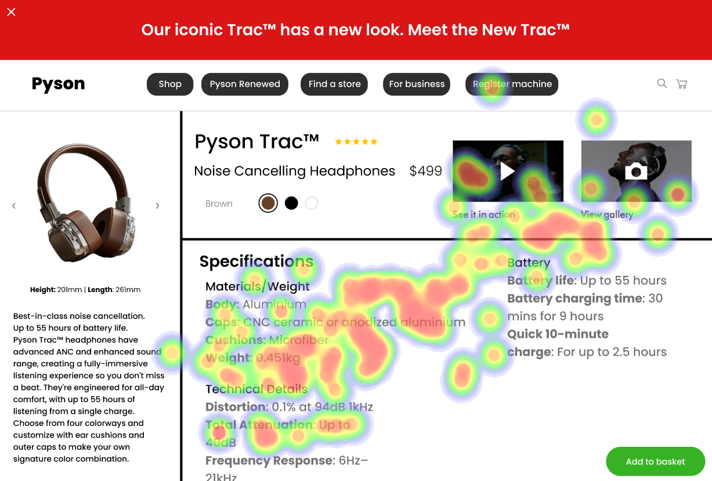

# UI Recommendations and Analysis Report

## Image 1

### Strengths

1. **Product Image** 
   - **Description**: The large size and central placement naturally draw the eye, aligning with the F-pattern of reading web content.
   - **Heatmap Correlation**: The heatmap shows significant user focus on the product image, indicating effective visual hierarchy.

2. **Product Name and Price**
   - **Description**: Placed near the top in the reading flow, catching initial attention as users skim the page.
   - **Heatmap Correlation**: High fixation around this area suggests it effectively communicates key product information quickly.

### Weaknesses

1. **Low Contrast in 'Specifications' Section**
   - **Reason**: This issue can significantly affect readability for users, especially those with visual impairments, thus not meeting WCAG guidelines.
   - **Heatmap Correlation**: Heatmap data indicates lower fixation in the specifications area, correlating with the low contrast issue affecting engagement with the content.
   - **Severity**: High
   - **Impact**: Users may skip critical specification details due to poor readability, leading to potential frustration or misunderstanding of product features.
   - **Recommendations**: Improve text contrast in the 'Specifications' section to meet at least a 4.5:1 ratio, enhancing readability and user engagement.

2. **Small and Closely Spaced Navigation Bar Items**
   - **Reason**: This issue affects usability, conflicting with Fitts' Law by making it difficult for users to select options quickly.
   - **Heatmap Correlation**: Limited focus on the navigation bar suggests usability issues related to size and spacing, deterring user interaction.
   - **Severity**: Medium
   - **Impact**: May lead to decreased usage of overpopulated navigation elements, resulting in inefficient page exploration.
   - **Recommendations**: Increase size and spacing of navigation bar items to improve usability and enable quicker access to key site sections.

### WCAG Standards
- The UI partially meets WCAG 2.1 standards, requiring adjustments for AA compliance. Recommendations include increasing text contrast ratios and improving navigation element sizes.

--

## Image 2

### Strengths

1. **Add to Basket Button**
   - **Description**: Clear call to action with high contrast and proximity to product description influence decision pathways.
   - **Heatmap Correlation**: High fixation on the 'Add to Basket' button indicates effective CTA placement and design.

### Weaknesses

1. **Small Font Size and Insufficient Line Spacing in Text**
   - **Reason**: It hinders readability, especially for users with visual impairments.
   - **Heatmap Correlation**: Some areas of the text have low fixation indicating potential readability issues due to visual clutter or small text size.
   - **Severity**: Medium
   - **Impact**: Reduced readability could lead to users missing important details about the product features.
   - **Recommendations**: Enhance font size and apply adequate line spacing in the product description and specifications for improved readability and user comprehension.

2. **Poorly Contrasted Navigation Links in Sidebar**
   - **Reason**: Poor contrast does not comply with accessibility standards, causing users to overlook them.
   - **Heatmap Correlation**: There is significantly lower heatmap activity around the sidebar navigation links.
   - **Severity**: Low
   - **Impact**: Users might ignore or miss navigation links, leading to frustration or slower navigation.
   - **Recommendations**: Enhance sidebar navigation link contrast to ensure quick recognition and improved navigation across the site.

### WCAG Standards
- The UI partially meets WCAG 2.1 AA standards. Recommendations include increasing text size and contrast for navigation links to enhance accessibility.

--

## Image 3

### Strengths

1. **Product Image**
   - **Description**: Large size and central placement capture the user's immediate attention.
   - **Heatmap Correlation**: High fixation on the product image confirms its role as a primary focus point, validating its placement and prominence.

### Weaknesses

1. **Lack of Visual Emphasis on Navigation Links**
   - **Reason**: This issue affects intuitive site interaction, deviating from Nielsen's Usability Heuristics.
   - **Heatmap Correlation**: Minimal fixation on navigation links supports the issue of insufficient emphasis.
   - **Severity**: Medium
   - **Impact**: Low engagement with navigation can lead to difficulty accessing different site sections, resulting in user frustration.
   - **Recommendations**: Enhance visual emphasis of navigation links to improve interaction and ease of site navigation.

2. **Low Contrast Text in Product Description**
   - **Reason**: It conflicts with WCAG standards, impacting essential product comprehension.
   - **Heatmap Correlation**: Less attention on the product description area indicates issues with visual clarity.
   - **Severity**: High
   - **Impact**: Low readability impedes users' understanding of key product features, leading to potential loss of interest.
   - **Recommendations**: Increase contrast of product description text to meet accessibility standards and improve user comprehension.

### WCAG Standards
- The UI partially meets WCAG 2.1 at level A. Improvements are needed for text contrast, particularly in product descriptions, to achieve at least level AA compliance.

--

Overall, the analysis indicates key areas for improvement for accessibility and usability, specifically adhering to WCAG standards and enhancing visual hierarchy within the navigation and content areas for better user engagement.

