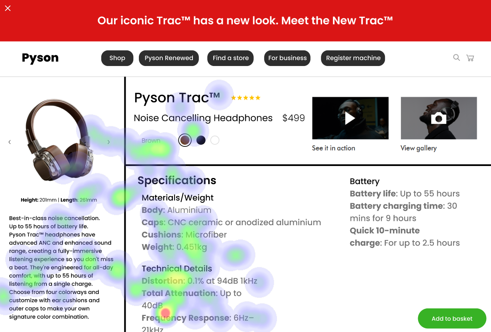

# UI Recommendations Report

## Image 1

### Strengths
- **Prominent Product Image Placement**
  - *Description:* The product image is prominently placed and aligned with the F-pattern, capturing user attention.
  - *Heatmap Correlation:* Users focused heavily on the product image, which aligns with its central and prominent placement.

- **Effective Highlight of Product Name and Price**
  - *Description:* Product Name and Price are effectively highlighted next to the product image, supporting quick user recognition.
  - *Heatmap Correlation:* High fixation on these elements supports their effectiveness in capturing user attention quickly.

- **Visibility of Add to Basket Button**
  - *Description:* The 'Add to Basket' button is highly visible due to its distinct color and size.
  - *Heatmap Correlation:* Noticeable attention on the button confirms its effectiveness as a principal interactive element on the page.

### Weaknesses
- **Breadcrumb Navigation Visibility**
  - *Issue:* Breadcrumb Navigation is too small and lacks contrast.
  - *Reason:* Breadcrumbs suffer from low visibility, which violates heuristics of visibility and feedback.
  - *Heatmap Correlation:* Low focus on this area confirms the breadcrumb's poor size and low contrast issues.
  - *Severity:* Medium
  - *Impact:* Reduced navigation ease could lead to a frustrating user experience and possible site abandonment.
  - *Recommendations:* Increase text size and contrast to conform with WCAG 2.1 Level AA.

- **Color Choice Sub-options Visibility**
  - *Issue:* Sub-options for color choice are not visible due to low contrast.
  - *Reason:* This problem violates the heuristic of visibility, making options hard to notice.
  - *Heatmap Correlation:* Sparse attention suggests these elements are being overlooked.
  - *Severity:* Medium
  - *Impact:* Users miss out on understanding customizable options, possibly leading to dissatisfaction.
  - *Recommendations:* Enhance contrast and raise the visibility of color options to ensure they are easily noticeable.

### WCAG Standards Compliance
The UI meets most of the WCAG 2.1 Level AA standards but needs improvements in breadcrumb and color options contrast.

## Image 2

### Strengths
- **Alignment of Product Name and Price**
  - *Description:* Product Name and Price are aligned effectively with proximity to the product image, capturing attention neatly.
  - *Heatmap Correlation:* High fixation around the product name and price supports its effectiveness in capturing user attention.

- **Distinct Color Options**
  - *Description:* Color Options are distinct and clear, enhancing interactivity and choice.
  - *Heatmap Correlation:* Users focused on the color options, indicating successful engagement.

### Weaknesses
- **Specifications Text Contrast**
  - *Issue:* Text in the specifications section does not meet contrast requirements.
  - *Reason:* Low contrast fails to meet WCAG 2.1 guidelines, violating accessibility by compromising readability.
  - *Heatmap Correlation:* Low focus on specifications aligns with the visual clarity issues.
  - *Severity:* High
  - *Impact:* Users may struggle to read specifications, causing frustration and abandonment.
  - *Recommendations:* Improve text contrast to at least 4.5:1 to meet accessibility standards.

- **Add to Basket Button Positioning**
  - *Issue:* The 'Add to Basket' button lacks prominence due to its position.
  - *Reason:* Position in the bottom right corner does not align with Fitts Law for optimized accessibility.
  - *Heatmap Correlation:* Low attention on the button suggests repositioning might improve usability.
  - *Severity:* Medium
  - *Impact:* Reduced interactions could lead to decreased conversions.
  - *Recommendations:* Reposition the button to a more prominent area in alignment with the primary visual path.

### WCAG Standards Compliance
The UI partially meets WCAG 2.1 standards at level A. Improvements are necessary for text contrast and CTA visibility.

## Image 3

### Strengths
- **Optimized Product Image Placement**
  - *Description:* Product Image placement is optimized for visual engagement.
  - *Heatmap Correlation:* Users focused heavily on the product image, confirming its effectiveness in capturing user attention.

- **Visibility of Product Name and Price**
  - *Description:* Product Name and Price are bold and well-positioned for user visibility.
  - *Heatmap Correlation:* High fixation on the product name and price area aligns with expected user behavior.

### Weaknesses
- **Contrast of Secondary Text**
  - *Issue:* Poor contrast on secondary text below the product name.
  - *Reason:* The secondary text lacks adequate contrast, impacting readability.
  - *Heatmap Correlation:* Less focus on this area supports the issue of poor contrast.
  - *Severity:* Medium
  - *Impact:* Users may skip important details due to reduced readability.
  - *Recommendations:* Increase contrast to meet WCAG standards.

- **Overloaded Specifications Information**
  - *Issue:* Specifications section presents overloaded information.
  - *Reason:* Dense text violates the heuristic of reducing cognitive overload.
  - *Heatmap Correlation:* Sparse attention suggests users might be overwhelmed by dense information.
  - *Severity:* Low
  - *Impact:* Users may find it challenging to assimilate all information quickly.
  - *Recommendations:* Segment information more clearly, highlight key points, or use bullet points for better assimilation.

### WCAG Standards Compliance
While the UI meets most WCAG 2.1 Level AA standards, secondary text contrast still requires attention for full compliance.

