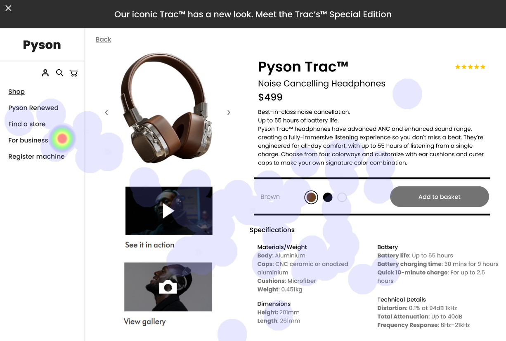

## UI Recommendations Report

This report presents an analysis of the strengths and weaknesses from three webpage images with respect to UI elements and their compliance with WCAG 2.1 Level AA standards. The recommendations provided aim to enhance user experience and accessibility.

### Image 1 Analysis

#### Strengths
1. **Centralized Product Image**  
   - **Description:** The product image is large and centrally positioned, effectively drawing user attention following the F-pattern.  
   - **Correlation:** Heatmaps show users focusing heavily on the product image, confirming its effectiveness.

2. **Readable Product Name and Price**  
   - **Description:** Positioned near the product image with contrasting text for easy scanning.  
   - **Correlation:** High attention validates its role in quickly conveying essential product information.

3. **Visible 'Add to Basket' Button**  
   - **Description:** Uses a contrasting color against the background with clear labeling.  
   - **Correlation:** Focused attention on this button, indicating successful visibility and interaction potential.

#### Weaknesses
1. **Customization Section Contrast**  
   - **Issue:** Low contrast in the color selection area's text.  
   - **Severity:** High  
   - **Impact:** Can lead to user confusion and frustration.  
   - **Recommendation:** Improve contrast to a minimum 4.5:1 ratio by using darker text shades or lighter backgrounds.

#### WCAG Compliance
The UI generally meets WCAG 2.1 Level AA standards, but the customization section needs improved contrast for better readability, especially for users with vision impairments.

### Image 2 Analysis

#### Strengths
1. **Centralized Product Image**  
   - **Description:** Large and central positioning aligns with the F-pattern to capture user focus.  
   - **Correlation:** High fixation from users indicates successful engagement.

2. **Prominent Product Info**  
   - **Description:** Bold text and strategic placement guide user attention to name and price.  
   - **Correlation:** Significant user focus indicates effective communication of information.

3. **Strategic 'Add to Basket' Button**  
   - **Description:** Features high contrast, large size, and prominent placement.  
   - **Correlation:** Concentrated attention confirms it as a strong call-to-action.

#### Weaknesses
1. **Low-Visibility Breadcrumbs**  
   - **Issue:** Small size and low contrast lessen visibility.  
   - **Severity:** Medium  
   - **Impact:** May cause disorientation and hinder navigation.  
   - **Recommendation:** Increase contrast and font size to adhere to WCAG 1.4.3 standards.

2. **Understated Additional Info Sections**  
   - **Issue:** 'Specifications' and 'In the Box' sections lack visual hierarchy for exploration.  
   - **Severity:** Low  
   - **Impact:** Users might miss valuable information impacting decisions.  
   - **Recommendation:** Add icons or images to enhance visibility and engagement.

#### WCAG Compliance
Partial compliance with WCAG 2.1 Level AA with room for improvement in navigation elements like breadcrumbs for enhanced visibility.

### Image 3 Analysis

#### Strengths
1. **Attention-Grabber Product Image**  
   - **Description:** Large, centrally placed image ensures immediate user focus aligning with the F-pattern.  
   - **Correlation:** Users heavily focus on the product image.

2. **Clear Product Information Display**  
   - **Description:** Bold, clear typography for price and name near the image.  
   - **Correlation:** High focus ensures effective information delivery.

3. **Readable Specification Section**  
   - **Description:** Bold headers and structured layout aid in comprehending details.  
   - **Correlation:** Moderate user attention highlights its informative role.

#### Weaknesses
1. **Text Contrast in Specifications Section**  
   - **Issue:** Low contrast affects readability of text like 'Height' and 'Weight'.  
   - **Severity:** High  
   - **Impact:** Affects users' ability to gather information, leading to frustration.  
   - **Recommendation:** Augment text contrast to at least a 4.5:1 ratio for readability.

2. **Low-Visibility Navigation Icons**  
   - **Issue:** Icons blend with the background, reducing clarity and interaction.  
   - **Severity:** Medium  
   - **Impact:** Critical actions may be missed, affecting conversions.  
   - **Recommendation:** Improve contrast or adjust positioning to promote clear interaction.

#### WCAG Compliance
Mostly compliant with WCAG 2.1 Level AA standards; some text contrast issues need addressing for full compliance.

Overall, while there are successful elements in capturing user attention and conveying essential product information, enhancements in text contrast and visibility of navigation aids are crucial for improving accessibility and user experience in alignment with WCAG standards.

