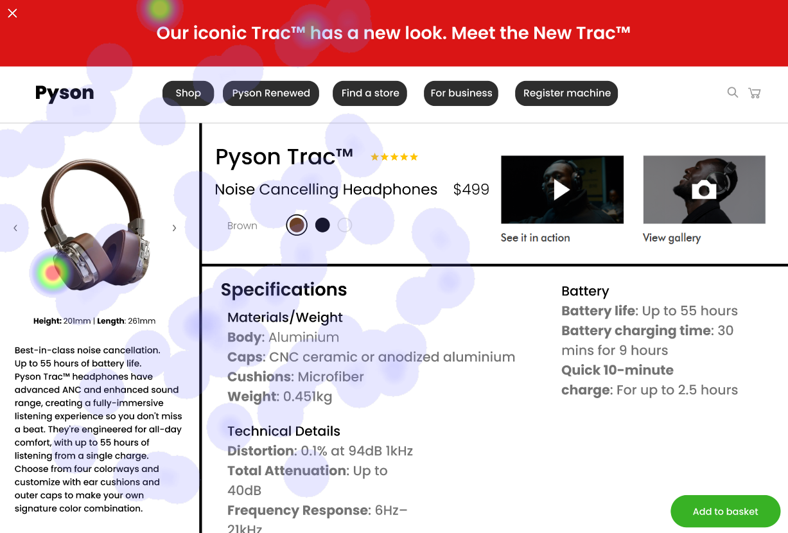
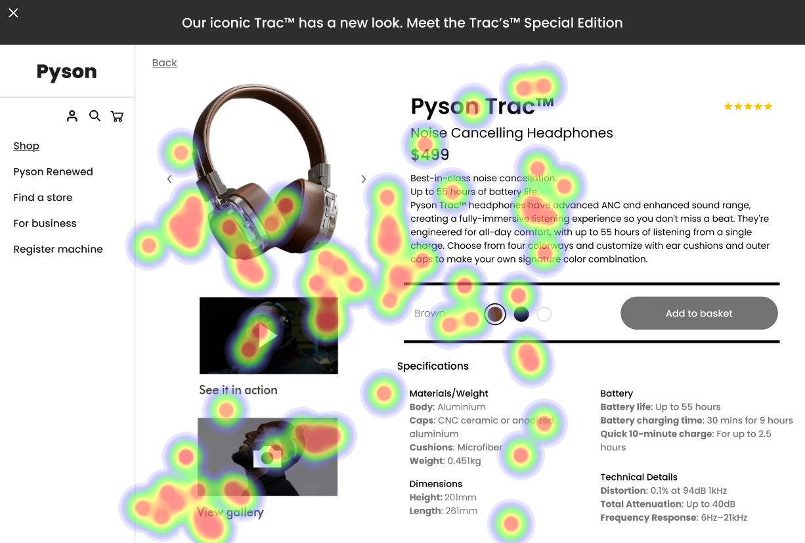
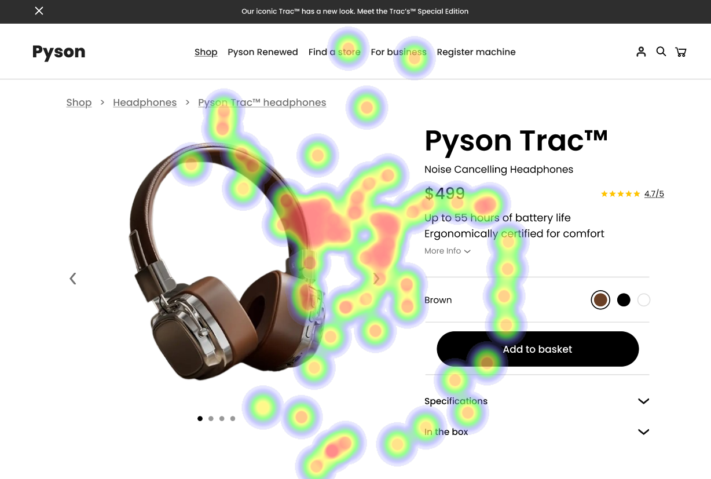

# UI Recommendations Report

## Image 1

### Strengths
- 🎯 The product image is large and centrally located, which naturally draws the user's eye.
  - 🔥 **Heatmap Correlation**: The heatmap shows high fixation on the product image, confirming its effectiveness in capturing user attention.
  
- 📌 The product title 'Pyson Trac™' is prominently displayed next to the star ratings, clearly indicating the product.
  - 🔥 **Heatmap Correlation**: The heatmap indicates significant attention on the product title and star ratings, supporting its effectiveness in providing key information to users at a glance.

- 🎥 The 'See it in action' and 'View gallery' buttons engage users with additional media.
  - 🔥 **Heatmap Correlation**: There is moderate attention on these buttons, highlighting user interest in multimedia experiences.

### Weaknesses
- 📏 The text related to specifications is very small.
  - **Reason**: This creates visual strain and makes it difficult to read quickly.
  - 🔥 **Heatmap Correlation**: Low attention to these specifications due to size and readability.
  - **Severity**: Medium
  - **Impact**: Reduces user engagement, leading to frustration.
  - **Recommendations**: 
    - Increase the text size to at least 16px.
    - Use a legible font family.
    - Position this section closer to the product image for better visibility.

- 🔵 The color options are circles with no labels.
  - **Reason**: This may cause confusion, especially for users with color vision deficiencies.
  - 🔥 **Heatmap Correlation**: Moderate attention indicates hesitation or need for closer inspection.
  - **Severity**: Medium
  - **Impact**: Leads to user frustration and unintended product selection.
  - **Recommendations**: 
    - Add color names or tooltips to each color circle.
    - Ensure labels are easily accessible.

- ⚪ The contrast of the 'Add to basket' button is low.
  - **Reason**: Makes it difficult to read and visually less prominent.
  - 🔥 **Heatmap Correlation**: Low attention on the button, indicating that users may be missing it.
  - **Severity**: Medium
  - **Impact**: Decreases call-to-action effectiveness.
  - **Recommendations**: 
    - Increase contrast to at least 4.5:1.
    - Consider changing the button color to a brighter hue.

### WCAG Standards
- The UI meets WCAG 2.1 Level A but has areas needing improvement to achieve Level AA compliance. Recommendations include increasing text size, enhancing color contrast, and providing clear labels for interactive elements.

## Image 2

### Strengths
- 🏷️ The product name 'Pyson Trac™' and price '$499' are positioned near the top.
  - 🔥 **Heatmap Correlation**: High concentration of user gaze confirms their importance.

- 🎨 Color options represented with visual icons attract user interaction.
  - 🔥 **Heatmap Correlation**: Significant user interaction indicates active consideration of choices.

### Weaknesses
- 📄 The description text uses a small font size.
  - **Reason**: Hinders readability, negatively impacting user experience.
  - 🔥 **Heatmap Correlation**: Little attention on the product description shows users may overlook it.
  - **Severity**: Medium
  - **Impact**: Important product details may be missed.
  - **Recommendations**: 
    - Increase the font size to at least 16px.
    - Ensure sufficient spacing between lines.

- ⏳ The 'Add to basket' button blends into the background.
  - **Reason**: Gray color lacks prominence, making it easy to miss.
  - 🔥 **Heatmap Correlation**: Minimal interaction indicates poor visibility.
  - **Severity**: High
  - **Impact**: Low visibility may lead to decreased conversion rates.
  - **Recommendations**: 
    - Change button color for greater visibility.
    - Increase size to make it a focal point.

### WCAG Standards
- The UI likely meets WCAG 2.1 Level AA standards, but improvements are necessary for the description text and 'Add to basket' button.

## Image 3

### Strengths
- 📷 The product image is large, centrally placed, and visually engaging.
  - 🔥 **Heatmap Correlation**: Very high fixation confirms it captures user attention effectively.

- 🛍️ The product name and price are prominently displayed and easy to read.
  - 🔥 **Heatmap Correlation**: Significant attention showing user interest.

- ✅ The 'Add to basket' button has high contrast and a good position.
  - 🔥 **Heatmap Correlation**: Concentrated area of high attention.

### Weaknesses
- 📏 Inconsistent spacing and alignment of elements.
  - **Reason**: Makes the page feel less professional and harder to scan.
  - 🔥 **Heatmap Correlation**: Scattered attention across the page.
  - **Severity**: Medium
  - **Impact**: Reduces user trust and complicates information retrieval.
  - **Recommendations**: 
    - Standardize spacing and alignment using a grid layout.
    - Ensure all interactive elements are properly aligned.

- 🔗 The 'More Info' link is small and low contrast.
  - **Reason**: Difficult to see and click.
  - 🔥 **Heatmap Correlation**: Very little attention indicates users may miss essential details.
  - **Severity**: Medium
  - **Impact**: Users may miss important product information.
  - **Recommendations**: 
    - Make the 'More Info' link larger.
    - Increase contrast to meet accessibility standards.
    - Position it appropriately for user expectation.

### WCAG Standards
- The UI likely meets WCAG 2.1 Level A standards, but issues need to be addressed for comprehensive compliance.

## Performance Metrics
- Total execution time: 104.08 seconds
- CrewAI analysis time: 67.06 seconds

