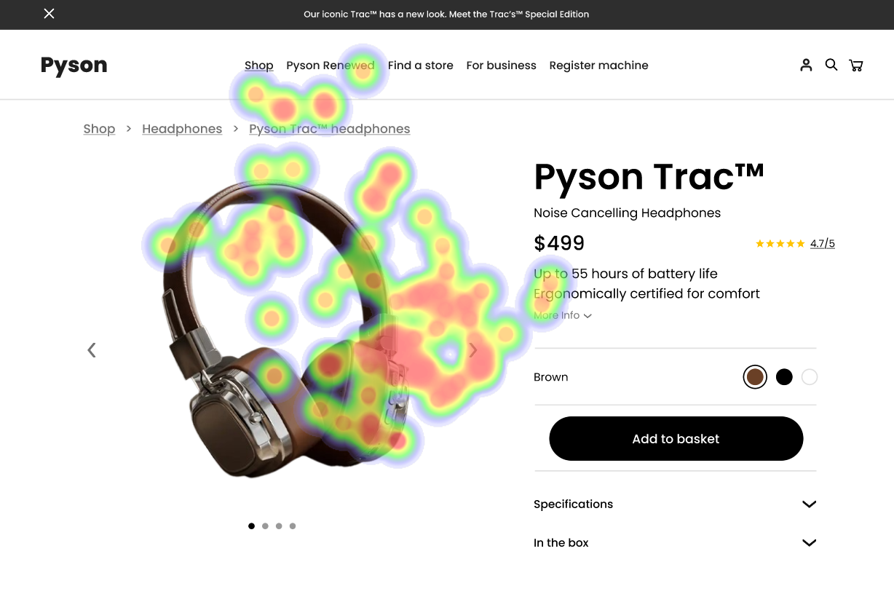

# UI Recommendations Report

This report collates the analysis and recommendations for UI improvements based on images reviewed. Each section corresponds to an image, detailing strengths, weaknesses, and actionable recommendations.

## Image 1

### Strengths
- 🖼️ **Large Product Image**: Centrally placed, effectively captures user attention and drives engagement.
- 🏪 **Prominent 'Find a Store' Link**: The focus on this link indicates high user interest in finding physical store locations.
- 💵 **Clear Product Name and Price**: Users can efficiently assess the product and its cost.

### Weaknesses
- 🔍 **Insufficient Contrast for Subtitles**:
  - **Reason**: Low visibility may lead users to overlook key details like battery life.
  - **Impact**: Incomplete purchasing decisions due to overlooked specifications.
  - **Recommendations**: 
    - Increase text contrast in the lower right corner (minimum ratio 4.5:1).
    - Ensure readability under varied lighting conditions.
  
- 🎨 **Brown Color Selection Blends**:
  - **Reason**: Reduced visibility for color options.
  - **Impact**: User frustration due to unclear color options.
  - **Recommendations**: 
    - Change background of the color selection area for better contrast.
    - Enlarge color swatches for visibility.

- ❌ **Small 'Add to Basket' Button**:
  - **Reason**: Less noticeable size affects final purchase actions.
  - **Impact**: Directly impacts conversion rates.
  - **Recommendations**: 
    - Resize button to increase visibility.
    - Consider relocating it to a more prominent position, such as the top right corner.

### WCAG Standards
- **Compliance**: Meets WCAG 2.1 Level AA standards, but requires improvements in text contrast and interactive element visibility.

## Image 2

### Strengths
- 🖼️ **Large Product Image**: Captures most attention effectively.
- 🏷️ **Prominent Product Title**: Easily readable and quickly identified by users.
- 💰 **Clear Price Display**: Follows standard e-commerce patterns and is a key factor in decision-making.

### Weaknesses
- 🎨 **Color Selection Options**:
  - **Reason**: Lack of immediate visual status for selections.
  - **Impact**: Poor customization experiences.
  - **Recommendations**: 
    - Increase size of color swatches.
    - Implement visual feedback, like borders or checkmarks.

- 🔗 **Small 'More Info' Link**:
  - **Reason**: Less visibility makes it likely to be ignored.
  - **Impact**: Users may overlook crucial information.
  - **Recommendations**: 
    - Increase size and contrast of the link.
    - Consider a button-style design for better visibility.

### WCAG Standards
- **Compliance**: WCAG 2.1 Level AA standards seem achievable; improvements in contrast and visual indicators needed.

## Image 3

### Strengths
- 🖼️ **Centrally Located Product Image**: Effectively draws immediate attention.
- 🌟 **Product Name and Five-Star Rating**: Demonstrates social proof and garners immediate recognition.
- 🎨 **Color Selection Options**: Visually highlights available choices effectively.

### Weaknesses
- 🔠 **Lack of Visual Hierarchy in Specifications**:
  - **Reason**: Uniform styling complicates scanning for key details.
  - **Impact**: May lead to overlooked product features.
  - **Recommendations**: 
    - Introduce structure with headings and varied font weights.
    - Implement bullet points for readability.

- ❌ **Small 'Add to Basket' Button**:
  - **Reason**: Diminished visibility may reduce user interaction.
  - **Impact**: Critical for engagement and conversion rates.
  - **Recommendations**: 
    - Increase button size and enhance visual prominence.
    - Reposition to a more eye-catching area.

### WCAG Standards
- **Compliance**: Preliminary assessment suggests adherence to WCAG 2.1 Level AA, with needed improvements in color contrast.

This comprehensive report outlines the strengths and weaknesses observed in the UI designs along with actionable recommendations aimed at improving user experience and accessibility.

## Performance Metrics
- Total execution time: 79.92 seconds
- CrewAI analysis time: 49.70 seconds

