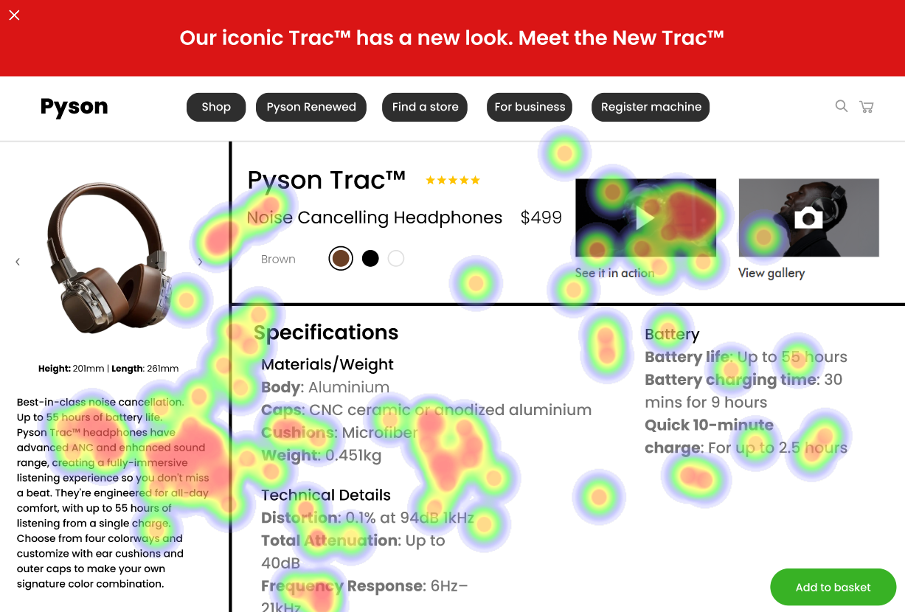
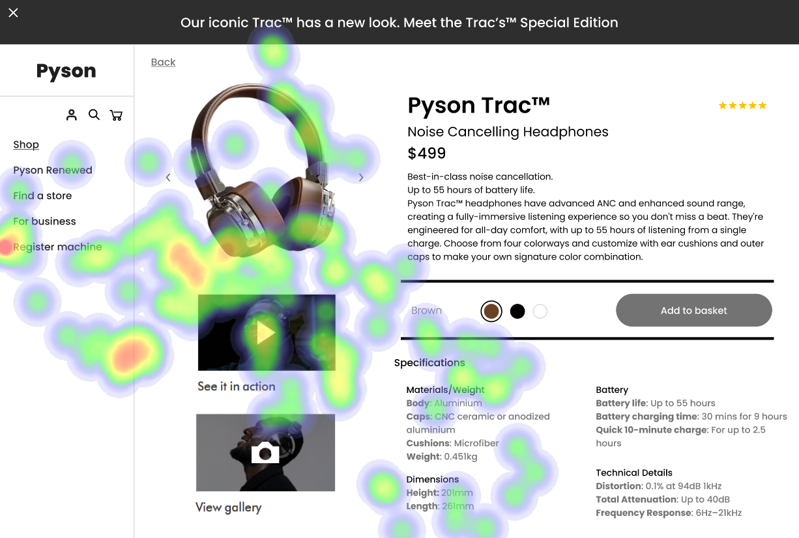

# UI Recommendations Report

## Image 1 Analysis

### Strengths
- The product image is large and centrally placed, immediately capturing the user's attention and creating a strong visual anchor. 
  - 🔥 Heatmap Correlation: High fixation on the product image confirms its effectiveness in capturing user attention.
- The 'See it in action' video is a dynamic element that draws attention due to its interactive nature.
  - 🎥 Heatmap Correlation: Significant user focus on the 'See it in action' video suggests that interactive elements effectively capture user attention.

### Weaknesses
- The contrast between the text and background in some areas is too low, making it difficult to read.
  - **Reason**: Certain labels in the specification section appear to have low contrast, affecting readability.
  - ⚠️ Heatmap Correlation: Lower intensity in the specifications section suggests users are not spending much time reading details.
  - **Severity**: Medium
  - **Impact**: Users may miss important information due to difficulty reading the text, leading to a poorer understanding of the product's features and benefits.
  - **Recommendations**: 
    - Increase the text contrast to at least 4.5:1 for all labels in the specifications section. 
    - Adjust the background color to enhance readability.

- The placement of the 'Add to basket' button may lead users to potentially ignore it.
  - **Reason**: The button is located in the bottom right corner of the screen, not standing out.
  - ⚠️ Heatmap Correlation: Low intensity around the 'Add to basket' button indicates it is likely being ignored.
  - **Severity**: Medium
  - **Impact**: Users may miss or hesitate to click the button, hindering completion of the purchase flow.
  - **Recommendations**: 
    - Reposition the 'Add to basket' button to the top right corner. 
    - Increase its size and color contrast to make it more prominent.

### WCAG Compliance
- The UI partially meets WCAG 2.1 AA standards but needs improvements for full compliance.

## Image 2 Analysis

### Strengths
- The product title and price are prominently displayed near the top of the page, making them easily visible.
  - 🔍 Heatmap Correlation: Notable user attention on the product name and price indicates quick identification of crucial information.
- The 'See it in action' video offers a more engaging and informative way to understand the product.
  - 🎬 Heatmap Correlation: Significant attention focused on the video section suggests users are highly interested in seeing the product in use.

### Weaknesses
- Lack of visual hierarchy and proximity between related elements in the specifications section creates a cluttered experience.
  - **Reason**: Important specifications are not clearly grouped, making it difficult for users to quickly scan the information.
  - ⚠️ Heatmap Correlation: Diffuse attention across the specifications section indicates lack of clear focus.
  - **Severity**: Medium
  - **Impact**: Users may struggle to find specific details, leading to frustration and decreased likelihood of purchase.
  - **Recommendations**: 
    - Introduce visual hierarchy by grouping related specifications with clear headings and sufficient spacing. 

- The color swatches lack sufficient visual differentiation.
  - **Reason**: The brown swatch blends into the background, and the white swatch lacks a distinct border.
  - ⚠️ Heatmap Correlation: Moderate attention on the color selection area, indicating users do not focus on each swatch.
  - **Severity**: Medium
  - **Impact**: Users may not notice all available color options, affecting their purchasing decision.
  - **Recommendations**: 
    - Redesign the color swatches to have distinct borders and higher contrast against the background for each option.

### WCAG Compliance
- The UI partially meets WCAG 2.1 standards but requires improvements to achieve full conformance.

## Image 3 Analysis

### Strengths
- The product image is large and centrally located, drawing immediate attention.
  - 👀 Heatmap Correlation: Concentrated focus around the product image shows users spend significant time viewing it.
- The 'Add to basket' button is large and has a high contrast with the background.
  - 🛒 Heatmap Correlation: Concentration of attention on the 'Add to basket' button indicates it is quickly and easily found.

### Weaknesses
- The color selection options are displayed as small circles with minimal text.
  - **Reason**: They lack visual prominence, making them difficult to notice and interact with.
  - ⚠️ Heatmap Correlation: Low attention on the color selection options suggests users do not readily notice them.
  - **Severity**: Medium
  - **Impact**: Users may overlook available color options, increasing interaction cost as they search for the information.
  - **Recommendations**: 
    - Increase the size of the color swatches and include labels directly next to them to enhance visibility.

### WCAG Compliance
- The UI partially meets WCAG 2.1 AA standards. Some areas need improvement to fully comply.

This structured report summarizes the strengths and weaknesses observed across the image interfaces, along with actionable recommendations to enhance the overall user experience and ensure compliance with web accessibility standards.

## Performance Metrics
- Total execution time: 81.81 seconds
- CrewAI analysis time: 48.85 seconds

