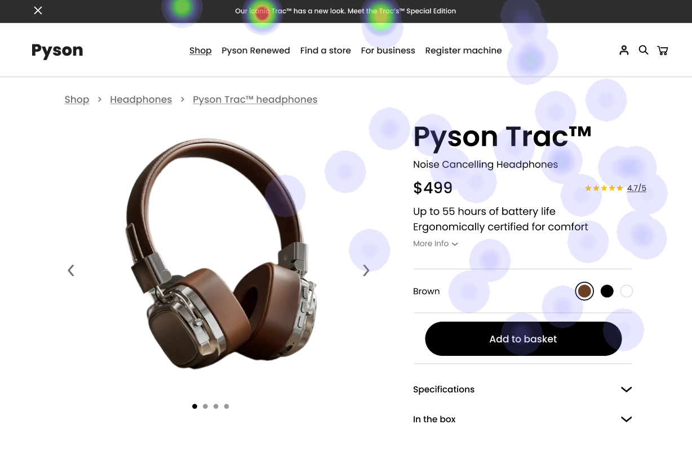
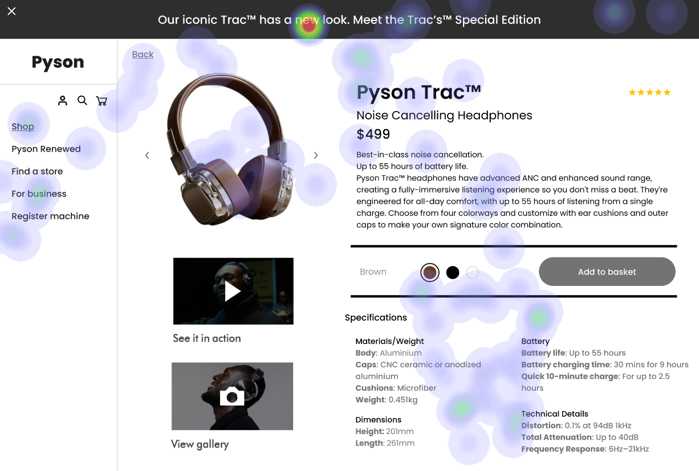
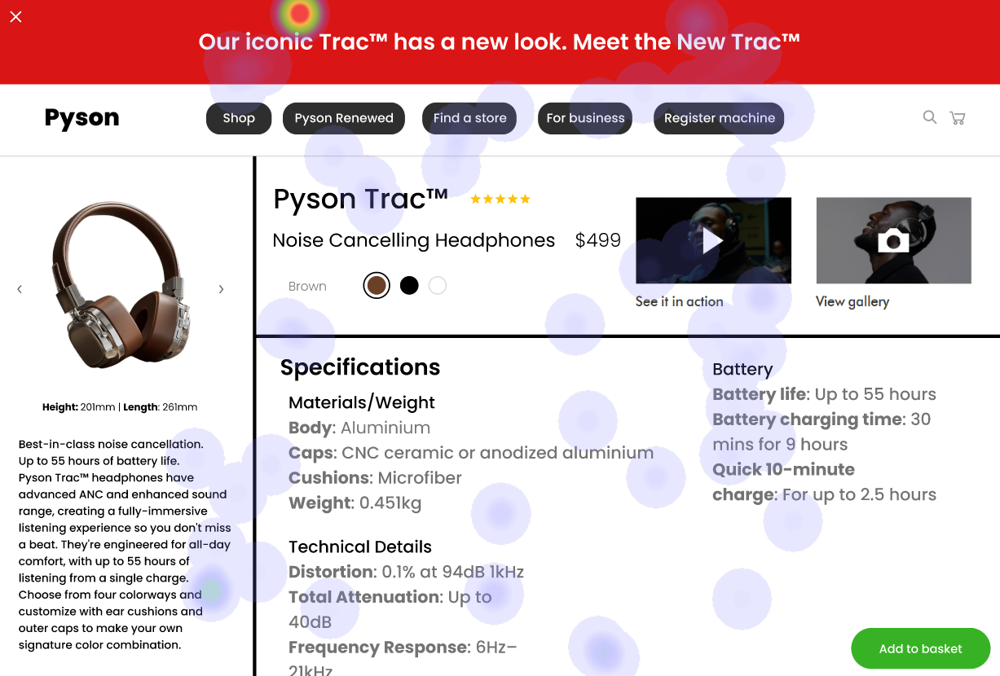

# UI Recommendations Report

## Image 1 Analysis

### Strengths
- **Product Name and Price**:  
  High fixation on these elements suggests effective visibility and alignment with user expectations. 📊
- **'Add to Basket' Button**:  
  Users direct their gaze towards the button, confirming its prominence in the user flow. 🛒

### Weaknesses
- **Lack of clear visual hierarchy in the top navigation**:  
  - **Reason**: Navigation items appear with similar visual weight, leading to confusion.  
  - **Heatmap Correlation**: Diffused attention on navigation items, indicating difficulty in discerning their importance.  
  - **Severity**: Medium  
  - **Impact**: Slows navigation, increasing users' time to find key categories.  
  - **Recommendations**: 
    - Implement a larger font size and varied weights to differentiate primary navigation items. 
    - Group them by importance and assign distinct colors for better clarity. 🎨  

### WCAG Standards
- UI likely meets WCAG 2.1 Level AA, but a detailed audit for contrast ratios and keyboard accessibility is necessary.

## Image 2 Analysis

### Strengths
- **Product Image**:  
  High gaze concentration confirms it as a focal point. 🖼️
- **Product Name and Price**:  
  Significant attention on these details indicates users are assessing product value. 💰

### Weaknesses
- **Specification text is small and dense**:
  - **Reason**: Low contrast and poor readability may lead to users overlooking important details.  
  - **Heatmap Correlation**: Low attention indicated here signals disengagement with vital product info.  
  - **Severity**: Medium  
  - **Impact**: Critical details may be missed, impacting purchase decisions and user satisfaction.  
  - **Recommendations**: 
    - Increase font size and adjust contrast to meet WCAG requirements of 4.5:1. 
    - Ensure specifications are clearly sectioned with adequate white space for better readability. 📏 

### WCAG Standards
- The UI likely meets WCAG 2.1 Level A but should be assessed for Level AA compliance with contrast adjustments.

## Image 3 Analysis

### Strengths
- **Product Image**:  
  Confirms the image is the primary attention-grabbing element. 🌟
- **Product Name and Price**:  
  Users are drawn to understand product offerings quickly. 📋

### Weaknesses
- **Poor color contrast for selection options**:
  - **Reason**: Low differentiation between color options can lead to errors in product selection.  
  - **Heatmap Correlation**: Dispersed focus in the color selection area indicates user difficulty.  
  - **Severity**: Medium  
  - **Impact**: User frustration may result in incorrect choices, reducing conversion rates.  
  - **Recommendations**: 
    - Enhance color contrast between options to ensure they are visually distinct. 
    - Use labels that clearly denote options and create hover effects to improve clarity. 🖍️ 

- **Low attention to product feature descriptions**:
  - **Reason**: Key selling points are poorly positioned, leading to lower engagement.  
  - **Heatmap Correlation**: Low gaze allocation suggests missed selling opportunities.  
  - **Severity**: Medium  
  - **Impact**: May hinder user understanding and interest in the product.  
  - **Recommendations**: 
    - Reposition key features to be closer to the product image and increase font size to enhance visibility. 
    - Use bullet points for clarity and succinctness. 📑 

### WCAG Standards
- UI needs a comprehensive audit for accessibility adherence, particularly for color contrast improvements.

This report summarizes the analysis and recommendations to improve the UI based on the observations made in each image. Implementing these changes can enhance user experience and interaction.

## Performance Metrics
- Total execution time: 52.55 seconds
- CrewAI analysis time: 25.07 seconds

