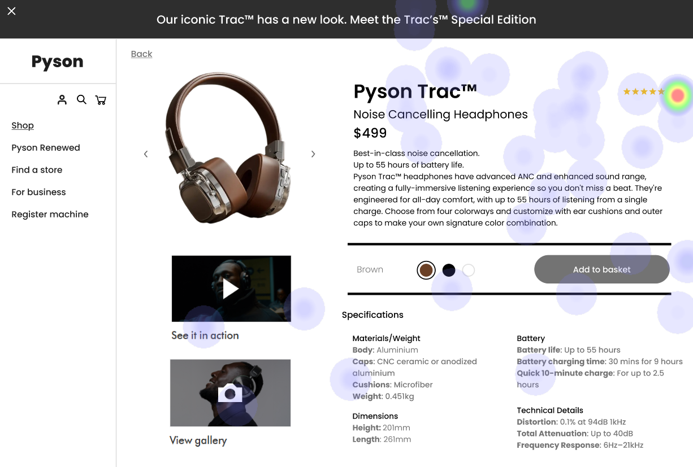

# UI Recommendations Report

## Image 1

### Strengths
- 🎯 The product image is large and centrally located, drawing the user's attention effectively.
  - Heatmap Correlation: Significant user focus on the product image confirms its effectiveness in capturing initial attention.
- 🏷️ The product name and price are prominently displayed near the product image.
  - Heatmap Correlation: Concentrated attention on these elements indicates users are actively seeking this key information.
- 🛒 The 'Add to basket' button is high-contrast and centrally placed.
  - Heatmap Correlation: Strong concentration of user attention around this button indicates its effectiveness in guiding interaction.

### Weaknesses
- 🔴 **Small Color Selection Circles**
  - Reason: Small size makes them difficult to target, especially on touch devices.
  - Heatmap Correlation: Diffuse attention around the color selection area suggests users struggle to select a color.
  - Severity: Medium
  - Impact: Users may experience frustration and increase cognitive load.
  - Recommendations: Increase the size of the color selection circles for better accessibility and compliance with Fitts's Law.
  
- 🔴 **Ambiguous 'More Info' Link**
  - Reason: Small and lacks strong visual cues, leading to potential oversight.
  - Heatmap Correlation: Little to no attention on this link indicates users are not engaging with it.
  - Severity: Low
  - Impact: Low discoverability can reduce the likelihood of purchase.
  - Recommendations: Increase size and contrast of the 'More Info' link and consider adding an icon for better visibility.

### WCAG Standards
- Ensure color contrast ratios for all text elements meet the minimum required ratios, images have appropriate alternative text, and all interactive elements are navigable via keyboard.

## Image 2

### Strengths
- 🎉 The product image is prominently displayed on the left side of the page.
  - Heatmap Correlation: High concentration of user gaze confirms its effectiveness in capturing initial attention.
- 🖊️ The headline effectively communicates the product with clear visibility.
  - Heatmap Correlation: High level of user engagement with the headline indicates its attractiveness.

### Weaknesses
- 🔴 **Low Visibility of 'Add to basket' Button**
  - Reason: Located in the bottom right corner without sufficient standout.
  - Heatmap Correlation: Low concentration of user gaze shows users need to search for it.
  - Severity: Medium
  - Impact: Delayed purchases due to users searching for the button.
  - Recommendations: Reposition the 'Add to basket' button to a more prominent location near the product image and enhance its contrast.

- 🔴 **Small Font Size in 'Specifications' Section**
  - Reason: Small text sizes hinder visibility and readability.
  - Heatmap Correlation: Minimal attention in this section suggests users may overlook it.
  - Severity: Medium
  - Impact: Difficult-to-read specifications may frustrate users and lead to uninformed decisions.
  - Recommendations: Increase font size and ensure it adheres to readability best practices with good contrast.

### WCAG Standards
- A comprehensive accessibility audit is needed to ensure full compliance, particularly regarding text contrast and font sizes.

## Image 3

### Strengths
- 📷 The product image is centrally located and large.
  - Heatmap Correlation: High fixation on the product image confirms its ability to capture user attention.
- 🔖 The product name and price are effectively grouped.
  - Heatmap Correlation: Moderate attention indicates easy availability of this information.
- ⭐ Customer ratings are prominently displayed.
  - Heatmap Correlation: Distinct hot spot over the ratings suggests active user engagement.

### Weaknesses
- 🔴 **Small Text Sizes in Specifications Section**
  - Reason: Small text size frustrates users and affects readability.
  - Heatmap Correlation: Minimal attention indicates users may skip important information.
  - Severity: Medium
  - Impact: Users may miss crucial details, leading to misinformed purchase decisions.
  - Recommendations: Increase font size and ensure it meets WCAG readability standards.

- 🔴 **Low Contrast in Product Color Options**
  - Reason: Low contrast makes distinguishing between colors difficult.
  - Heatmap Correlation: Lower engagement with color options suggests confusion.
  - Severity: Medium
  - Impact: Users may select incorrect colors leading to frustration.
  - Recommendations: Improve color contrast by adjusting the selection palette; ensure compliance with WCAG standards.

### WCAG Standards
- The UI likely meets WCAG 2.1 standards at Level A but has areas needing improvement to achieve Level AA compliance, particularly in text contrast and sizing.

This report encapsulates the key recommendations derived from the UI analysis for each image. Implementing these changes will enhance user experience and accessibility.

## Performance Metrics
- Total execution time: 72.38 seconds
- CrewAI analysis time: 33.94 seconds

