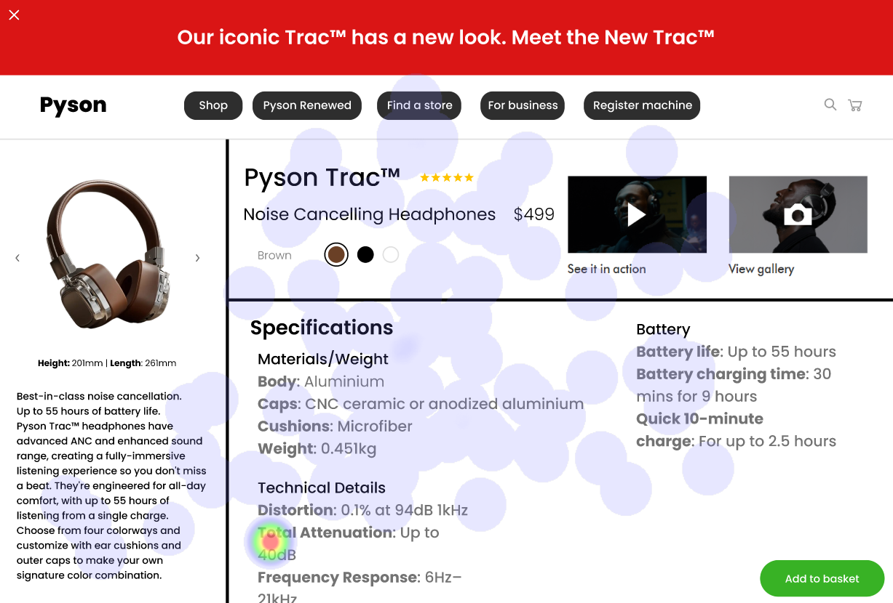

# UI Recommendations Report

## Image 1

### Strengths
- The product image is large, centrally placed, and visually appealing, drawing immediate attention. 👍
  - Heatmap correlation: High fixation on the product image confirms its effectiveness in capturing user attention.
  
- The product name and price are clearly displayed near the product image, ensuring users can quickly identify the product and its cost. 💵
  - Heatmap correlation: Concentrated attention around the product name and price, indicating users actively seek this information.
  
- The 'Add to basket' button has reasonable attention, indicating users are finding and engaging with the primary call to action on the page. 🛒
  - Heatmap correlation: Degree of fixation on the 'Add to basket' button.

### Weaknesses
- **Color Options**: The color options are visually very small and the label 'Brown' does not correspond well with the selected color shown in the circle. 🟤
  - **Reason**: This can cause confusion for the user trying to select the different colors.
  - **Heatmap correlation**: Low attention in this area compared to the main product information.
  - **Severity**: Medium
  - **Impact**: Prevents effective selection of color options, leading to dissatisfaction and potential abandonment.
  - **Recommendations**:
    - Increase the size of the color options for better visibility.
    - Improve label-color correspondence.
    - Make the selectable aspect clearer through design cues.

- **Breadcrumb Navigation**: Breadcrumb navigation is small and low contrast. 🧭
  - **Reason**: Reduces discoverability and wayfinding capabilities.
  - **Heatmap correlation**: Low attention, suggesting users do not frequently use it for navigation.
  - **Severity**: Medium
  - **Impact**: Users may struggle to understand their current location within the site.
  - **Recommendations**:
    - Increase the font size and contrast of the breadcrumb navigation for better visibility.

- **Text Contrast**: Some text elements may not meet the required 4.5:1 contrast ratio for normal text. 📉
  - **Reason**: Reduced readability leads to user frustration.
  - **Heatmap correlation**: Moderate attention on the description.
  - **Severity**: Medium
  - **Impact**: Can lead to abandonment of the purchase.
  - **Recommendations**:
    - Adjust the text color to achieve the required contrast ratio and improve readability for all users.

### WCAG Standards
- Some text elements may not meet WCAG guidelines for contrast, indicating a need for improvement to ensure compliance and inclusivity for users with visual impairments.

## Image 2

### Strengths
- The product image is large and centrally located, adhering to common e-commerce practices. 📸
  - Heatmap correlation: Significant focus on the product image indicating high user engagement.
  
- The product name and price are prominently displayed, facilitating quick identification. 💲
  - Heatmap correlation: Considerable attention confirmed on the product name and price.
  
- The Add to Basket button is a high-contrast black button, making it visually distinct and easy to locate. 🔲
  - Heatmap correlation: Some attention noted, but may still need optimization to increase visibility.

### Weaknesses
- **Small Font Size**: The 'More Info' link is hard to notice due to its smaller font. 📖
  - **Reason**: Low visibility affects user ability to access important product details.
  - **Heatmap correlation**: Very little attention on the link suggests low usability.
  - **Severity**: Low
  - **Impact**: Users may overlook important product details.
  - **Recommendations**:
    - Increase the font size.
    - Differentiate the link visually for enhanced visibility.

- **Lack of Visual Hierarchy**: Specifications and 'In the Box' sections lack strong visual indicators. 📏
  - **Reason**: These sections do not grab user attention effectively.
  - **Heatmap correlation**: Moderate attention noted but less than critical areas.
  - **Severity**: Low
  - **Impact**: Users may overlook important product information.
  - **Recommendations**:
    - Enhance visual hierarchy by adjusting font sizes and adding visual cues like borders or backgrounds.

### WCAG Standards
- Some elements may not fully comply with WCAG 2.1 guidelines, indicating areas for improvement particularly with contrast and keyboard navigation for accessibility.

## Image 3

### Strengths
- The product image is large, centrally located, and visually appealing. 🌟
  - Heatmap correlation: High fixation on the product image.

- The product name and price are clearly identifiable. 🏷️
  - Heatmap correlation: Significant attention to the product name and price.

- The 'See it in action' and 'View gallery' initiatives are well-received, suggesting effectiveness. 👀
  - Heatmap correlation: Users pay attention to these previews.

### Weaknesses
- **Call-to-Action Hierarchy**: Lack of clear hierarchy for the 'Add to Basket' button. 🚪
  - **Reason**: The button isn’t visually prominent, risking reduced conversions.
  - **Heatmap correlation**: Lower attention indicates potential difficulty for users to locate it.
  - **Severity**: Medium
  - **Impact**: Could lead to missed conversion opportunities.
  - **Recommendations**:
    - Improve button color contrast.
    - Reposition to a more visible area (such as top-right).
    - Consider adding animation to draw attention.

- **Low Contrast in Description Text**: Affects readability and engagement. 🔍
  - **Reason**: Impedes user understanding of product details.
  - **Heatmap correlation**: Moderate attention but lower than essential elements.
  - **Severity**: Medium
  - **Impact**: May frustrate users, leading to shorter engagement with the product page.
  - **Recommendations**:
    - Adjust the text color to enhance contrast against the background, ensuring compliance with WCAG standards.

### WCAG Standards
- Likely meets Level A of WCAG 2.1 but needs improvements to achieve Level AA, especially regarding contrast and screen access.

###

## Performance Metrics
- Total execution time: 74.56 seconds
- CrewAI analysis time: 39.54 seconds

