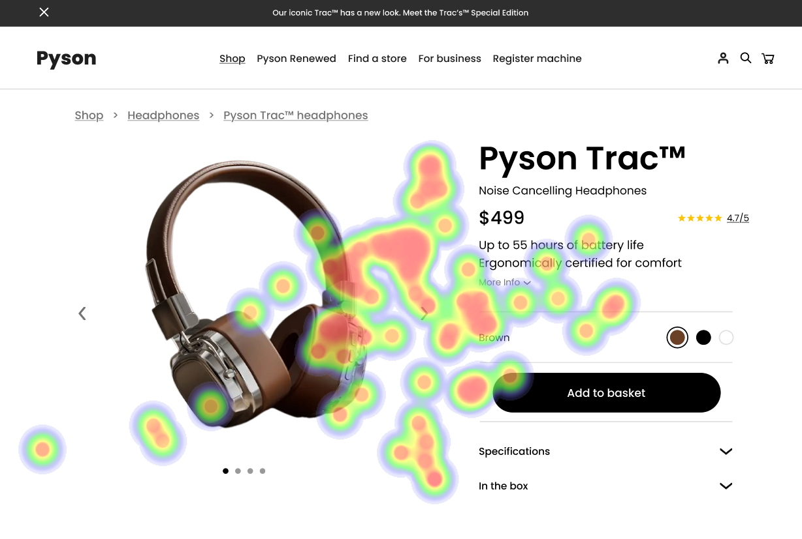

# UI Recommendations Report

This report outlines the analysis and recommendations based on the UI effectiveness for three images. Each section provides insights derived from heatmap data along with corresponding strengths, weaknesses, and recommendations for improvement.

## Image 1

### Strengths
- **Product Image is large and centrally located** 🌟
  - High concentration of user gaze on the product image indicates its role in attracting and maintaining attention.
  
- **Product Name and Price are prominently displayed** 💰
  - Significant user attention around the product name and price suggests they successfully inform users about the product.
  
- **"Add to Basket" button is prominent and centrally located** 🛒
  - The heatmap confirms that the button receives significant attention, indicating that users are finding it easily and engaging with it.

### Weaknesses
- **Color Options are represented as small circles with subtle variations** 🎨
  - This leads to difficulties in differentiating options, making it hard for users to select their preferred color.
  - Heatmap shows low attention on color options, suggesting users are overlooking these elements.
  - **Severity:** Medium 
  - **Impact:** Users may select colors incorrectly or miss options entirely, leading to frustration and impacting satisfaction.
  - **Recommendations:**
    - Increase size of color swatches and add a bold border or highlight effect to make them more distinguishable. 
    - Improve color contrast between swatches and background to enhance visibility. 
    - Ensure colors are distinctly different to prevent confusion.
  
- **"More Info" link is less prominent and easy to overlook** 🔍
  - Smaller font and dull color make this link easy to miss, leading to gaps in user knowledge about the product.
  - Heatmap indicates little user focus on the "More Info" link, suggesting lack of awareness of additional product details.
  - **Severity:** Low 
  - **Impact:** Reduced likelihood of making informed purchase decisions, which can lead to potential frustration.
  - **Recommendations:**
    - Increase font size of the "More Info" link. 
    - Use a bolder color for better contrast, and position it in a more visible area.

### Accessibility Compliance
- The UI meets some WCAG 2.1 Level AA standards, but improvements are needed for color contrast and element visibility, particularly for users with visual impairments.

## Image 2

### Strengths
- **Specifications Section is clearly labeled and detailed** 📋
  - Strong focus indicates users actively seek out this information for understanding product features.

### Weaknesses
- **"Add to Basket" button has low visual prominence** 🚫
  - Low contrast against the background makes it difficult to locate.
  - Heatmap reveals a relative lack of attention on the button, suggesting users are not engaging with it effectively.
  - **Severity:** High 
  - **Impact:** Decreased likelihood of purchase due to difficulty in locating the button.
  - **Recommendations:**
    - Increase the button's contrast ratio to at least 4.5:1 against the background.
    - Enlarge its size and consider repositioning it near the product image for better visibility.
  
- **Color Options are not easily identifiable** 🎨
  - Small, similar circles lack clear affordance leading to inefficient user interaction.
  - Heatmap shows users displayed diffuse attention on color options, indicating potential overlook.
  - **Severity:** Medium 
  - **Impact:** Frustration and potential abandonment of the purchase process.
  - **Recommendations:**
    - Enlarge color swatches and enhance visual cues by using more distinctive color borders or icons to indicate selected states.

### Accessibility Compliance
- UI appears partially compliant with WCAG 2.1 Level AA due to contrast issues in buttons and color selection; adjustments needed to meet standards.

## Image 3

### Strengths
- **Product Image is centrally located and visually appealing** 🌠
  - High focus indicates success in capturing user interest.

- **Product Title and Price are prominently placed** 📈
  - Significant engagement points to effectiveness in conveying essential product information.

### Weaknesses
- **Color selection options lack clear visual cues** 🎨
  - Small, similar color options can confuse users, impacting selection efficiency.
  - Heatmap indicates less intense attention on color options, suggesting they are not immediately noticed.
  - **Severity:** Medium 
  - **Impact:** Users may abandon attempts to select a preferred color.
  
- **Specifications Section uses small text and is densely packed** 📖
  - Difficult to scan quickly for information, potentially leading to user frustration.
  - Heatmap reveals scattered user attention, indicating low effectiveness in communicating product details.
  - **Severity:** Medium 
  - **Impact:** Harder for users to absorb key information essential for purchasing decisions.
  - **Recommendations:**
    - Increase font size and whitespace in the specifications section to make it more scannable and user-friendly.

### Accessibility Compliance
- Initial assessments suggest the UI partially meets WCAG 2.1 Level A but lacks compliance with aspects relating to color differentiation and contrast.

This report provides a comprehensive overview of the UI performance across the analyzed images, highlighting strengths and areas for improvement, along with actionable recommendations to enhance user experience and accessibility.

## Performance Metrics
- Total execution time: 79.18 seconds
- CrewAI analysis time: 35.81 seconds

