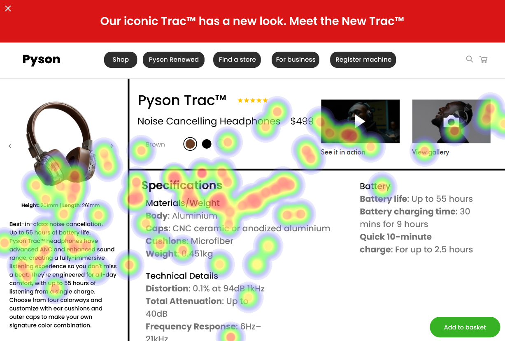
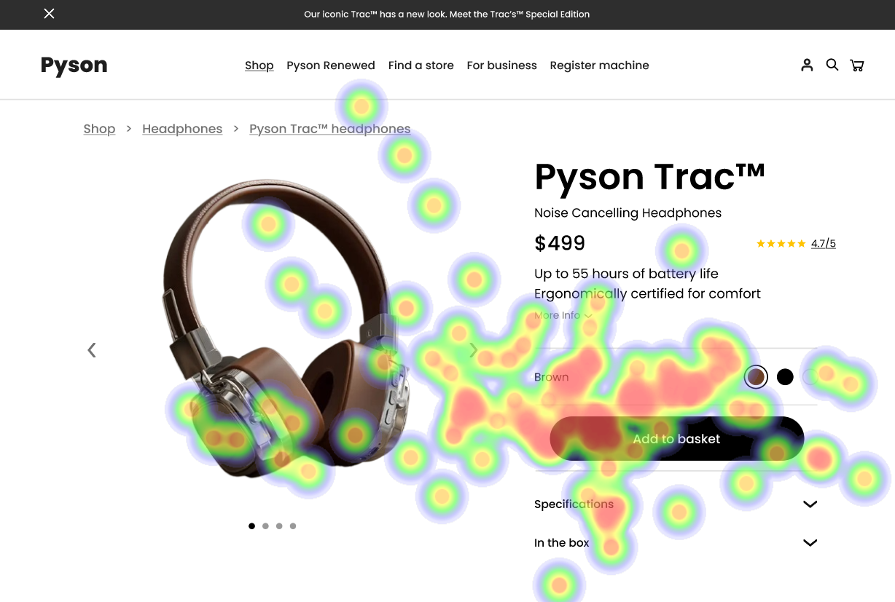

# UI Recommendations Report

This report summarizes the strengths and weaknesses identified in the current user interface along with actionable recommendations for improvement based on analyzed heatmap data.

## Image 1

### Strengths
- 🎨 The product image is large, centrally located, and visually appealing, drawing immediate attention to the headphones.
  - Heatmap shows high fixation on the product image, confirming its effectiveness in capturing user attention.
- 💰 The product name and price are prominently displayed, making them easily noticeable.
  - Heatmap data indicates significant user focus on the product name and price, supporting their effectiveness in engaging the user.

### Weaknesses
- ➖ The size and placement of the "Add to basket" button is not prominent enough.
  - **Reason:** Located in the bottom right corner, this button does not attract sufficient attention and hinders quick purchase operations.
  - **Heatmap Correlation:** Low attention to the "Add to basket" button, indicating poor visibility and interaction.
  - **Severity:** High
  - **Impact:** Users may overlook the button, decreasing conversion rates and negatively affecting sales.
  - **Recommendations:** 
    - Increase the button's size and reposition it to the top-right corner.
    - Change the button color to increase contrast against the background to a minimum of 4.5:1.

- ➖ Color selection icons lack sufficient contrast, making them hard to distinguish.
  - **Reason:** Low contrast between the color options and the background reduces their visibility and usability.
  - **Heatmap Correlation:** Scattered attention around the color options, indicating struggles in identifying colors.
  - **Severity:** Medium
  - **Impact:** Users may face frustration or misselect color options, leading to a negative experience.
  - **Recommendations:** 
    - Enhance the contrast of color selection icons to meet WCAG 2.1 standards.
    - Adjust the shades to ensure clear visibility.

- ➖ Specifications section text size is too small for readability.
  - **Reason:** Small text size makes it hard to read, particularly affecting users with visual impairments.
  - **Heatmap Correlation:** Users may overlook this section due to small text size.
  - **Severity:** Medium
  - **Impact:** Reduced readability can lead to skipped information critical for product understanding.
  - **Recommendations:** 
    - Increase the text size of the specifications section to at least 16px.
    - Ensure adequate contrast with the background.

### WCAG Compliance
- The site likely aims for WCAG 2.1 Level AA compliance but needs auditing. Problems with text contrast and small font sizes may violate accessibility guidelines.

## Image 2

### Strengths
- 🎥 The "See it in action" and "View gallery" previews provide engaging dynamic content that enhances the user experience.
  - Heatmap shows moderate attention to these previews, suggesting users find them valuable.

### Weaknesses
- ➖ The "Add to basket" button has low visibility against its background.
  - **Reason:** While positioned well, its color does not provide enough contrast, making it challenging for users to locate.
  - **Heatmap Correlation:** Scattered attention around the button highlights poor visibility.
  - **Severity:** High
  - **Impact:** Reduced clarity can lead to decreased conversion rates.
  - **Recommendations:** 
    - Increase the contrast level of the button to a minimum of 4.5:1.
    - Consider a more vibrant color that stands out against the background.

- ➖ Collapsed sections for "More Info", "Specifications", and "In the box" hide important details.
  - **Reason:** Users need to click to expand these sections, creating friction in finding essential product information.
  - **Heatmap Correlation:** Indicates low initial attention, suggesting users may not engage with collapsed sections.
  - **Severity:** Medium
  - **Impact:** Hiding this information may impede decision-making, risking abandonment.
  - **Recommendations:** 
    - Consider displaying these sections fully by default or using an accordion style for easy expansion, making details more accessible.

### WCAG Compliance
- The UI needs improvements to meet WCAG 2.1 Level AA standards, particularly concerning color contrasts and text size.

## Image 3

### Strengths
- 📸 The product image serves as an effective focal point due to its size and positioning.
  - Heatmap shows strong concentration of user fixations on the product image, aligning with user expectations.

### Weaknesses
- ➖ Navigation bar elements are largely ignored by users.
  - **Reason:** These elements appear less relevant when users are engaged with specific product purchasing decisions.
  - **Heatmap Correlation:** Minimal attention to navigation indicates a focus on the product.
  - **Severity:** Medium-High
  - **Impact:** Navigating away later could hinder overall user satisfaction.
  - **Recommendations:** 
    - Increase the navigation bar's prominence with a contrasting background and larger text.
    - Improve its positioning or add highlighted interactive cues to stimulate exploration.

- ➖ Product carousel control buttons are subtle and poorly differentiated.
  - **Reason:** Small size and low contrast reduce user discoverability and interaction.
  - **Heatmap Correlation:** Little interaction with these controls suggests users do not recognize their purpose.
  - **Severity:** Medium
  - **Impact:** Low engagement with the carousel limits the user's ability to view the product from multiple angles.
  - **Recommendations:** 
    - Revamp the design of carousel controls with a more discernible size.
    - Provide distinct colors to enhance visibility and encourage interaction.

### WCAG Compliance
- The elements on the page appear close to meeting WCAG 2.1 Level AA, but specific components like color contrasts need verification.

By following these recommendations, the user interface can significantly improve in terms of usability, accessibility, and ultimately conversion rates.

## Performance Metrics
- Total execution time: 77.16 seconds
- CrewAI analysis time: 48.64 seconds

