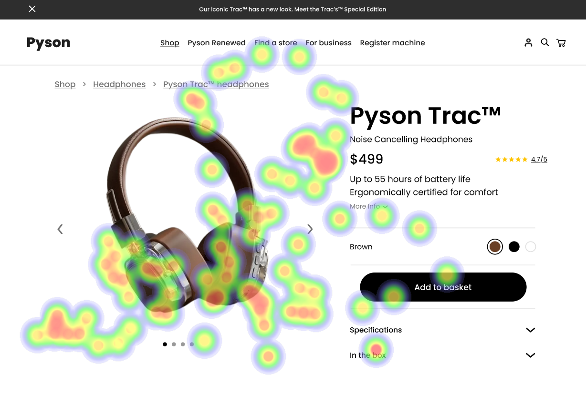
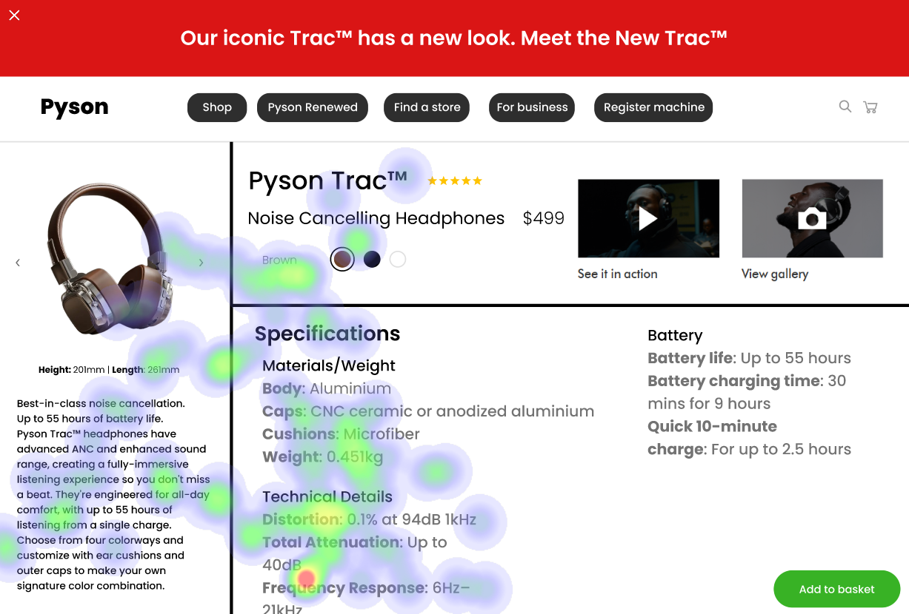
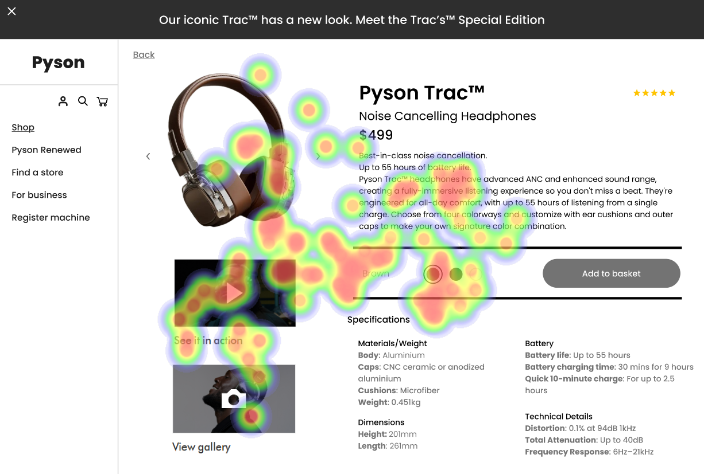

# UI Recommendations Report

## Image 1

### Strengths
- The product image is large and centrally placed, naturally drawing the user's attention. 🖼️
- The product name and price are prominently displayed near the product image. 💲
- The 'Add to basket' button has a dark background with white text, making it highly visible. ✅

### Weaknesses
- **Weakness**: The product color options are relatively small and lack descriptive labels. ❌  
  **Reason**: This makes it difficult for users to quickly identify and select their desired color, violating Nielsen's heuristics for usability.  
  **Heatmap Correlation**: The heatmap indicates a lower level of attention on the color options compared to the product image or 'Add to basket' button.  
  **Severity**: Medium  
  **Impact**: Users may overlook the color options or have difficulty selecting their preferred color, leading to delayed or abandoned purchases.  
  **Recommendations**: 
  - Increase the size and prominence of color selection circles. 
  - Use distinct visual cues and labels for each color option.
  - Possibly implement tooltips to explain each color clearly. 🎨

### WCAG Standards
- The UI appears to partially meet web accessibility standards but needs significant improvements in color contrast and element visibility. ⚖️

## Image 2

### Strengths
- The product title and price are well-placed next to the product image. 🏷️

### Weaknesses
- **Weakness**: The color selection options have low visual contrast. ❌  
  **Reason**: This reduces distinguishability, going against WCAG guidelines for text contrast, posing challenges for users with visual impairments.  
  **Heatmap Correlation**: The heatmap shows scattered attention around the color options, suggesting users struggle to engage with them.  
  **Severity**: Medium  
  **Impact**: Users may become frustrated and spend more time evaluating their choices, which could lead to abandoning the site altogether.  
  **Recommendations**: 
  - Enhance the contrast of the color selection options. 
  - Increase their size.
  - Consider adding hover text to provide additional information about each color. 🌈

### WCAG Standards
- The UI meets some Level A guidelines but requires additional work to meet Level AA standards, especially concerning contrast ratios. ⚖️

## Image 3

### Strengths
- The product image is visually appealing and prominently featured. 🌟

### Weaknesses
- **Weakness**: The 'Add to basket' button is poorly positioned in the bottom-right corner. ❌  
  **Reason**: Its location is less prominent and the color blends into the background, which violates Fitts's Law regarding ease of targeting.  
  **Heatmap Correlation**: The heatmap shows relatively low attention on the 'Add to basket' button, indicating it's not immediately visible to users.  
  **Severity**: Medium  
  **Impact**: This oversight may hinder conversion rates as users may overlook the button entirely.  
  **Recommendations**: 
  - Reposition the 'Add to basket' button to a more central location. 
  - Adjust its color to ensure a high contrast ratio, making it visually distinct. 🚀

### WCAG Standards
- Potentially fails to meet important Level AA requirements due to low contrast and unclear interaction affordances. ⚖️

This organized report provides a clear overview of the UI strengths and weaknesses for each image, along with actionable recommendations to enhance user experience and accessibility.

## Performance Metrics
- Total execution time: 67.78 seconds
- CrewAI analysis time: 33.00 seconds

