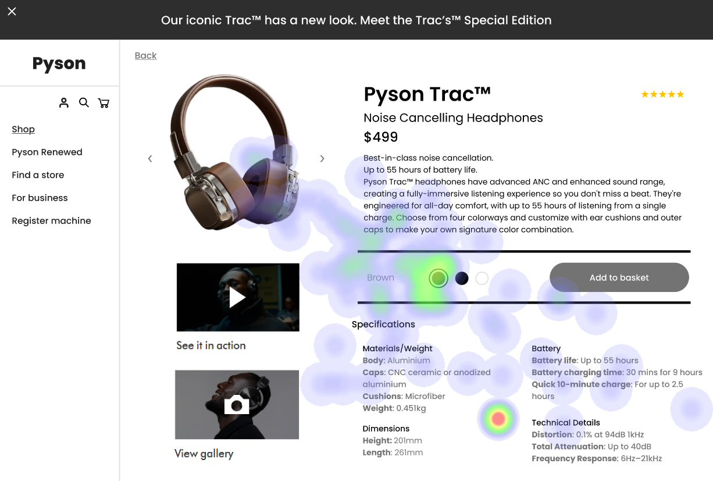

# UI Recommendations Report

## Image 1

### Strengths
- The product image is large and centrally placed, immediately capturing attention. 🌟
  - **Heatmap Correlation:** High fixation on the headphones confirms that users are drawn to the visual representation of the product.
- The product title 'Pyson Trac™' is clearly legible and positioned well.
  - **Heatmap Correlation:** High attention on the product title indicates users are actively seeking product identity.
- The price '$499' is displayed prominently below the product name.
  - **Heatmap Correlation:** Notable fixation on the price shows user interest in product cost.

### Weaknesses
- The clickable 'More Info' text link is small and may be easily overlooked.
  - **Reason:** Its size and low prominence may cause users to miss key information about additional product features.
  - **Heatmap Correlation:** Low attention in that area suggests users are likely to overlook it.
  - **Severity:** Medium
  - **Impact:** Reduced likelihood of purchase due to missed information.
  - **Recommendations:** 
    - Increase the size of the 'More Info' link and change its color to bright cyan or orange.
    - Ensure it adheres to accessibility standards to enhance visibility. 🎨
    
- The specifications (product dimensions, battery life) are formatted as a wall of text, negatively impacting readability.
  - **Reason:** Poor formatting can discourage users from engaging with important product details.
  - **Heatmap Correlation:** Low fixation suggests users are not reading this content thoroughly.
  - **Severity:** Medium
  - **Impact:** Users may miss essential details leading to post-purchase dissatisfaction.
  - **Recommendations:** 
    - Implement bullet points or collapsible sections for easy scanning. 
    - Improve temporal engagement with the specifications. 📋

### WCAG Standards Compliance
- The UI meets WCAG 2.1 Level AA, but adjustments are needed for smaller text elements to comply fully with contrast ratio requirements.

## Image 2

### Strengths
- The product image is prominently displayed on the left side of the page.
  - **Heatmap Correlation:** High fixation around the product image confirms its effectiveness in capturing user attention.
- The product name and price are positioned close together.
  - **Heatmap Correlation:** Indicates users are actively looking for this information, as confirmed by combined fixation.
- The 'See it in action' video thumbnail invites further engagement.
  - **Heatmap Correlation:** Notable attention on the thumbnail suggests users prefer dynamic engagement. 🎥

### Weaknesses
- Text providing product dimensions is small and positioned far from the product image.
  - **Reason:** Difficult to access key sizing information quickly.
  - **Heatmap Correlation:** Low attention in this area suggests users are not noticing or engaging with this information.
  - **Severity:** Medium
  - **Impact:** Users may face dissatisfaction if the product doesn't meet their expectations regarding size.
  - **Recommendations:** 
    - Increase font size and place dimensions closer to the product image for improved visibility. 🔍

- Color selection circles lack clear visual affordance.
  - **Reason:** Small size makes it unclear that these options are interactive.
  - **Heatmap Correlation:** Dispersed attention suggests users are struggling to identify these options as actionable.
  - **Severity:** Medium
  - **Impact:** Users may not explore color options due to confusion, limiting their choices.
  - **Recommendations:** 
    - Make the color selection circles larger and add hover states or animations to indicate interactivity. 💡

### WCAG Standards Compliance
- The UI complies with WCAG 2.1 Level AA standards, but further assessment is required to ensure all color contrast ratios meet level requirements.

## Image 3

### Strengths
- The large centrally placed product image aligns with visual hierarchy principles.
  - **Heatmap Correlation:** Strong user gaze concentration confirms its effectiveness in capturing user attention. 👀
- Product name and price are positioned prominently near the top.
  - **Heatmap Correlation:** Significant attention in this area supports the visibility of this crucial information.
- 'Add to basket' button uses contrasting color to stand out.
  - **Heatmap Correlation:** High user focus on the button indicates it effectively captures attention and encourages interaction. 🛒

### Weaknesses
- Color selection options are not visually distinct, making it hard to differentiate.
  - **Reason:** Users may struggle to quickly identify and select a color.
  - **Heatmap Correlation:** Dispersed attention indicates users spend more time scanning for the correct color rather than selecting easily.
  - **Severity:** Medium
  - **Impact:** Frustration may lead to reduced likelihood of purchase.
  - **Recommendations:** 
    - Increase contrast or add borders to color selection options to enhance differentiation. 🎨

- The specifications section presents a wall of text, discouraging user engagement.
  - **Reason:** Poorly formatted text inhibits easy skimming of essential product details. 
  - **Heatmap Correlation:** Low attention suggests that users are not engaging with the specifications content.

- Dimensions presented in millimeters may not resonate with users accustomed to different units.
  - **Reason:** Diversity in measurement systems can confuse users during the decision process.
  - **Heatmap Correlation:** Minimal attention indicates disengagement with this information due to unfamiliarity.
  - **Severity:** Low
  - **Impact:** Could lead to dissatisfaction if users misinterpret size expectations.
  - **Recommendations:**
    - Add a unit conversion option or display dimensions in both metrics (mm and inches). 🌍

### WCAG Standards Compliance
- The UI likely meets WCAG 2.1 Level A, requiring further checks on contrast ratios and semantic structure for Level AA compliance.

## Performance Metrics
- Total execution time: 84.59 seconds
- CrewAI analysis time: 52.42 seconds

