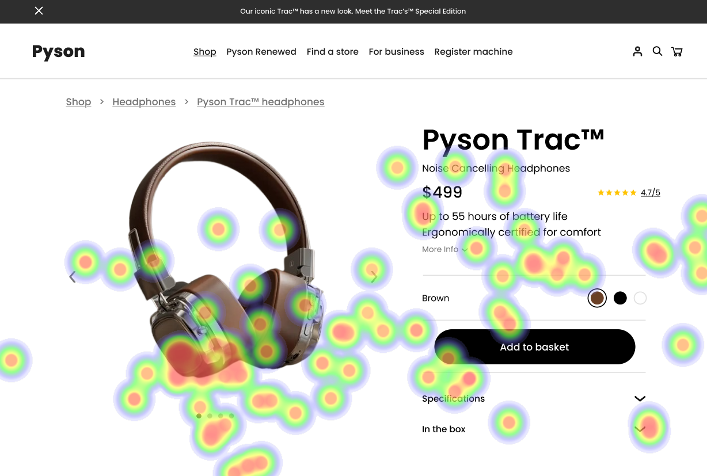

# UI Recommendations and Analysis Report

## Image 1

### Strengths
- **Centrally Located Product Image**: The product image is large and draws the eye naturally. 📸
- **Clear Display of Product Name and Price**: Positioned close to the image, ensuring users notice them easily. 💰
- **Prominent Product Title**: The title stands out, aiding immediate recognition. 🔍

### Weaknesses
- **'Add to Basket' Button Visibility**:  
  - **Issue**: Positioned in the bottom right corner and poorly visible.  
  - **Reason**: Reduces prominence, leading to user oversight.  
  - **Heatmap Correlation**: Low attention on the button.  
  - **Severity**: Medium  
  - **Impact**: Users might abandon their purchase.  
  - **Recommendations**:  
    - Reposition the button to the top-right corner.  
    - Increase its size and ensure high contrast (goal: 4.5:1). 🔼

- **Color Selection Buttons**:  
  - **Issue**: Low contrast and inadequate size.  
  - **Reason**: Small buttons frustrate users, especially those with visual impairments.  
  - **Heatmap Correlation**: Minimal attention indicated.  
  - **Severity**: Medium  
  - **Impact**: Users might leave without customizing their order.  
  - **Recommendations**:  
    - Redesign to increase size.  
    - Improve contrast to meet WCAG standards. 🎨

- **Specifications Text Size**:  
  - **Issue**: Text is too small to read easily.  
  - **Reason**: Leads to cognitive overload.  
  - **Heatmap Correlation**: Less engagement shown.  
  - **Severity**: Medium  
  - **Impact**: Critical details might be missed.  
  - **Recommendations**:  
    - Increase font size to at least 16px.  
    - Simplify the layout for better scanning. 📏

## Image 2

### Strengths
- **'See it in Action' Video**: Enhances engagement by providing valuable insights. 🎥
- **Clear Price and Description**: Users can comprehend critical information quickly. 💬

### Weaknesses
- **'More Info' Button Visibility**:  
  - **Issue**: Blends into surrounding text.  
  - **Reason**: Low visibility leads to missed information.  
  - **Heatmap Correlation**: Minimal focus on the button.  
  - **Severity**: Medium  
  - **Impact**: Users may hesitate to purchase.  
  - **Recommendations**:  
    - Increase button size.  
    - Change font color for better contrast.  
    - Add a border for visibility. 🔲

- **Cluttered Specifications Section**:  
  - **Issue**: Small text and dense information.  
  - **Reason**: Hard to extract relevant information quickly.  
  - **Heatmap Correlation**: Low engagement indicates struggles with processing.  
  - **Severity**: Medium  
  - **Impact**: Critical specs could be overlooked.  
  - **Recommendations**:  
    - Break down specifications into digestible parts (e.g., bullet points).  
    - Increase font size. 🗒️

## Image 3

### Strengths
- **Central and Large Product Image**: Grabs attention immediately. 🖼️
- **Well Positioned Product Title and Price**: Enhances information delivery effectively. ✏️

### Weaknesses
- **Color Selector Buttons Design**:  
  - **Issue**: Poorly designed and lack clear labeling.  
  - **Reason**: Confusing for users.  
  - **Heatmap Correlation**: Low attention indicates overlook.  
  - **Severity**: Medium  
  - **Impact**: Users may miss customizing options.  
  - **Recommendations**:  
    - Redesign for larger buttons.  
    - Include labels for clarity.  
    - Ensure high contrast for visibility. 📊

- **Navigation Bar Attention**:  
  - **Issue**: Minimal attention received.  
  - **Reason**: Product content overshadows navigation options.  
  - **Heatmap Correlation**: Navigation elements neglected.  
  - **Severity**: Medium  
  - **Impact**: User experience may suffer.  
  - **Recommendations**:  
    - Increase navigation bar size.  
    - Include dropdown functionalities for ease of use. 📁

### WCAG Standards Compliance
- Image 1: Partially meets WCAG 2.1, conformance level A; requires several improvements for higher AA compliance.  
- Image 2: Meets some WCAG 2.1 standards but needs enhancements for full Level AA compliance.  
- Image 3: Somewhat compliant with WCAG 2.1; improvement on contrast is essential for better accessibility.

**Note**: These recommendations aim to improve usability and enhance overall user experience significantly. The implementation of these changes should help increase engagement and conversion rates across the platform.

## Performance Metrics
- Total execution time: 100.32 seconds
- CrewAI analysis time: 64.21 seconds

