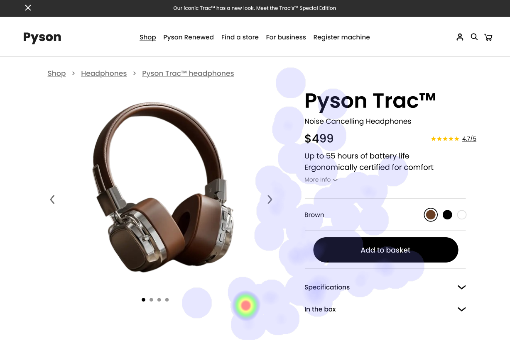

# UI Recommendations Report

This report outlines the strengths, weaknesses, and recommendations for improving the user interface of the product images based on user analysis.

## Image 1

### Strengths
- 🎯 The product image is large and prominently placed, immediately capturing user attention.
  - **Heatmap Correlation**: High fixation density confirms user focus on the image.
  
- 🏷️ The product name 'Pyson Trac™' and its price ($499) are clearly legible.
  - **Heatmap Correlation**: High concentration of views around the product name and price validates their prominence.

- 🚀 The calls-to-action buttons 'See it in action' and 'View Gallery' attract user attention.
  - **Heatmap Correlation**: Higher concentration of views indicates their importance.

### Weaknesses
- ❌ Lack of contrast and small size of the color selection circles.
  - **Reason**: Positioned below the product name, users might overlook them.
  - **Heatmap Correlation**: Less attention on color circles compared to other elements.
  - **Severity**: Medium
  - **Impact**: Users may miss color options, leading to dissatisfaction or lost purchases.
  - **Recommendations**: Increase size and contrast of the color selection circles to a minimum contrast ratio of 3:1.

- 🔍 Promotional text blends with the navigation bar.
  - **Reason**: Placement reduces visibility and user awareness of promotions.
  - **Heatmap Correlation**: Minimal user focus on the promotional text.
  - **Severity**: Low
  - **Impact**: Reduced awareness of promotions affecting user engagement.
  - **Recommendations**: Reposition the promotional text, increase font weight, and use a contrasting background.

### WCAG Standards
- The UI meets **WCAG 2.1 Level A** but likely falls short of **Level AA** due to color contrast issues.

## Image 2

### Strengths
- 🎨 The product image is centrally placed and visually appealing.
  - **Heatmap Correlation**: High fixation on the product image confirms effectiveness.

- 🔤 The product name is prominently displayed in a large font size.
  - **Heatmap Correlation**: Significant attention on the product name indicates clarity.

### Weaknesses
- ❗ Color selection options lack visual prominence.
  - **Reason**: Small circles with inadequate contrast.
  - **Heatmap Correlation**: Low attention suggests poor engagement.
  - **Severity**: Medium
  - **Impact**: Users may miss these options, affecting purchase decisions.
  - **Recommendations**: Enlarge color circles, increase contrast, and consider adding labels.

- 📄 Specifications text is dense and overwhelming.
  - **Reason**: Affects user's ability to quickly gather necessary information.
  - **Heatmap Correlation**: Low attention implies disengagement from crucial information.
  - **Severity**: Medium
  - **Impact**: Potential uncertainty in making a purchase.
  - **Recommendations**: Break down specifications into bullet points or sections, increase font size.

### WCAG Standards
- The UI generally meets **WCAG 2.1 AA** standards, but some color contrast issues require revision.

## Image 3

### Strengths
- 📷 The product image occupies a large portion of the screen.
  - **Heatmap Correlation**: Significant user attention confirms effectiveness.

- 💲 The product name and price are positioned near the image and are legible.
  - **Heatmap Correlation**: Notable attention indicates active interest.

### Weaknesses
- ⚠️ Color options lack differentiation.
  - **Reason**: Small circles with minimal visual distinction hinder interaction.
  - **Heatmap Correlation**: Low attention indicates usability concerns.
  - **Severity**: Medium
  - **Impact**: Difficulty in selecting preferred colors may lead to errors or abandonment.
  - **Recommendations**: Increase size and contrast of color option circles and consider hover effects.

### WCAG Standards
- The UI meets **WCAG 2.1 AA** standards in most areas, but some elements need better contrast for improved readability.

This concludes the structured report on UI recommendations for the images analyzed.

## Performance Metrics
- Total execution time: 70.62 seconds
- CrewAI analysis time: 39.49 seconds

