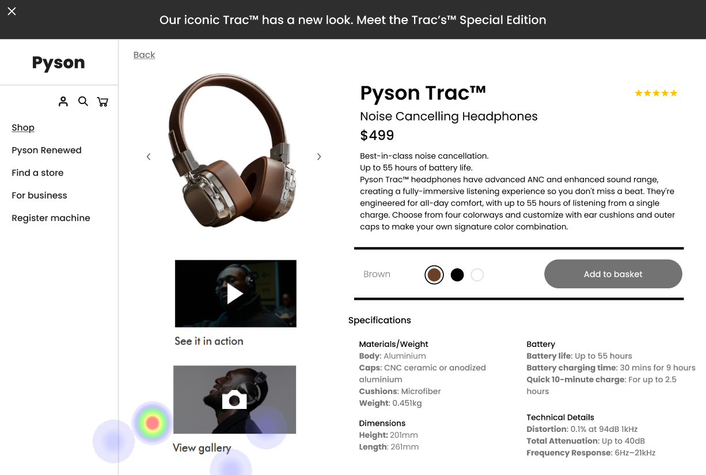
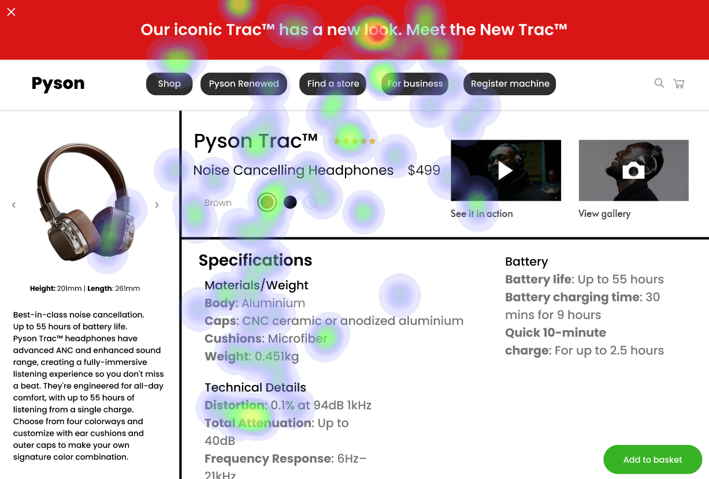

# UI Recommendations Report

## Image 1

### Strengths
- **Large Product Image:** The product image is large, centrally placed, and visually appealing, adhering to the F-pattern often observed in user eye movements on web pages. It captures attention and provides a quick visual representation of the product. 🎯
- **Prominent Product Title:** The product title is prominently displayed with a larger font size, making it highly visible and easily readable. 📕
- **Clear Price Display:** The price is displayed in a clear and prominent font, immediately below the product name. 💰

### Heatmap Correlation
- High fixation on the product image confirms its effectiveness in capturing user attention.
- Concentrated attention on the product title demonstrates that users readily identify and read the product's name.
- Noticeable attention on the price indicates that users are actively considering the cost.

### Weaknesses
- **Understated 'More Info' Link:** The 'More Info' link is understated and located below the product description, lacking visual prominence.
  - **Reason:** Low visibility may lead users to overlook important product information.
  - **Recommendations:**
    - Increase font size and change to a more contrasting color.
    - Transform it into a button-style link for better visibility.

- **Color Selection Options:** The color selection options (Brown, Black, White) lack strong visual differentiation.
  - **Reason:** Small swatches are positioned closely together.
  - **Recommendations:**
    - Increase the size of the color swatches.
    - Add a thin border around each swatch to enhance visual separation.

- **Small Navigation Arrows:** The arrows for image carousel navigation are small and placed close to the product.
  - **Reason:** Users struggle to navigate effectively through product images.
  - **Recommendations:**
    - Increase the size of the navigation arrows.
    - Place them farther away from the product image for clarity.

### WCAG Standards
The UI likely meets WCAG 2.1 Level AA but requires a detailed audit for full compliance, with a focus on color contrast ratios and keyboard navigation.

## Image 2

### Strengths
- **Clear 'View Gallery' Call-to-Action:** The 'View gallery' link is a clear call-to-action near an image related to the gallery content.
  
### Heatmap Correlation
- High level of attention on the 'View gallery' area indicates that users are interested in seeing more product visuals.

### Weaknesses
- **Color Swatch Size and Proximity:** The color swatches for selecting headphone colors are small and positioned closely.
  - **Reason:** Difficult for users to accurately select their desired color, particularly on touch devices.
  - **Recommendations:**
    - Increase the size of the swatches.
    - Improve visual separation with spacing or outlines.

### WCAG Standards
The UI partially meets WCAG 2.1 AA standards, but needs improvement in contrast and semantic structure.

## Image 3

### Strengths
- **Prominent Product Image:** The product image is large and centrally located, making it visually prominent. 🎉
- **Clear Product Title:** The product title is displayed prominently using a readable font. ✍️
- **Visual Color Options:** Color options are presented using visual cues (colored circles), clearly indicating available choices. 🟠🔵⚫

### Heatmap Correlation
- High fixation on the product image confirms engagement and effectiveness in capturing user attention.
- Significant focus on the product title.
- Focused attention on the color selection circles shows user engagement.

### Weaknesses
- **Closely Positioned Action Buttons:** The 'Shop', 'Pyson Renewed', 'Find a store' buttons are too close and visually similar.
  - **Reason:** Increases cognitive load on users, making it hard to differentiate.
  - **Recommendations:**
    - Redesign the navigation bar to include spacing and distinct styling for each button.

- **Small Text in Specifications Section:** The text in the specifications section is small and may not be readable for all users.
  - **Reason:** Violates WCAG guidelines on minimum font sizes.
  - **Recommendations:**
    - Increase font size and ensure good contrast against background colors.

### WCAG Standards
The UI partially meets WCAG 2.1 AA standards; areas needing improvement include contrast for secondary text.

This report outlines key strengths and weaknesses across three images, providing actionable recommendations to enhance user experience and meet WCAG standards. 📊✨

## Performance Metrics
- Total execution time: 65.36 seconds
- CrewAI analysis time: 33.45 seconds

