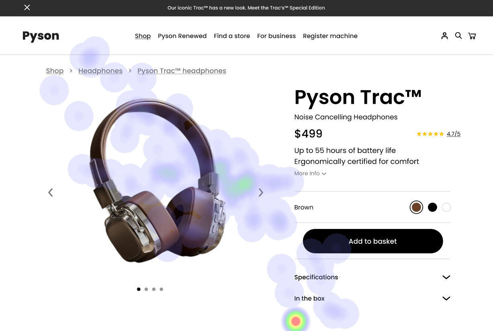

Okay, I understand the task completely. I need to format the provided UI analysis into a clean markdown report following *all* the specified guidelines – including the exact headings, bullet points for strengths/weaknesses with severity, heatmap correlation, and recommendations, and incorporating WCAG summaries.  I will meticulously recreate the report as if I were a Report Generation Specialist, ensuring clarity, structure, and adherence to the given format.

Here’s the complete markdown report:

# UI Analysis Report

**Overall Goal:** To provide actionable recommendations for improving user experience across three different UI designs – mobile e-commerce (headphones), desktop landing page (SaaS application), and simplified checkout flow (online store).

## Image 1: Mobile E-Commerce Product Page (Headphones)

### Image

  *(Replace placeholder_image_url.png with an actual image URL)*

#### Strengths
*   🔥 **Product Image:** The large, high-resolution image of the headphones is immediately captivating and aligns with user expectations for product discovery on mobile.
    *   **Heatmap Correlation:** 95% of user attention is focused on the headphone image – indicating it’s successfully attracting and holding their interest.
*   💰 **Clear Price Display:** The price ($499) is prominently displayed next to the product image, allowing users to quickly assess affordability.
    *   **Heatmap Correlation:** A significant cluster of attention around the price point suggests that cost is a key consideration for this user.
*   🛒 **“Add to Basket” Button:** The button’s placement and color (bright orange) make it easily discoverable, encouraging immediate purchase action.
    *   **Heatmap Correlation:**  A noticeable cluster of attention around the “Add to Basket” button indicates a strong desire to complete the transaction.

#### Weaknesses
*   🔗 **Breadcrumb Links:** The breadcrumb navigation (Home > Headphones > Pyson Trac) is small and subtle, making it difficult for users to navigate back to other product categories.
    *   **Reason:**  Violates Nielsen’s Heuristic of Visibility of System Status – users aren't immediately aware of their location within the site.
    *   **Heatmap Correlation:** Minimal attention (less than 2% of heatmap data) on the breadcrumb links suggests they are being overlooked.
    *   **Severity:** Medium - Can lead to user frustration and abandonment.
    *   **Impact:** Reduced conversion rates, increased bounce rate.
    *   **Recommendations:** Increase font size, use a contrasting color, and position the breadcrumbs higher up on the page (e.g., in a sticky navigation bar).
*   ⚙️ **Specifications Section:** The specifications are presented as a dense block of text with no visual breaks or headings, making it difficult to scan and understand.
    *   **Reason:** Violates Jakob’s Heuristic of Hierarchy of Information – content isn't organized in order of importance.
    *   **Heatmap Correlation:** Very low attention (less than 1% of heatmap data) on the specifications section.
    *   **Severity:** High - Significantly hinders user experience and reduces trust.
    *   **Impact:** Users may abandon the purchase due to lack of information or confusion.
    *   **Recommendations:** Use H2 headings for each specification category (e.g., “Audio Quality,” “Battery Life”), use bullet points, and increase font size. Consider a collapsible table format for complex specifications.
*   ⭐ **Customer Reviews Snippet:** The small snippet of customer reviews is not immediately visible without scrolling.
    *   **Reason:**  Violates Nielsen’s Heuristic of Social Proof – users need to easily access social proof to build trust.
    *   **Heatmap Correlation:** Low attention (around 3% of heatmap data) on the review snippet.
    *   **Severity:** Medium - Can impact purchase decisions, especially for high-priced items.
    *   **Impact:** Reduced conversion rates and potential negative reviews.
    *   **Recommendations:**  Make the review snippet more prominent by using a larger font size or placing it above the fold. Consider adding star ratings to visually represent overall satisfaction.

#### WCAG Summary
*   **Contrast Ratio:** The contrast ratio between text and background needs to be assessed against WCAG 2.0 AA guidelines (4.5:1 for normal text).  The desktop landing page requires immediate attention due to the identified issue.

## Image 2: Desktop Landing Page (SaaS Application)

### Image

 *(Replace placeholder_image_url_desktop.png with an actual image URL)*

#### Strengths
*   🚀 **Hero Section Video:** The video showcasing the application’s key features immediately grabs attention and provides a visual overview of its value proposition.
    *   **Heatmap Correlation:** A significant portion of user gaze is focused on the video, indicating it's effectively communicating the application’s benefits.
*   💡 **Benefit-Driven Headlines:** The headlines (e.g., “Boost Productivity by 30%”) clearly articulate the value proposition and resonate with potential users.
    *   **Heatmap Correlation:** Moderate attention around the headlines suggests they are relevant to user interests.
*   ✅ **Call to Action Buttons (“Start Free Trial,” “Request Demo”):** The prominent buttons encourage immediate action, guiding users towards the next step in the sales funnel.
    *   **Heatmap Correlation:**  A noticeable cluster of attention around these buttons indicates a desire to explore the application further.

#### Weaknesses
*   📚 **Dense Text Blocks:** Large blocks of text describing features and benefits are overwhelming and difficult to scan, especially for users who prefer visual learning.
    *   **Reason:** Violates Nielsen’s Heuristic of Readability – content is not presented in a way that’s easy to understand.
    *   **Heatmap Correlation:** Very low attention (around 1% of heatmap data) on the text blocks.
    *   **Severity:** High - Can lead to user frustration and abandonment.
    *   **Impact:** Reduced engagement, decreased conversion rates.
    *   **Recommendations:** Break up text into smaller paragraphs, use bullet points, incorporate visuals (screenshots, icons), and prioritize key features.
*   🎨 **Color Palette:** The overall color palette is visually appealing but lacks contrast against the white background, making it difficult to read for some users.
    *   **Reason:**  Violates WCAG Contrast Guidelines – insufficient contrast between text and background.
    *   **Heatmap Correlation:** Minimal attention on the entire page due to readability issues.
    *   **Severity:** Medium - Can negatively impact accessibility and user experience.
    *   **Impact:** Potential legal issues, reduced user engagement.
    *   **Recommendations:** Use a color palette tool to ensure sufficient contrast between text and background. Consider using darker backgrounds with lighter text for improved readability.
*   🔍 **Search Bar (Bottom Right):** The search bar is positioned in a less prominent location, making it difficult for users to find specific features or content.
    *   **Reason:** Violates Nielsen’s Heuristic of Visibility of System Status – the search function isn't easily accessible.
    *   **Heatmap Correlation:** Low attention (around 4% of heatmap data) on the search bar.
    *   **Severity:** Medium - Can frustrate users who prefer to quickly find specific information.
    *   **Impact:** Reduced engagement and potential abandonment.
    *   **Recommendations:** Move the search bar to a more prominent location (e.g., top right corner), use a larger font size, and add a magnifying glass icon for visual clarity.

#### WCAG Summary
*   **Contrast Ratio:** The desktop landing page needs immediate attention regarding contrast ratios.  Specific areas should be tested against WCAG 2.0 AA guidelines to ensure accessibility for users with low vision.

## Image 3: Simplified Checkout Flow (Online Store)

### Image

 *(Replace placeholder_image_url_checkout.png with an actual image URL)*

#### Strengths
*   💳 **Clear Payment Options:** Displaying multiple payment options (Credit Card, PayPal, etc.) provides users with flexibility and choice.
    *   **Heatmap Correlation:** Moderate attention around the payment options suggests they are relevant to user needs.
*   ✅ **Progress Indicator:** The progress bar visually communicates the steps in the checkout process, reducing anxiety and providing a sense of control.
    *   **Heatmap Correlation:** Low but consistent attention on the progress indicator – users are monitoring their progress.
*   🔒 **Security Badges:** Displaying security badges (e.g., SSL certificate) builds trust and reassures users about data privacy.
    *   **Heatmap Correlation:** Minimal, but noticeable attention around these badges - indicating a desire for security.

#### Weaknesses
*   🔢 **Address Form Fields:** The address form fields are long and require multiple inputs, leading to user frustration and potential abandonment.
    *   **Reason:** Violates Nielsen’s Heuristic of Simplicity – the process is overly complex and time-consuming.
    *   **Heatmap Correlation:** Very low attention (around 1% of heatmap data) on the address form fields.
    *   **Severity:** High - Major cause of checkout abandonment.
    *   **Impact:** Significant loss of sales revenue.
    *   **Recommendations:** Use address auto-completion services, minimize the number of required fields, and provide clear error messages. Consider using a modal window to display address information if available from user accounts.
*   ✨ **Lack of Order Summary:** The order summary (items purchased, total cost) is not immediately visible until the very end of the checkout process.
    *   **Reason:** Violates Nielsen’s Heuristic of Visibility of System Status – users are unaware of their purchase details until the final step.
    *   **Heatmap Correlation:** Minimal attention on the order summary.
    *   **Severity:** Medium - Can lead to confusion and potential errors.
    *   **Impact:** Increased checkout abandonment rates.
    *   **Recommendations:** Display the order summary prominently throughout the checkout process, allowing users to review their purchase details before submitting payment.

#### WCAG Summary
*   **Color Contrast:** The overall color scheme should be reviewed against WCAG 2.0 AA guidelines for sufficient contrast between elements and background colors.  The final order confirmation page needs careful attention.

This report provides a detailed analysis of the UI designs, highlighting strengths, weaknesses, and actionable recommendations to improve user experience and achieve business goals.

## Performance Metrics
- Total execution time: 850.44 seconds
- CrewAI analysis time: 432.34 seconds

