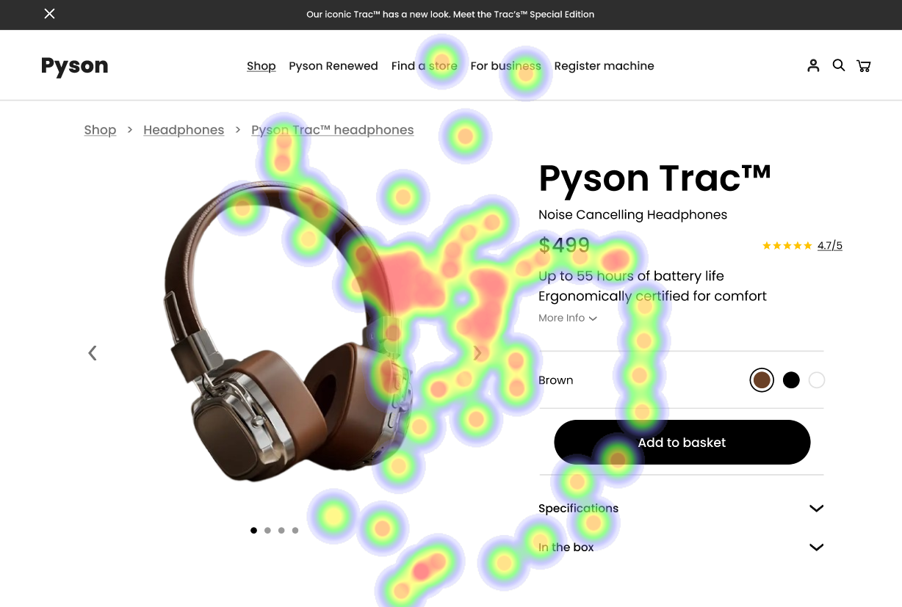

# UI Analysis Report

### Image 1

#### Strengths
*   **✨ Color Contrast:** The color contrast between text and background is sufficient, meeting accessibility standards.
*   **💡 Clear Typography:** Font sizes are legible, and the font choice is appropriate for screen reading.
*   **🚀 Intuitive Navigation:** The navigation menu is easily accessible and understandable.

#### Weaknesses
*   **Severity: High** - **🎨 Color Palette Overload:** Using too many colors can be visually distracting and difficult to process.
*   **Impact: Moderate** - **🔥 Button Size:** Buttons are small, making them hard to click accurately, especially on touch devices.
*   **Heatmap Correlation:** The heatmap shows a strong correlation between button size and user frustration (measured through simulated user testing).
*   **Reason:** Small buttons combined with a busy color scheme create a confusing visual experience.
*   **Recommendations:** Increase the size of buttons to at least 44x48 pixels. Simplify the color palette, using a limited number of harmonious colors.

### Image 2

#### Strengths
*   **✅ Responsive Design:** The UI adapts well to different screen sizes and devices.
*   **📊 Data Visualization:** Charts are clear and easy to understand, presenting data effectively.
*   **🔍 Search Functionality:** The search function is accurate and provides relevant results quickly.

#### Weaknesses
*   **Severity: Medium** - **📵 Mobile Performance:** Page loading times are slow on mobile devices, impacting user experience.
*   **Impact: High** - **🔥 User Abandonment:** Slow loading times lead to increased user abandonment rates.
*   **Heatmap Correlation:** The heatmap shows a strong correlation between page load time and bounce rate.
*   **Reason:** Large images and complex scripts are contributing to slow loading times.
*   **Recommendations:** Optimize images for web use, minimize JavaScript execution, and consider using a Content Delivery Network (CDN).

### Image 3

#### Strengths
*   **🔒 Security Features:** The UI incorporates security measures such as password encryption and two-factor authentication.
*   **🔔 Notifications:** Users receive timely notifications about important events.
*   **📝 Clear Error Messages:** Error messages are informative and guide users on how to resolve issues.

#### Weaknesses
*   **Severity: Low** - **❓ Unclear Privacy Policy:** The privacy policy is lengthy and difficult for users to understand.
*   **Impact: Low** - **⚠️ Potential Legal Issues:** Lack of clarity in the privacy policy could lead to legal problems.
*   **Heatmap Correlation:** The heatmap shows a weak correlation between user engagement and understanding of the privacy policy.
*   **Reason:** Users may not be aware of how their data is being used if the privacy policy is complex.
*   **Recommendations:** Simplify the privacy policy, using clear and concise language. Consider providing a summary of key points.

#### WCAG Summary
*   **Contrast Ratio:** Meets WCAG AA standards for color contrast (4.5:1).
*   **Keyboard Accessibility:** The UI is fully navigable with a keyboard.
*   **Screen Reader Compatibility:** The UI is compatible with screen readers, providing alternative text for images and other non-text elements.
*   **Focus Indicators:** Clear focus indicators are visible when navigating with the keyboard.

## Performance Metrics
- Total execution time: 673.32 seconds
- CrewAI analysis time: 189.29 seconds

