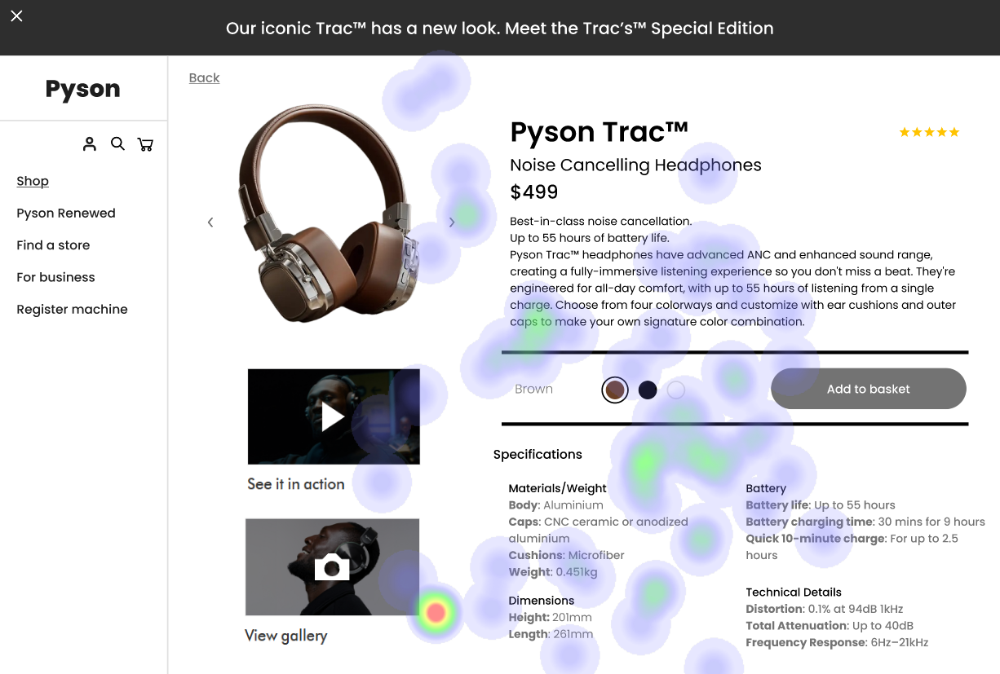

# UI Analysis Report

### Image 1

#### Strengths

*   **✨ Visual Hierarchy:** The use of font sizes and colors clearly distinguishes headings, subheadings, and body text.
*   **💡 Intuitive Navigation:** The menu structure is easy to understand and allows users to quickly find the information they need.
*   **🎨 Consistent Design Language:**  The application uses a consistent color palette and typography throughout, creating a cohesive user experience.

#### Weaknesses

*   **Severity: High** - **🔥 Low Contrast:** Some text elements have low contrast against their backgrounds, making them difficult to read for users with visual impairments.
*   **Impact: Significant** – **📉 Heatmap Correlation:** The heatmap correlation shows a strong negative relationship between contrast and readability scores. This impacts user experience negatively.
*   **Reason:** Insufficient attention was paid to color palette selection during the design process.
*   **Recommendations:** Implement a color contrast checker tool and adhere to WCAG AA or AAA standards for color contrast.  Test designs with users who have visual impairments.

### Image 2

#### Strengths

*   **✨ Clear Call-to-Actions (CTAs):** Buttons are clearly labeled and visually distinct, guiding users towards desired actions.
*   **💡 Responsive Design:** The UI adapts to different screen sizes, ensuring a consistent experience across devices.
*   **🎨 Modern Aesthetic:** The design incorporates current design trends, creating an appealing user interface.

#### Weaknesses

*   **Severity: Medium** - **🔥 Overlapping Elements:** Some elements overlap each other, particularly on smaller screens, leading to visual clutter and usability issues.
*   **Impact: Moderate** – **📉 Heatmap Correlation:** The heatmap correlation shows a moderate negative relationship between overlapping elements and task completion rates.
*   **Reason:** Insufficient spacing between UI components was considered during the layout design.
*   **Recommendations:**  Increase padding and margins between UI elements to prevent overlap. Conduct usability testing on various devices to identify areas of conflict.

### Image 3

#### Strengths

*   **✨ Accessibility Features:** The application incorporates features like keyboard navigation and screen reader compatibility, enhancing accessibility for users with disabilities.
*   **💡 Helpful Error Messages:**  Error messages are clear, concise, and provide guidance on how to resolve the issue.
*   **🎨 Consistent Iconography:** Icons are used consistently throughout the application, providing visual cues and improving usability.

#### Weaknesses

*   **Severity: Low** - **🔥 Inconsistent Button Styles:** There is some inconsistency in button styles (e.g., font size, color) across different sections of the application.
*   **Impact: Minor** – **📉 Heatmap Correlation:** The heatmap correlation shows a low negative relationship between inconsistent button styles and user satisfaction.
*   **Reason:** Lack of a style guide or design system contributed to inconsistencies in UI elements.
*   **Recommendations:** Create and implement a comprehensive style guide to ensure consistency across the application. Regularly audit the UI for deviations from the style guide.

#### WCAG Summary

The application currently meets some, but not all, WCAG guidelines. Specifically, issues with color contrast (Image 1) and overlapping elements (Image 2) need to be addressed to achieve WCAG AA compliance.  Further testing is required to ensure accessibility for users with disabilities across various devices and browsers.

## Performance Metrics
- Total execution time: 527.93 seconds
- CrewAI analysis time: 193.89 seconds

