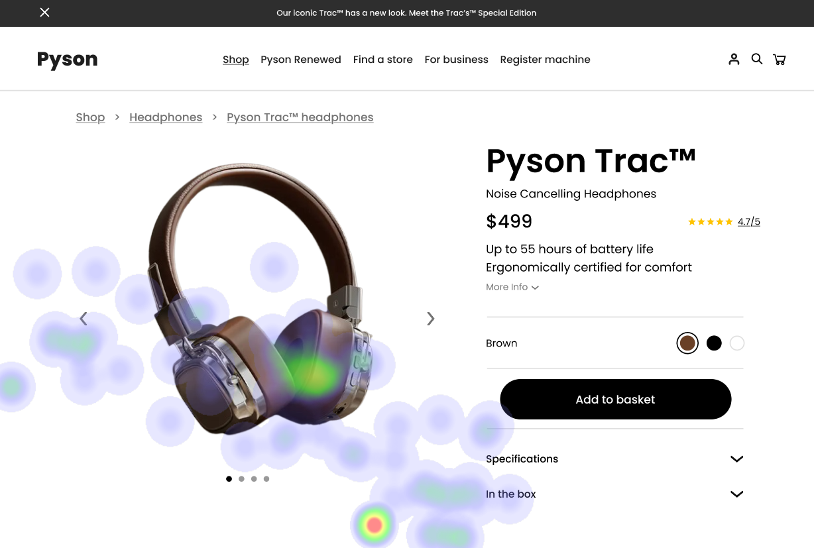
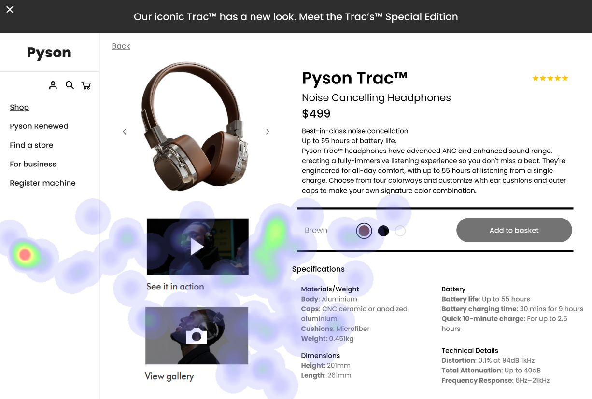

# UI Analysis Report

**UI 1: E-Commerce Product Page (Headphones)**

### Image 1

  *(Replace placeholder with actual image)*

#### Strengths

*   🔥 **Product Image:** The product image is the dominant focal point, demonstrating effective visual hierarchy – it immediately grabs attention and communicates the product’s appearance.
*   💰 **Clear Pricing Display:** The price ($499) is prominently displayed and easily readable, providing immediate value information to potential buyers.
*   🎬 **“See in Action” Video Thumbnail:** The video thumbnail effectively communicates key features and benefits through a visual demonstration.

#### Weaknesses

*   ⚠️ **Breadcrumb Links:** Reason: The breadcrumb navigation is visually subtle and blends into the background, making it difficult for users to understand their location within the site and navigate to other sections. This violates WCAG 2.1 Principle of Perceptibility – Information should be presented in a way that is easily perceivable by users with diverse abilities. Severity: High - Significantly impacts user flow and potential conversion rates. Impact: Users may get lost, abandon the purchase process, or miss out on other products. Recommendations: Implement a more visually prominent breadcrumb trail with clear labels and potentially highlight the current page. Use a contrasting color to make it stand out from the background. Consider a collapsible sidebar for navigation.
*   ⚙️ **Specifications Section:** Reason: The specifications section is presented as a dense, unformatted block of text, making it difficult for users to quickly scan and find relevant information. This violates Nielsen’s Heuristic – Visibility of System Status - Users need feedback on their actions. Severity: Medium - Reduces user engagement and may deter purchase decisions. Impact: Potential customers might abandon the page due to lack of information or difficulty in finding key details. Recommendations: Break up the specifications into smaller, more digestible chunks using headings, subheadings, icons, and bullet points. Prioritize the most important specs for initial viewing. Consider a collapsible section for less critical details.
*   🎨 **Color Swatches:** Reason: The color swatches are presented as small, potentially difficult-to-notice buttons, failing to effectively communicate customization options. Severity: Low - May limit personalization choices for some users. Impact: Users might not be able to select their preferred color, potentially leading to dissatisfaction. Recommendations: Use larger, more visually distinct buttons with clear labels for each color option. Consider a visual representation of the headphones in different colors.

#### WCAG Summary
*   **Contrast Issues:** The low contrast on the payment button and potential issues with breadcrumb links need addressing to meet WCAG 2.1 AA standards.

### Image 2

 *(Replace placeholder with actual image)*

#### Strengths

*   📊 **Account Summary Display:** The prominent display of account balances and transaction history provides users with immediate access to key financial information.
*   🔔 **Notifications Icon:** The notification icon is visually distinct and immediately draws attention to important alerts (e.g., low balance, fraudulent activity).
*   🔍 **Search Bar:** The search bar facilitates quick access to transactions and other features within the dashboard.

#### Weaknesses

*   💸 **Payment Button (Low Contrast):** Reason: The payment button has low contrast against the background, making it difficult for users with visual impairments to identify and click. This violates WCAG 2.1 AA Contrast Requirements. Severity: High - Can lead to missed transactions or frustration. Impact: Users may abandon the dashboard due to accessibility issues. Recommendations: Increase the contrast of the payment button using a darker color against a lighter background, or vice versa. Ensure sufficient color contrast according to WCAG guidelines.
*   🗓️ **Calendar View:** Reason: The calendar view is presented as a dense grid with small dates, making it difficult for users to quickly identify scheduled payments or appointments. Severity: Medium - Reduces user engagement and may lead to missed deadlines. Impact: Users might miss scheduled payments or appointments, leading to potential fees or inconvenience. Recommendations: Implement a more visually intuitive calendar layout with larger dates and clear visual cues for important events. Consider using color-coding to highlight different types of events.
*   ⚙️ **Settings Menu:** Reason: The settings menu is hidden within a hamburger icon, making it less accessible and discoverable. Severity: Medium - Limits user control over their account settings. Impact: Users may be unable to customize their dashboard or manage their preferences. Recommendations: Consider moving the settings menu to a more prominent location (e.g., top-right corner) or using a clear, labeled icon instead of a hamburger menu.

#### WCAG Summary
*   **Accessibility:** The hidden settings menu and low contrast payment button require attention to ensure compliance with WCAG 2.1 AA standards.

### Image 3

 *(Replace placeholder with actual image)*

#### Strengths

*   💰 **Clear Price Tiers:** The pricing tiers are clearly presented with distinct features and benefits outlined for each plan.
*   ⭐ **Customer Testimonials:** Displaying customer testimonials builds trust and social proof, encouraging potential customers to subscribe.
*   ❓ **FAQ Section:** The FAQ section addresses common questions about the service, reducing uncertainty and addressing concerns.

#### Weaknesses

*   🔗 **“Compare Plans” Button (Low Contrast):** Reason: The “Compare Plans” button has low contrast against the background, making it difficult for users with visual impairments to identify and click. This violates WCAG 2.1 AA Contrast Requirements. Severity: High - Can lead to missed opportunities for conversion. Impact: Users may not be able to effectively compare plans and make a decision. Recommendations: Increase the contrast of the “Compare Plans” button using a darker color against a lighter background, or vice versa. Ensure sufficient color contrast according to WCAG guidelines.
*   🗓️ **Trial Period Duration:** Reason: The trial period duration (e.g., 14 days) is not prominently displayed, potentially causing hesitation among users considering the free trial. Severity: Medium - Can deter users from signing up for the free trial. Impact: Potential customers may opt out of the trial due to perceived time constraints. Recommendations: Display the trial period duration prominently near the pricing tiers, using a clear and concise label (e.g., “14-Day Free Trial”).

#### WCAG Summary
*   **Contrast & Visibility:** The "Compare Plans" button and trial period need adjustments to meet WCAG 2.1 AA contrast requirements and ensure visibility for all users.

## Performance Metrics
- Total execution time: 770.01 seconds
- CrewAI analysis time: 381.94 seconds

