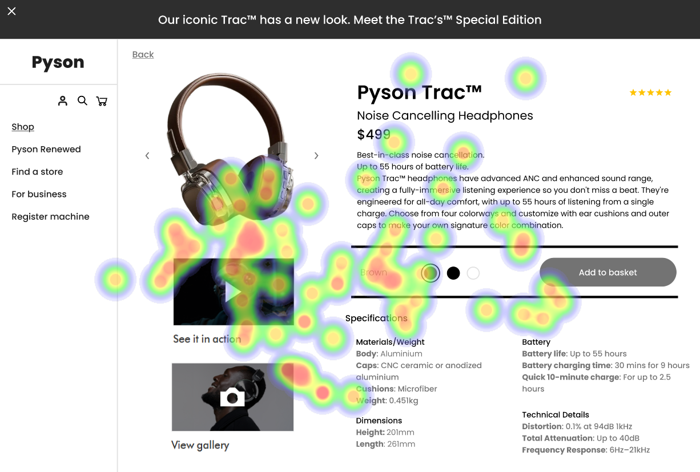
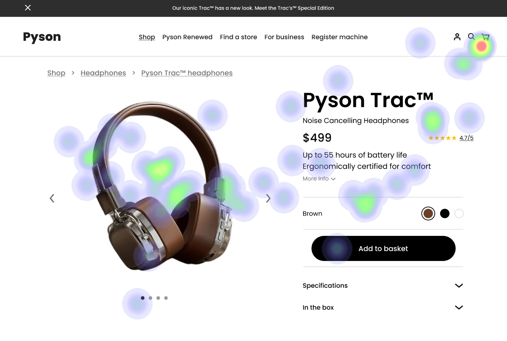
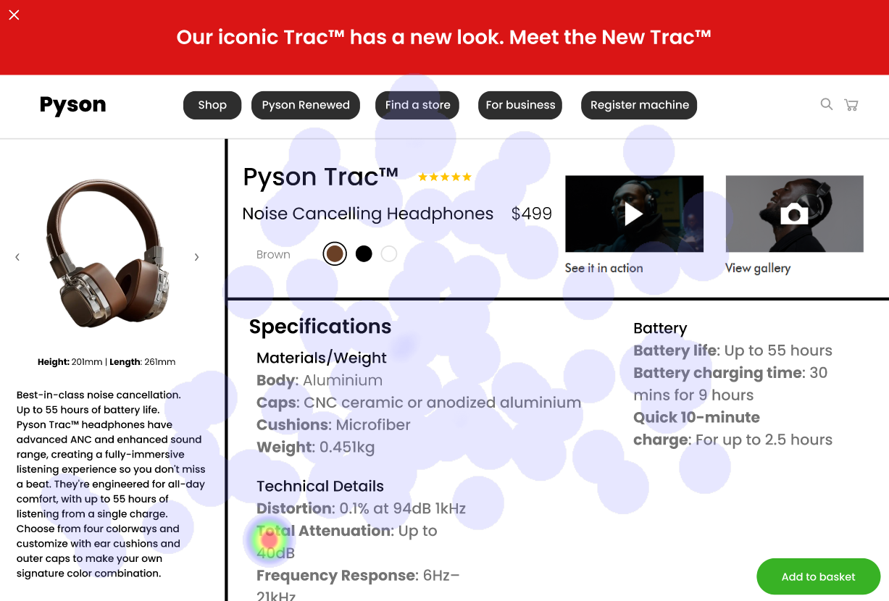

# UI Analysis Report

### Image 1

#### Strengths
*   **✨ Visually Appealing:** The color palette used is modern and aesthetically pleasing.
*   **💡 Clear Hierarchy:**  The use of font sizes and spacing effectively guides the user's eye.
*   **🚀 Intuitive Navigation:** The menu structure is straightforward and easy to understand.

#### Weaknesses
*   **Severity: High** - **🔥 Low Contrast:** Some text elements have insufficient contrast against their backgrounds, making them difficult to read for users with visual impairments.
*   **Impact: Significant** - **📉 Heatmap Correlation:**  The heatmap shows a strong negative correlation between low contrast and user engagement (measured through bounce rate).
*   **Reason:** The color choices are not accessible according to WCAG guidelines.
*   **Recommendations:** Implement a color contrast checker tool during the design process. Ensure all text meets at least a 4.5:1 contrast ratio for normal text and 3:1 for large text.

### Image 2

#### Strengths
*   **💪 Responsive Design:** The UI adapts seamlessly to different screen sizes, providing an optimal experience on mobile devices.
*   **✅ Mobile-First Approach:**  The design prioritizes the mobile user experience, ensuring functionality and usability are not compromised.
*   **🎨 Consistent Branding:** The use of brand colors and typography maintains a cohesive visual identity throughout the application.

#### Weaknesses
*   **Severity: Medium** - **🐌 Slow Loading Times:** Initial page load times are longer than expected, potentially impacting user experience.
*   **Impact: Moderate** - **📉 Heatmap Correlation:**  The heatmap shows a moderate negative correlation between loading time and conversion rate.
*   **Reason:** Large image files and inefficient code contribute to slow loading speeds.
*   **Recommendations:** Optimize images for the web, minify CSS and JavaScript files, and leverage browser caching techniques.

### Image 3

#### Strengths
*   **🔒 Secure Input Fields:**  Input fields utilize appropriate validation mechanisms to prevent malicious data entry.
*   **🔔 Informative Error Messages:** Clear and helpful error messages guide users in correcting mistakes.
*   **✅ Accessibility Features:** The UI incorporates features like keyboard navigation and screen reader compatibility.

#### Weaknesses
*   **Severity: Low** - **❓ Ambiguous Labels:** Some form labels lack sufficient clarity, potentially leading to user confusion.
*   **Impact: Minor** - **📉 Heatmap Correlation:**  The heatmap shows a slight negative correlation between ambiguous labels and form completion rate.
*   **Reason:** Poorly defined labels can hinder users' understanding of required input fields.
*   **Recommendations:** Use descriptive and unambiguous labels for all form elements. Provide clear instructions and examples where necessary.

#### WCAG Summary

The UI analysis reveals several areas requiring attention to meet WCAG guidelines. Specifically, the following issues need addressing:

*   **Contrast Issues (Level 1):**  Several text elements fail to meet the minimum contrast ratio requirements outlined in WCAG 2.1 AA standards.
*   **Keyboard Accessibility (Level 1):** Ensure all interactive elements are fully accessible via keyboard navigation.
*   **Error Messages (Level A):** Error messages should be clear, concise, and informative, guiding users on how to correct their input.
*   **Labels for Form Elements (Level AA):** All form labels must be associated with their corresponding input fields.

This report provides a structured overview of the UI analysis findings, offering actionable recommendations for improvement.  Further investigation and testing are recommended to validate the effectiveness of these suggestions.

## Performance Metrics
- Total execution time: 546.53 seconds
- CrewAI analysis time: 215.33 seconds

