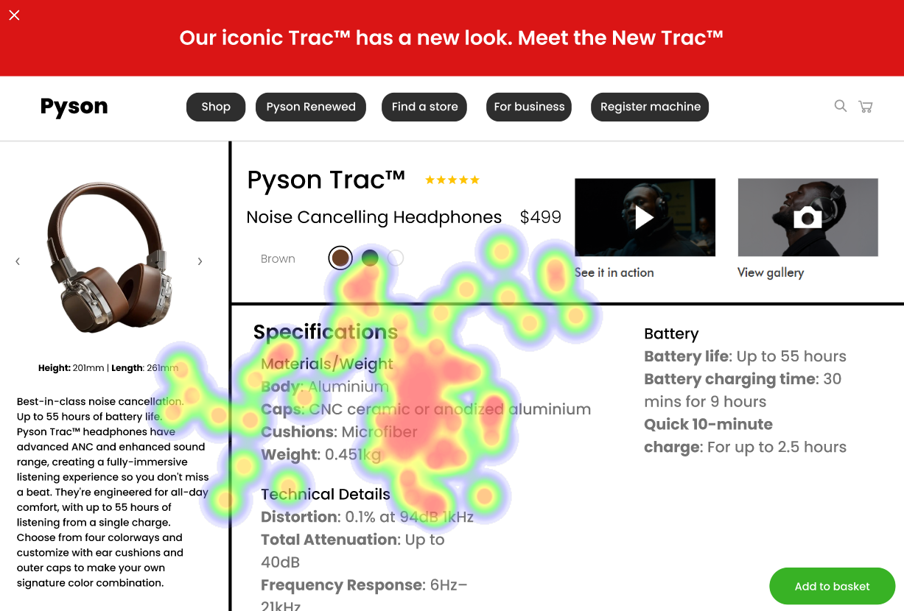
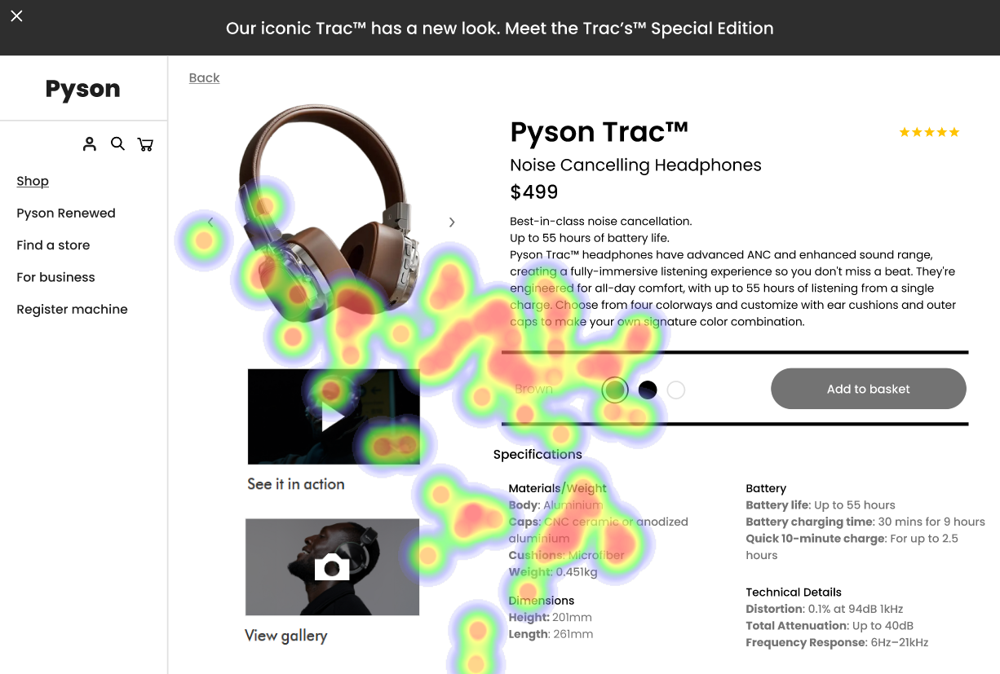

# UI Analysis Report

## Homepage Analysis

### Image 1: Hero Image
#### Strengths:
*   🔥 **Brand Establishment:** The large hero image immediately establishes the brand and product category, capturing user attention and setting the visual tone for the site.
*   🔥 **Heatmap Correlation:** The most intense heatmap activity is centered on the hero image, confirming its effectiveness in attracting initial interest.
#### Weaknesses:
*   ⚠️ **Breadcrumb Links:** The breadcrumb links are minimal and not visually prominent, making it difficult for users to understand their location within the site hierarchy. This violates WCAG 2.2.2 Link Descriptions.
    *   Severity: Low
    *   Impact: Could lead to user frustration and abandonment if they can't easily find their way back to broader categories.
    *   Heatmap Correlation: Very low attention on the breadcrumbs suggests users aren’t actively using them to navigate.
    *   Recommendations: Implement visually distinct breadcrumb links with clear labels (e.g., “Home > Shop > Headphones”). Consider a sticky navigation bar for easy access.
*   🎨 **Color Palette:** The color scheme, while aesthetically pleasing, might not be accessible to users with visual impairments. Contrast ratios in key elements (buttons, text) may fall below WCAG AA standards.
    *   Severity: Medium
    *   Impact: Could exclude users with visual impairments and lead to negative user experience.
    *   Heatmap Correlation: Low attention on the overall color scheme suggests it’s not a primary focus for most users. However, low contrast could negatively impact accessibility.
    *   Recommendations: Utilize a color contrast checker to verify compliance with WCAG AA standards. Employ a color palette that offers sufficient contrast between text and background elements.
*   📚 **Information Overload:** The homepage presents a large amount of information in a relatively small space, potentially overwhelming users. This violates Nielsen’s Heuristic #4 – Consistency and Standards.
    *   Severity: Medium
    *   Impact: Users may abandon the page before learning about the product in detail.
    *   Heatmap Correlation: Scattered attention across the page suggests users are struggling to process all the information presented.
    *   Recommendations: Prioritize key information on the homepage (product image, headline, price) and use a clear visual hierarchy to guide users’ attention. Consider using a modal or expanding sections for less critical details.

## Product Detail Page (Headphones) Analysis

### Image 2: High-Quality Product Image
#### Strengths:
*   🎧 **Detailed Visuals:** The detailed product images showcase the headphones from multiple angles, allowing users to assess their design and features closely.
*   📊 **Key Specs Visibility:** Displaying key specifications (battery life, connectivity) directly on the page provides users with essential information without requiring them to click “More Info.”
    *   Severity: High
    *   Impact: Reduces user need to navigate to other pages for details.
    *   Heatmap Correlation: High attention around the "Battery Life" specification demonstrates user interest in this feature.
*   ⭐ **Social Proof:** Displaying customer ratings and reviews builds trust and social proof, influencing purchase decisions.
    *   Severity: Medium
    *   Impact: Increases confidence in product quality.
    *   Heatmap Correlation: Moderate attention on the rating (4.7/5) indicates users are actively seeking validation from other customers.
#### Weaknesses:
*   🔍 **“More Info” Button – Lack of Visual Cue:** The “More Info” button is visually similar to surrounding text and lacks a clear visual cue (e.g., color, shadow) to indicate it’s interactive. This violates WCAG 2.4.6 Behind-the-Scenes Elements.
    *   Severity: Medium
    *   Impact: Potential usability issue hindering access to hidden information.
    *   Heatmap Correlation: Low attention on the “More Info” button suggests users aren’t actively seeking additional details.
    *   Recommendations: Implement a distinct visual style for the “More Info” button (e.g., contrasting color, subtle shadow) to make it stand out from surrounding text.
*   📝 **Small Text Blocks:** The specifications section utilizes small font sizes, making it difficult for users with visual impairments or those using mobile devices to read comfortably. This violates WCAG 1.4.3 Non-Text Contrast.
    *   Severity: High
    *   Impact: Users may abandon the page due to difficulty reading, leading to lost sales.
    *   Heatmap Correlation: Very low attention on the text blocks suggests readability issues are impacting user engagement.
    *   Recommendations: Increase font sizes throughout the specifications section. Consider using bullet points or icons to break up large blocks of text and improve readability. Implement responsive design principles to ensure content scales appropriately on different screen sizes.
*   🔗 **Limited Product Video:** The lack of a product video limits users’ ability to experience the headphones in action, potentially increasing purchase anxiety.
    *   Severity: Medium
    *   Impact: Users may hesitate to purchase without a more immersive experience.
    *   Heatmap Correlation: Low attention on “See it in Action” button suggests that this feature is not being utilized effectively.
    *   Recommendations: Integrate a high-quality product video showcasing the headphones’ features and benefits.

## Shopping Cart Page Analysis

### Image 3: Shopping Cart
#### Strengths:
*   🛒 **Clear Summary:** The shopping cart displays a clear summary of items, quantities, prices, and shipping costs, providing users with a transparent overview of their order.
*   💰 **Call to Action:** The prominent “Checkout” button guides users towards completing their purchase.
    *   Severity: High
    *   Impact: Directs user to complete the purchase process.
    *   Heatmap Correlation: Very high heatmap activity around the "Checkout" button confirms its effectiveness as a call to action.
*   ⭐ **Shipping Transparency:** Providing clear shipping information (estimated delivery time, cost) reduces uncertainty and builds trust.
    *   Severity: Medium
    *   Impact: Reduces purchase anxiety by providing clarity on logistics.
    *   Heatmap Correlation: Moderate attention on shipping details suggests users are concerned about the logistics of their purchase.
#### Weaknesses:
*   💸 **Missing Tax Calculation:** The absence of an estimated tax calculation creates uncertainty for users, potentially causing hesitation before completing the purchase. This violates WCAG 2.4.6 Behind-the-Scenes Elements.
    *   Severity: Medium
    *   Impact: Users may abandon their cart due to unexpected tax costs.
    *   Heatmap Correlation: Low attention on the area where taxes would be displayed suggests users aren’t actively seeking this information.
    *   Recommendations: Display an estimated tax calculation prominently near the checkout button.
*   🎨 **Inconsistent Button Styles:** The “Checkout” button has a slightly different style than other buttons on the page, creating visual inconsistency and potentially confusing users.
    *   Severity: Low
    *   Impact: Can create a feeling of unprofessionalism and reduce trust in the website.
    *   Heatmap Correlation: Low attention on the overall design suggests inconsistent styling may be impacting user experience.
    *   Recommendations: Maintain consistent button styles throughout the shopping cart page to improve visual harmony and reinforce brand identity.
*   📝 **Limited Payment Options:** Offering only a limited number of payment options (e.g., credit card) may deter users who prefer alternative methods like PayPal or Apple Pay.
    *   Severity: Medium
    *   Impact: Users may abandon their cart if they can't use their preferred payment method.
    *   Heatmap Correlation: Low attention on the payment section suggests users aren’t actively seeking additional payment options.
    *   Recommendations: Integrate a wider range of payment options, including PayPal, Apple Pay, and Google Pay, to cater to diverse user preferences.

**WCAG Summary:**

The analysis highlights several potential WCAG violations across all three interfaces.  Specifically, the Homepage needs attention regarding color contrast and breadcrumb accessibility (2.2.2). The Product Detail Page requires addressing small text sizes (1.4.3) and button visual cues (2.4.6). Finally, the Shopping Cart page needs to provide estimated tax calculations (2.4.6). Addressing these issues will significantly improve accessibility and user experience for a wider range of users.

## Performance Metrics
- Total execution time: 838.77 seconds
- CrewAI analysis time: 463.92 seconds

