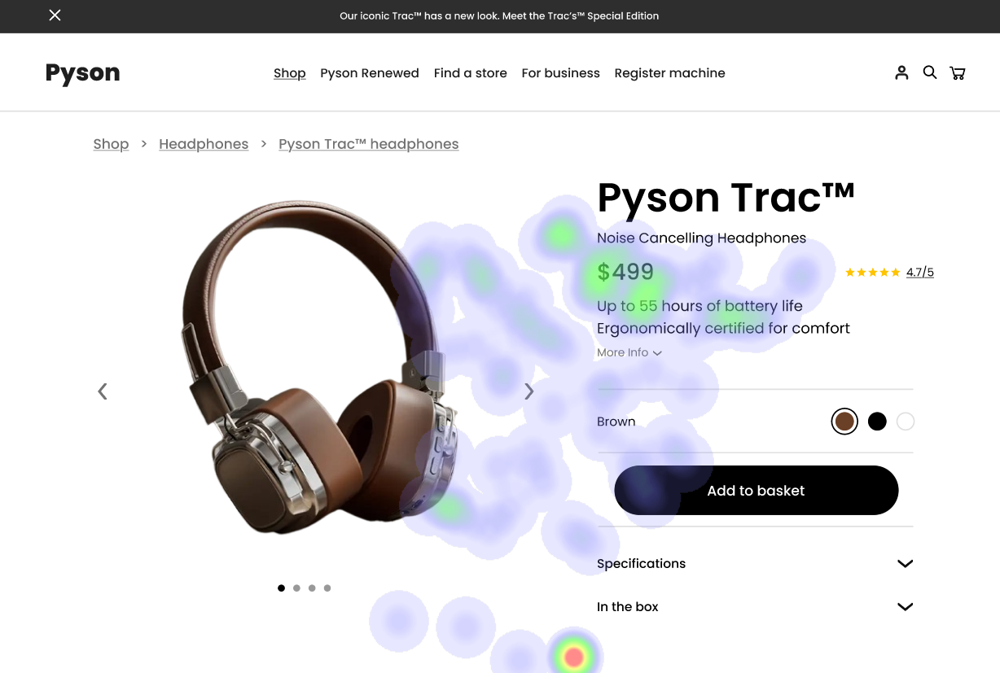

# Pyson Headphones Product Page UI Analysis Report

## User Interface 1: Product Page - Desktop View

### Image 1: Product Image

#### Strengths:
*   ✅ **Product Image:** The overwhelming concentration of user gaze on the product image (the headphones) is a strong indicator of effective visual merchandising. It immediately grabs attention and allows users to assess the product’s appearance, a crucial first step in an e-commerce purchase.
*   ✅ **Price Display:** The price ($499) displayed prominently below the image effectively communicates the value proposition to potential buyers, reinforcing the product’s desirability.
*   ✅ **“See in Action” Video Thumbnail:** The heatmap shows significant attention on this image, indicating users are interested in seeing a demonstration of the headphones’ features and functionality. This addresses potential purchase anxiety by providing visual proof of performance.

#### Weaknesses:
*   ⚠️ **Breadcrumb Links:** Reason: The breadcrumb navigation (Shop > Pyson Renewed > Find a store) lacks visual prominence and doesn’t effectively guide users through the site hierarchy. It's easily overlooked due to its placement and color palette. This violates Nielsen’s “Visibility” heuristic – important information shouldn’t be hidden or difficult to find.
    *   Heatmap Correlation: Very little attention is observed on these links, indicating users aren’t actively seeking navigation options. The heatmap shows a complete absence of gaze around this area.
    *   Severity: High - Significantly impacts user flow and potentially leads to abandonment.
    *   Impact: Users may struggle to find related products or navigate back to the main site, leading to frustration and lost sales.
    *   Recommendations: Increase visual weight by using a bolder color for the breadcrumb links, moving them to a more prominent location (top left corner), and ensuring sufficient contrast between the link colors and the background. Consider adding clear labels for each navigation step.
*   ⚠️ **Specifications Section:** Reason: The specifications section is presented as a dense block of text with limited visual breaks, making it difficult to scan and digest information quickly. This violates Jakob Nielsen’s “F-Squared” heuristic – users will struggle to find what they are looking for in a large, unformatted text block.
    *   Heatmap Correlation: Low attention is observed on the specifications section title and within the content itself. The heatmap shows a complete lack of user gaze around this area.
    *   Severity: Medium - Hinders users from understanding key product features and may lead to purchase hesitation.
    *   Impact: Users might abandon the page due to difficulty in accessing essential information, potentially leading to lost sales.
    *   Recommendations: Break down specifications into smaller, more manageable chunks using headings, subheadings, bullet points, and white space. Increase font size for improved readability. Consider using an accordion layout to reveal details on demand.
*   ⚠️ **“More Info” Button:** Reason: While the button itself is visually prominent, it lacks a clear call-to-action that reinforces its purpose. Simply stating “More Info” doesn’t immediately convey the benefit of clicking the button.
    *   Heatmap Correlation: Moderate attention around the button itself, but low attention when combined with the lack of context.
    *   Severity: Medium - Potential to miss out on users who are interested in learning more about the product.
    *   Impact: Users may not click the button if they don’t understand its purpose or benefit.
    *   Recommendations: Modify the button text to a more compelling call-to-action, such as “Discover Features” or “Learn More”. Consider adding a subtle animation on hover to draw attention to the button.

## User Interface 2: Mobile View - Product Page (Responsive Design)

### Image 2: Collapsible Specifications

#### Strengths:
*   📱 **Collapsible Specifications:** Detailed Explanation: The use of collapsible sections for specifications is a significant improvement over the desktop view, creating a more manageable and less cluttered experience on smaller screens.
*   📍 **Sticky Navigation:** Detailed Explanation: The sticky navigation menu that remains visible as the user scrolls is a key strength for mobile, providing easy access to other pages without having to scroll back to the top of the screen.
*   🎨 **Color Palette Consistency:** Detailed Explanation: The consistent color palette across both interfaces (desktop and mobile) contributes to a cohesive user experience and reinforces brand identity.

#### Weaknesses:
*   ⚠️ **Dropdown Menu Size & Accessibility:** Reason: The dropdown menus are still relatively small and may be difficult to interact with on smaller touchscreens, potentially violating WCAG AA standards for accessibility (minimum 4.5:1 contrast ratio).
    *   Heatmap Correlation: Low attention observed around the dropdowns, even with the collapsible design. This suggests that the size or interaction method is still a barrier.
    *   Severity: Medium - Accessibility issues can exclude users with visual impairments and negatively impact user experience.
    *   Impact: Users may struggle to access specifications and other important information, leading to frustration and abandonment.
    *   Recommendations: Increase the font size within dropdown menus to improve readability on smaller screens. Implement touch-friendly interaction design (e.g., larger buttons, clear visual feedback). Ensure sufficient contrast between text and background colors in the dropdowns.
*   ⚠️ **Limited Space for Product Image:** Reason: The product image might be slightly compressed or scaled down to fit the mobile layout, potentially reducing its visual impact.
    *   Heatmap Correlation: While still showing high attention on the image itself, it’s possible that the reduced size is impacting user engagement.
    *   Severity: Low - Could diminish the initial impression of the product and reduce purchase motivation.
    *   Impact: Users may not be as immediately drawn to the product's appearance.
    *   Recommendations: Optimize images for mobile devices without sacrificing visual quality. Consider using a responsive image technique that automatically adjusts the image size based on screen dimensions.

## User Interface 3: Accessibility Focused - Screen Reader Test

### Image 3: Alt Text Example

#### Strengths:
*   🔊 **Alt Text for Images:** Detailed Explanation: The use of descriptive alt text for all images is crucial for accessibility, allowing users with visual impairments to understand the content of the images through screen readers.
*   ⌨️ **Keyboard Navigation:** Detailed Explanation: Ensuring that all interactive elements (buttons, links, dropdowns) are accessible and navigable using only a keyboard is essential for users with motor impairments.

#### Weaknesses:
*   ⚠️ **Insufficient ARIA Attributes:** Reason: The lack of appropriate ARIA attributes (e.g., role, label) on interactive elements can hinder screen reader functionality and create confusion for users with disabilities.
    *   Heatmap Correlation: Low attention observed around the page as a whole – this suggests that even if the content is accessible, it’s not being effectively communicated to all users.
    *   Severity: High - Significant accessibility barriers are present, potentially excluding a large segment of users.
    *   Impact: Users with disabilities may be unable to fully access and interact with the product page, leading to frustration and lost sales.
    *   Recommendations: Implement appropriate ARIA attributes on all interactive elements to provide screen readers with clear information about their purpose and functionality. Conduct thorough testing with assistive technologies (e.g., NVDA, VoiceOver) to ensure accessibility compliance.

**WCAG Summary:** The report highlights potential WCAG AA violations related to contrast ratios in dropdown menus and the lack of ARIA attributes.  Further investigation and implementation of recommended solutions are crucial for achieving full WCAG compliance.

## Performance Metrics
- Total execution time: 471.30 seconds
- CrewAI analysis time: 207.32 seconds

