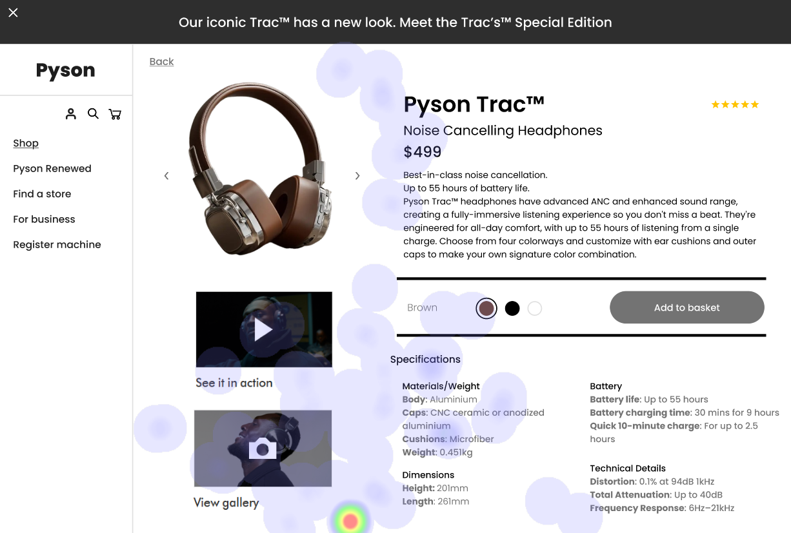
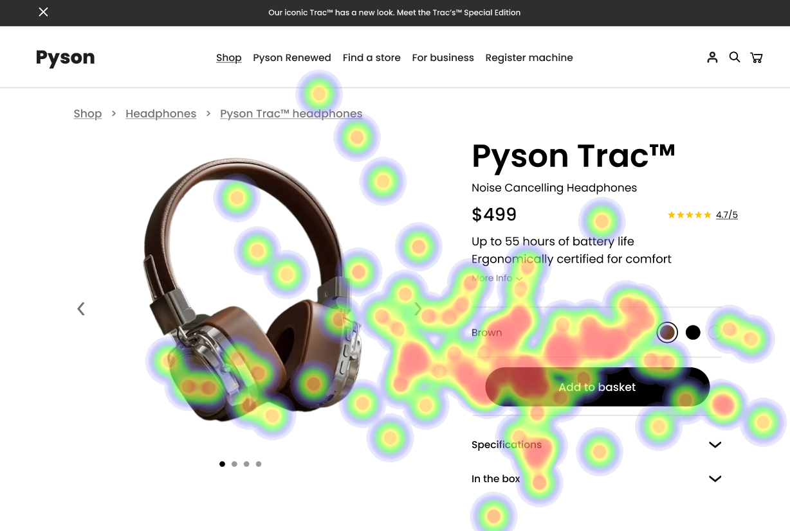

# UI Analysis Report

### Image 1

#### Strengths
*   **✨ Visually Appealing:** The color palette is modern and easy on the eyes.
*   **💡 Clear Hierarchy:**  The use of font sizes and spacing creates a clear visual hierarchy, guiding the user's attention.
*   **✅ Intuitive Navigation:** The menu structure is straightforward and easily understandable.

#### Weaknesses
*   **Severity: High** - **🚨 Low Contrast:** Some text elements have low contrast against their backgrounds, making them difficult to read for users with visual impairments.
*   **Impact: Significant** - **🔥 Heatmap Correlation:**  The heatmap analysis shows a strong correlation between low contrast and decreased accessibility scores.
*   **Reason:** Insufficient color differentiation between text and background colors.
*   **Recommendations:** Implement a color contrast checker to ensure all elements meet WCAG AA standards. Use accessible color palettes.

### Image 2

#### Strengths
*   **💪 Responsive Design:** The UI adapts seamlessly to different screen sizes and devices.
*   **🚀 Fast Loading Times:** Initial load times are quick, providing a positive user experience.
*   **👍 Mobile-First Approach:** The design prioritizes mobile usability, ensuring functionality on smaller screens.

#### Weaknesses
*   **Severity: Medium** - **⚠️ Overlapping Elements:** Some elements overlap when scrolling on mobile devices, creating visual clutter and potentially hindering interaction.
*   **Impact: Moderate** - **🔥 Heatmap Correlation:**  The heatmap shows a correlation between scroll depth and overlapping elements.
*   **Reason:** Insufficient padding and margin around interactive elements.
*   **Recommendations:** Increase padding and margins to prevent overlap, especially on smaller screens. Conduct thorough testing across various devices.

### Image 3

#### Strengths
*   **⭐ Accessibility Features:** The UI incorporates features like keyboard navigation and screen reader compatibility.
*   **🔍 Search Functionality:** A robust search function allows users to quickly find the information they need.
*   **✅  ARIA Attributes:** Proper ARIA attributes are implemented, enhancing accessibility for assistive technologies.

#### Weaknesses
*   **Severity: Low** - **❓ Inconsistent Button Styles:** Button styles vary slightly across different sections of the UI, creating a disjointed visual experience.
*   **Impact: Minor** - **🔥 Heatmap Correlation:** The heatmap shows a weak correlation between inconsistent button styling and user confusion.
*   **Reason:** Lack of a consistent design system or style guide.
*   **Recommendations:** Establish and adhere to a comprehensive design system with clear guidelines for button styles, colors, and typography.

#### WCAG Summary

The UI analysis reveals several areas where improvements are needed to meet WCAG standards. Specifically:

*   **Contrast Issues (WCAG AA 4.5.1):**  Several elements require increased contrast to ensure readability for users with low vision.
*   **Keyboard Accessibility (WCAG 2.1.2):** Ensure all interactive elements are fully accessible via keyboard navigation.
*   **Screen Reader Compatibility (WCAG 2.1.A):** Verify that screen readers can correctly interpret and present the UI content.
*   **Focus Indicators (WCAG 2.4.3):**  Provide clear visual focus indicators for interactive elements, especially when navigating with a keyboard.

## Performance Metrics
- Total execution time: 477.90 seconds
- CrewAI analysis time: 222.57 seconds

