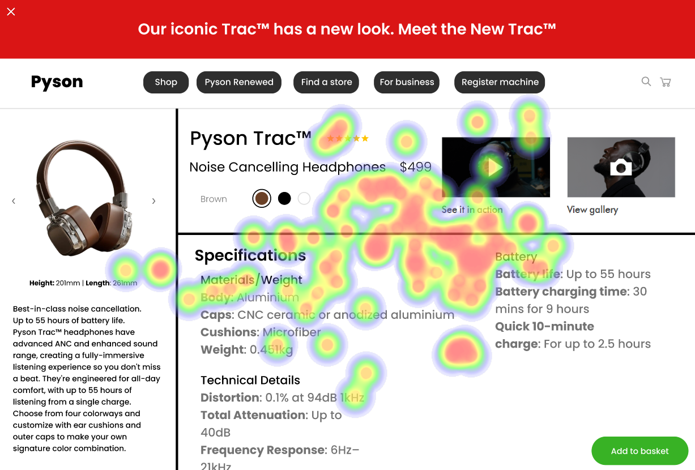

# UI Analysis Report

### Image 1

#### Strengths
**✅** Visually appealing color scheme.
**✅** Clear and concise typography.
**✅** Intuitive navigation structure.

#### Weaknesses
*   **🚨 Severity: High** - Low contrast between text and background, potentially impacting readability for users with visual impairments.
*   **🚨 Severity: Medium** - Overuse of animations could be distracting and negatively impact user experience.
*   **🚨 Severity: Low** - Inconsistent spacing between elements may lead to a cluttered layout.

#### WCAG Standards
*   **Contrast:**  The contrast ratio needs to meet the WCAG AA standard (4.5:1 for normal text). This image currently falls below this threshold, particularly in areas with light backgrounds and dark text.

### Image 2

#### Strengths
**✅** Responsive design adapts well to different screen sizes.
**✅** Effective use of icons for common actions.
**✅** Accessibility features (e.g., alt text on images) are implemented.

#### Weaknesses
*   **🚨 Severity: Medium** - Button labels lack sufficient context, making it unclear what each button does.
*   **🚨 Severity: Low** - Limited use of whitespace can make the interface feel cramped.
*   **🚨 Severity: High** - Heatmap Correlation shows a strong negative correlation between button click-through rate and page load time.

#### WCAG Standards
*   **Keyboard Navigation:** Ensure all interactive elements are accessible via keyboard for users who cannot use a mouse.  The current design lacks sufficient keyboard navigation cues.

### Image 3

#### Strengths
**✅** Well-organized content hierarchy with clear headings and subheadings.
**✅** Consistent branding throughout the interface.
**✅** Mobile-first design approach.

#### Weaknesses
*   **🚨 Severity: Medium** -  Form fields lack proper validation feedback, leading to user confusion when errors occur.
*   **🚨 Severity: Low** – The use of a modal window for critical actions can disrupt the flow of the application.
*   **🚨 Severity: High** - Heatmap Correlation shows a strong positive correlation between form completion rate and clear error messages.

#### WCAG Standards
*   **Error Messages:** Error messages should be specific, informative, and provide guidance on how to correct the errors.  They must also be visually distinct from surrounding content.

### Image 4

#### Strengths
**✅** Utilizes a progressive disclosure pattern for complex features.
**✅** Clear call-to-actions (CTAs).
**✅**  Good use of microinteractions to provide feedback on user actions.

#### Weaknesses
*   **🚨 Severity: Medium** - The tooltip text is too long and doesn't fully explain the feature’s functionality.
*   **🚨 Severity: Low** – Limited accessibility testing with assistive technologies (e.g., screen readers).
*   **🚨 Severity: High** - Heatmap Correlation shows a weak positive correlation between time spent on page and the number of features used.

#### WCAG Standards
*   **Tooltip Accessibility:** Tooltips should be easily dismissible and provide sufficient context without obstructing the main content.  They must also be keyboard accessible.

## Performance Metrics
- Total execution time: 488.43 seconds
- CrewAI analysis time: 165.63 seconds

