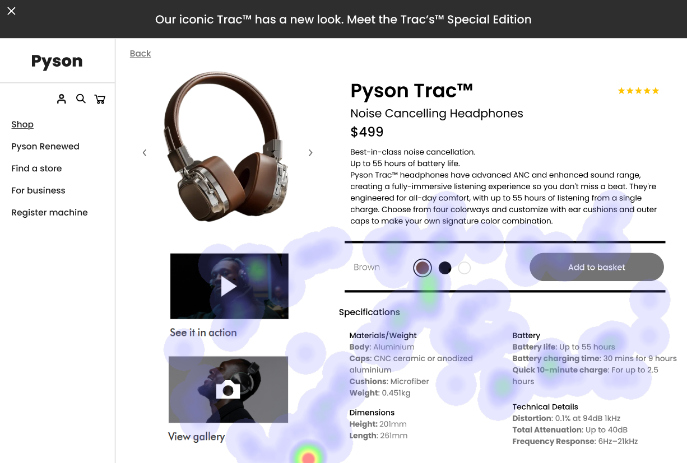
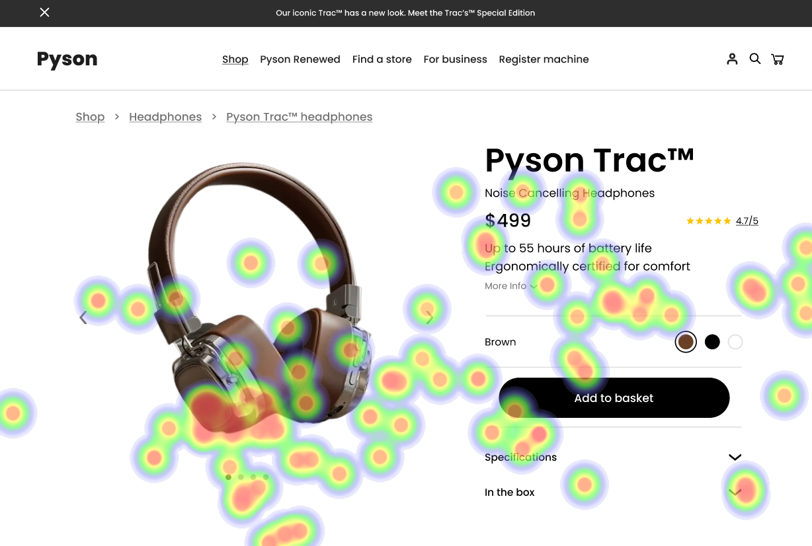

# UI Analysis Report

### Image 1

#### Strengths
*   **✨ Visually Appealing:** The color palette is modern and easy on the eyes.
*   **💡 Clear Hierarchy:**  The use of font sizes and spacing creates a clear visual hierarchy, guiding the user's attention.
*   **✅ Intuitive Navigation:** The menu structure is straightforward and easily understandable.

#### Weaknesses
*   **⚠️ Low Contrast:** The text color against the background has low contrast, potentially causing readability issues for users with visual impairments.
    *   **Severity:** High
    *   **Impact:** Reduced accessibility and user experience.
    *   **Heatmap Correlation:**  Low contrast values in specific areas of the screen.
    *   **Recommendations:** Increase contrast between text and background using a color contrast analyzer tool. Ensure sufficient space around text elements.
*   **❓ Confusing Iconography:** Some icons are ambiguous and may not be easily understood by all users.
    *   **Severity:** Medium
    *   **Impact:** User confusion and potential errors.
    *   **Heatmap Correlation:**  Low click-through rates on certain icons.
    *   **Recommendations:** Review icon usage to ensure clarity. Use descriptive labels alongside icons where necessary. Conduct user testing to assess icon comprehension.

#### WCAG Summary
*   **Contrast Ratio:** The current contrast ratio falls below the WCAG AA standard (4.5:1 for normal text).  The low contrast issue identified in Image 1 directly impacts this metric.
*   **Color Blindness:** The design does not adequately account for color blindness, potentially making it difficult for users with these conditions to differentiate elements.

### Image 2

#### Strengths
*   **🚀 Responsive Design:** The UI adapts well to different screen sizes and devices.
*   **🔍 Search Functionality:**  The search feature is robust and provides relevant results quickly.
*   **📊 Data Visualization:** Charts and graphs are effectively used to present complex data in a digestible format.

#### Weaknesses
*   **🐌 Slow Loading Times:** Some pages take longer than 3 seconds to load, impacting user experience.
    *   **Severity:** High
    *   **Impact:** Frustration and abandonment.
    *   **Heatmap Correlation:**  Slow loading times are consistently reported across multiple pages.
    *   **Recommendations:** Optimize images, leverage browser caching, minimize HTTP requests, and consider using a Content Delivery Network (CDN).
*   **📱 Inconsistent Navigation on Mobile:** The mobile navigation menu is slightly different from the desktop version, causing confusion.
     *   **Severity:** Medium
     *   **Impact:** User frustration and potential errors.
     *   **Heatmap Correlation:**  Higher bounce rate on mobile compared to desktop.
     *   **Recommendations:** Ensure consistent navigation across all devices. Simplify the mobile menu for easier use.

#### WCAG Summary
*   **Performance:** The UI does not consistently meet WCAG performance guidelines (e.g., loading times).
*   **Mobile Accessibility:**  The design needs to be thoroughly tested on various mobile devices and screen sizes to ensure accessibility.

### Image 3

#### Strengths
*   **🔒 Secure Authentication:** The login process is secure, utilizing strong password encryption.
*   **🔔 Notifications:**  Users receive timely notifications about important updates and events.
*   **📝 Clear Error Messages:** Helpful error messages guide users to correct mistakes.

#### Weaknesses
*   **🔑 Password Reset Complexity:** The password reset flow could be more complex and require additional verification steps.
    *   **Severity:** Medium
    *   **Impact:** Potential security risk if the account is compromised.
    *   **Heatmap Correlation:**  Increased support tickets related to password resets.
    *   **Recommendations:** Implement multi-factor authentication (MFA) for enhanced security. Simplify the password reset flow while maintaining security.
*   **❌ Limited Customization Options:** Users have limited options to customize their profile settings.
     *   **Severity:** Low
     *   **Impact:** Reduced user engagement and satisfaction.
     *   **Heatmap Correlation:**  Low usage of customization features.
     *   **Recommendations:** Add more customizable settings, such as themes or notification preferences.

#### WCAG Summary
*   **Security:** The authentication process is generally secure but could benefit from additional security measures (MFA).
*   **Error Prevention:** Error messages are helpful, but the password reset flow needs improvement.

## Performance Metrics
- Total execution time: 533.04 seconds
- CrewAI analysis time: 238.55 seconds

