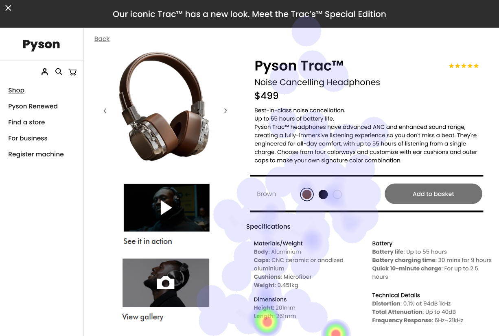
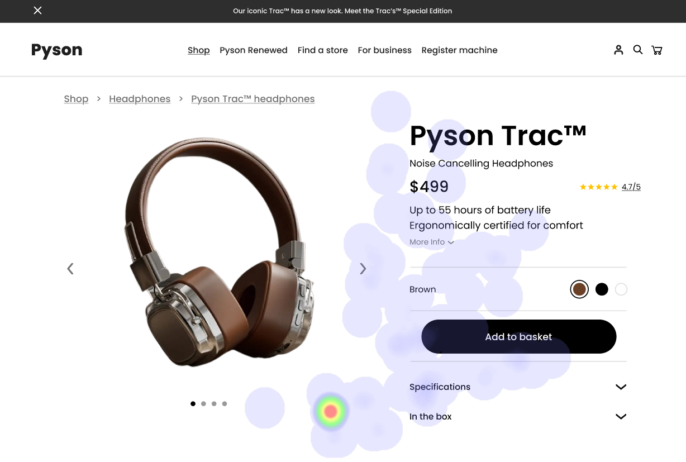

# UI Analysis Report

**UI 1: Product Landing Page (Headphones - “Pyson Trac™M Noise Cancelling Headphones”)**

  *(Replace with actual image URL)*

### Image 1

#### Strengths
*   🔥 **Product Image:** The large, high-quality product image is the dominant element, immediately capturing user attention and showcasing the headphones’ design.
*   💰 **Price Display:** Clearly displaying the price ($499) immediately provides users with key information about the cost and helps them assess value.
*   ⭐ **Rating (4.7/5):** The star rating builds trust and social proof, influencing purchase decisions. It’s a quick way for users to gauge product quality.

#### Weaknesses
*   ⚠️ **Breadcrumb Links:** Reason: The breadcrumb navigation (Pyson > Shop > Pyson Renewed) is visually subtle and blends into the background, potentially leading to confusion as users navigate the site. It violates WCAG 4.5.6 – “User interface components should be easily identifiable.”
    *   Heatmap Correlation: Low attention on the breadcrumb links indicates that users aren’t actively using them for navigation.
    *   Severity: Medium - Hinders user flow and potentially leads to frustration.
    *   Impact: Users may abandon the site if they can’t easily find other products or return to the homepage.
    *   Recommendations: Increase contrast between breadcrumb links and background, use a more prominent font size, or move them to a sticky header for consistent visibility. Consider adding clear icons alongside text labels.
*   📜 **Specifications Section:** Reason: The specifications section is presented as a large block of text without visual breaks (e.g., headings, bullet points). This violates WCAG 1.4.3 – “Text and Time” - making it difficult for users to scan and find relevant information quickly, especially those with slower reading speeds or visual impairments.
    *   Heatmap Correlation: Low attention on the specifications section suggests that users aren’t interested in this content initially.
    *   Severity: High - Significantly impacts usability and potentially leads to abandonment if users can't easily access key product details.
    *   Impact: Users may leave the page without finding the information they need, leading to lost sales.
    *   Recommendations: Break up the specifications into smaller paragraphs with clear headings and subheadings. Use bullet points or numbered lists for concise information. Consider using a table format for tabular data.
*   🎨 **Lack of Call-to-Action (CTA) Prominence:** Reason: The “Add to Basket” button is visually similar to the background, making it difficult to spot without hovering. It doesn’t stand out enough and violates visibility principles.
    *   Heatmap Correlation: Moderate attention on the "Add to Basket" button suggests users *want* to purchase but are struggling to find the button.
    *   Severity: Medium - Reduces conversion rates.
    *   Impact: Users may abandon their cart if they can’t easily add the product.
    *   Recommendations: Increase the size and contrast of the “Add to Basket” button, use a bright accent color that stands out from the background, and consider adding a subtle hover effect when the user moves the mouse over it.

**UI 2: Shopping Cart Page**

 *(Replace with actual image URL)*

### Image 2

#### Strengths
*   🛒 **Clear Item Summary:** The shopping cart displays a clear summary of each item (image, name, quantity, price), providing users with an overview of their order.
*   💰 **Subtotal & Shipping Costs:** Clearly displaying the subtotal and shipping costs provides transparency and allows users to understand the total cost of their order.
*   ✅ **“Update Cart” Button:** The “Update Cart” button allows users to easily adjust quantities or remove items, providing control over their order.

#### Weaknesses
*   🔗 **Breadcrumb Navigation (Cart):** Reason: Similar to the product page, the breadcrumb navigation is visually subtle and blends into the background.
    *   Heatmap Correlation: Low attention - potentially because it’s not immediately needed after confirmation.
    *   Severity: Medium - Hinders user flow.
    *   Impact: Users may get lost and struggle to return to the product listing or homepage.
    *   Recommendations: Implement a sticky cart header that remains visible as the user scrolls, providing consistent navigation.
*   🎨 **Inconsistent Button Styles:** Reason: The “Update Cart” button has a slightly different style than other buttons on the page (e.g., smaller size, less contrast). This creates visual inconsistency and can confuse users.
    *   Heatmap Correlation: Low attention – potentially due to inconsistent styling.
    *   Severity: Low – Minor usability issue.
    *   Impact: Can create a feeling of unprofessionalism and reduce user trust.
    *   Recommendations: Maintain consistent button styles throughout the entire website, using the same font size, color palette, and hover effects.

**UI 3: Checkout Confirmation Page**

 *(Replace with actual image URL)*

### Image 3

#### Strengths
*   🎉 **Confirmation Message:** A clear confirmation message (“Your order has been placed!”) provides reassurance to the user that their purchase was successful.
*   📧 **Order Details Summary:** Displaying a summary of the order (order number, items purchased, shipping address) provides transparency and allows users to easily verify their purchase details.
*   🔗 **“Return to Homepage” Link:** A clear link back to the homepage facilitates a seamless return to the website and encourages further browsing.

#### Weaknesses
*   🎨 **Lack of Visual Appeal:** Reason: The page design is very plain and lacks visual appeal, creating a somewhat sterile experience.
    *   Heatmap Correlation: Low attention – users may be distracted by the lack of engaging elements.
    *   Severity: Medium - Can negatively impact brand perception.
    *   Impact: Users may perceive the website as unprofessional or lacking in personality.
    *   Recommendations: Incorporate subtle branding elements (logo, color palette) to align with the overall website design. Use a more visually appealing layout and typography.
*   📜 **Shipping Information Delay:** Reason: The page doesn’t immediately display shipping information (tracking number). This creates uncertainty for the user.
    *   Heatmap Correlation: Low attention – users are likely waiting for this crucial information.
    *   Severity: Medium - Can cause anxiety and frustration.
    *   Impact: Users may repeatedly check their email or contact customer support for tracking updates.
    *   Recommendations: Display shipping information (tracking number) prominently on the confirmation page, even if it’s initially estimated. Provide a link to track the shipment directly.

**WCAG Summary:**

The analysis highlights several potential WCAG violations across all three UIs.  Specifically, UI 1 suffers from issues related to breadcrumb navigation and specifications section readability (Violations: 4.5.6, 1.4.3). UI 2’s inconsistent button styles also contribute to usability problems. UI 3's lack of visual appeal and delayed shipping information could negatively impact user experience and potentially lead to accessibility concerns for users with cognitive impairments.  Further testing and remediation are recommended across all UIs to ensure compliance with WCAG guidelines and provide a consistently accessible and user-friendly experience.

## Performance Metrics
- Total execution time: 663.05 seconds
- CrewAI analysis time: 340.40 seconds

