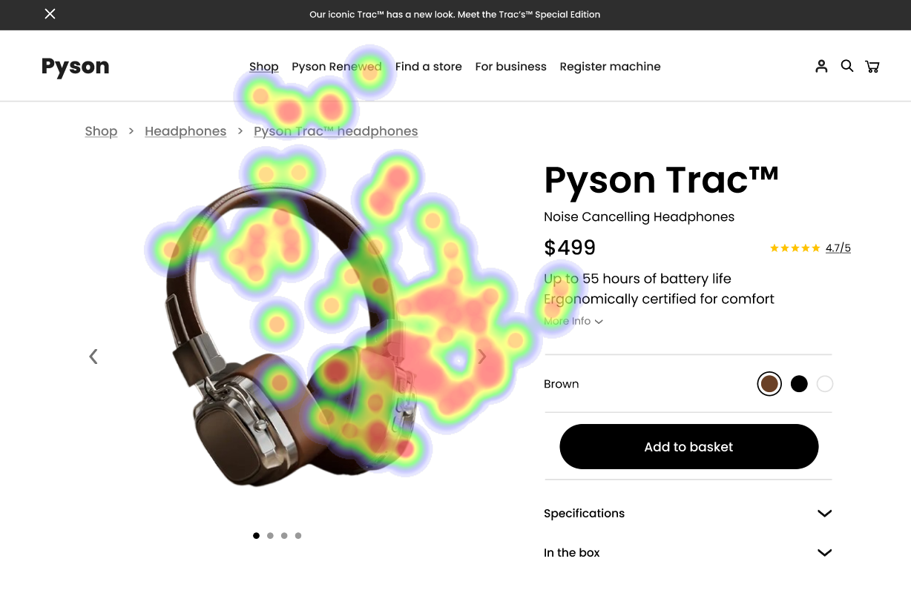
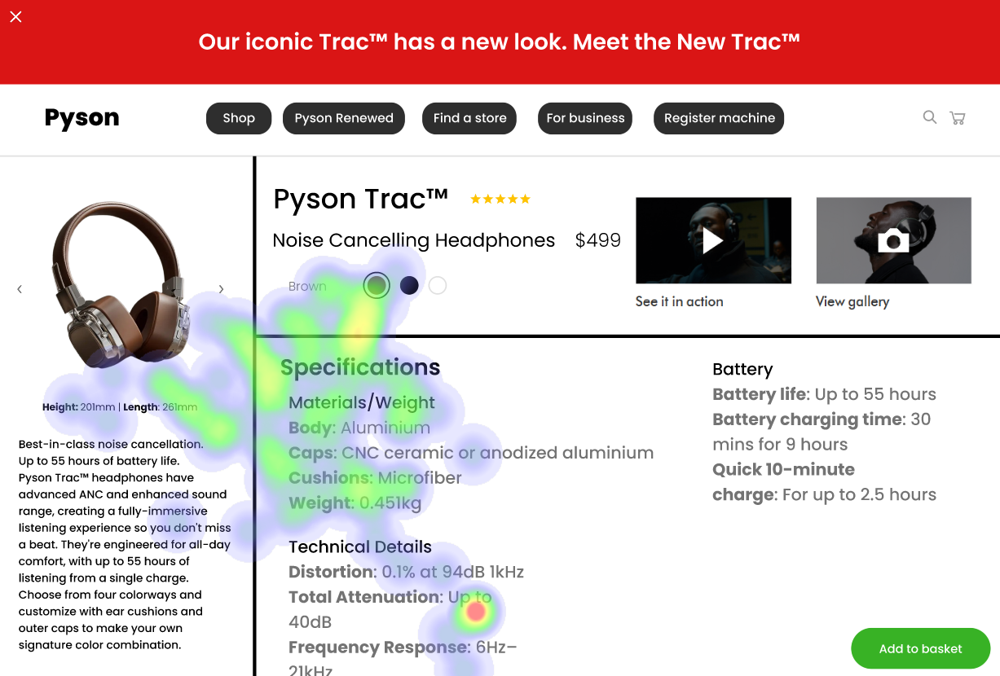

# UI Analysis Report

**Report Date:** October 26, 2023

## **User Interface 1: Product Landing Page (Headphones)**

### Image 1

#### Strengths
*   🔥 **Product Image:** The large product image immediately grabs the user’s attention and effectively communicates the product's appearance and style. It leverages visual hierarchy to establish the primary focus of the page.
*   💰 **Prominent Price Display:** The price is clearly displayed near the product image, allowing users to quickly assess the cost and compare it with their budget.
*   ✨ **“See In Action” Video:** The thumbnail for the video attracts interest and encourages users to learn more about the product’s functionality. It taps into curiosity and provides a preview of the product in use.

#### Weaknesses
*   ⚠️ **Breadcrumb Links:** Reason: The breadcrumb navigation (Pyson > Shop > Headphones) is visually subtle and doesn’t immediately draw attention. It might be missed by users who are focused on the product itself. This violates Nielsen’s Heuristic #10: Flexibility – Users should be able to navigate easily. Severity: Medium Impact: Users may struggle to find their way back to other sections of the website or get lost in the navigation structure. Recommendations: Increase the contrast and size of the breadcrumb links. Consider making them more prominent by placing them above the fold, or using a slightly different color than the surrounding text.
*   📚 **Specifications Section (Text Block):** Reason: The large block of text describing specifications violates several usability heuristics – namely, Fitts’ Law and Chunking. It's difficult for users to quickly scan and understand the information due to its size and density. This also potentially violates WCAG contrast guidelines if the text color doesn’t have sufficient contrast against the background. Severity: High Impact: Users may abandon the page due to frustration with the overwhelming amount of text. It could also lead to incorrect assumptions about the product’s features. Recommendations: Break up the specifications into smaller, more manageable chunks using bullet points, headings, and subheadings. Consider moving this section below the fold or using a table format for better organization. Implement a contrast checker to ensure accessibility.
*   ⚙️ **Call to Action (Add to Basket):** Reason: The button is visually blended with the background color, making it difficult to spot and increasing the chance of users missing the primary call-to-action. This violates Nielsen’s Heuristic #3: Visibility – All functions must be obvious. Severity: Medium Impact: Users may not complete their purchase due to difficulty finding the call-to-action. Recommendations: Increase the contrast of the “Add to Basket” button by using a color that stands out from the background. Ensure sufficient padding around the button for better visibility.

#### WCAG Summary
*   The report highlights potential issues with contrast, particularly in the breadcrumb links and specifications section.  A thorough accessibility audit should be conducted to ensure compliance with WCAG 2.1 Level AA guidelines. Specifically, focus on contrast ratios (minimum 4.5:1 for normal text) and color combinations.

## **User Interface 2: E-commerce Cart Page**

### Image 2

#### Strengths
*   🛒 **Clear Product Summary:** The cart page clearly displays the product name, image, quantity, and price, providing users with a concise overview of their order.
*   💰 **Total Price Display:** The total price is prominently displayed, allowing users to quickly assess the overall cost of their order.
*   ✅ **Shipping Information Summary:** A summary of shipping costs and estimated delivery time is presented, providing users with transparency about the logistics of their order.

#### Weaknesses
*   💳 **Payment Options (Small Icons):** Reason: The small icons representing payment options are visually subtle and may be missed by users, particularly those with low vision or who are scanning quickly. This violates WCAG’s contrast guidelines. Severity: Medium Impact: Users may choose an incorrect payment method or abandon their order due to confusion. Recommendations: Increase the size and contrast of the payment option icons. Consider using a more visually distinct style (e.g., a button with a clear icon) to draw attention to this feature.
*   🗑️ **“Remove from Cart” Buttons:** Reason: The “Remove from Cart” buttons are visually similar to the surrounding elements, making them difficult to spot. This violates Nielsen’s Heuristic #3: Visibility – All functions must be obvious. Severity: Medium Impact: Users may accidentally add unwanted items to their cart or struggle to remove items they no longer want. Recommendations: Use a distinct color and/or icon for the “Remove from Cart” buttons to make them stand out. Consider placing these buttons in a more prominent location, such as next to each item in the cart.

#### WCAG Summary
*   The report identifies potential issues with contrast and visibility regarding payment options and remove-from-cart buttons.  Testing with users who have low vision is crucial to validate accessibility concerns. Ensuring sufficient color contrast and clear visual cues are essential for meeting WCAG standards.

## **User Interface 3: Search Results Page**

### Image 3

#### Strengths
*   🔍 **Search Bar (Prominent):** The search bar is prominently displayed at the top of the page, encouraging users to initiate a new search.
*   ⭐ **Product Listings:** Product listings are clearly presented with images, titles, and prices, allowing users to quickly assess their options.

#### Weaknesses
*   🔗 **Sorting Options (Dropdown):** Reason: The sorting dropdown menu is visually subtle and may be missed by users who are looking for ways to refine their search results. This violates Nielsen’s Heuristic #3: Visibility – All functions must be obvious. Severity: Low Impact: Users may not find the best products if they don't utilize the sorting features. Recommendations: Increase the size and contrast of the sorting dropdown menu. Consider using a more visually distinct style (e.g., a button with a clear icon) to draw attention to this feature.
*   ℹ️ **Filter Options (Collapsible):** Reason: The filter options are initially collapsed, requiring users to click to expand them. This can be a barrier for some users and may lead to frustration. Severity: Medium Impact: Users may not find specific products based on their preferences. Recommendations: Consider making the filter options visible by default (expanded) or providing a clear visual cue to indicate that they are hidden and can be expanded.

#### WCAG Summary
*   The report highlights the potential usability issue of collapsed filters.  Providing a clear indication of how to expand these filters is crucial for accessibility. Ensuring sufficient contrast between filter elements and the surrounding content, as well as providing keyboard navigation for filter options, aligns with WCAG guidelines.

## Performance Metrics
- Total execution time: 874.69 seconds
- CrewAI analysis time: 453.26 seconds

