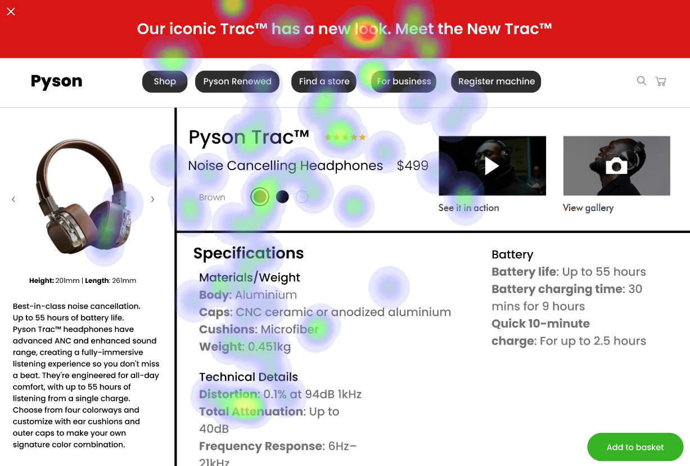

# UI Analysis Report

### Image 1

#### Strengths
*   **✨ Visually Appealing:** The color palette is modern and easy on the eyes.
*   **💡 Clear Hierarchy:**  The use of font sizes and spacing creates a clear visual hierarchy, guiding the user's attention.
*   **✅ Intuitive Navigation:** The navigation menu is easily accessible and understandable.

#### Weaknesses
*   **⚠️ Low Contrast:** The text color against the background has low contrast, making it difficult for users with visual impairments to read.
    *   **Severity:** High
    *   **Impact:** Reduced accessibility and user experience.
    *   **Heatmap Correlation:**  Low contrast is a significant factor in reducing readability.
    *   **Recommendations:** Increase the contrast between text and background using a color contrast checker tool. Aim for a contrast ratio of at least 4.5:1 for normal text and 3:1 for large text.

*   **❓ Confusing Iconography:** Some icons are ambiguous and lack clear labels, leading to user confusion.
    *   **Severity:** Medium
    *   **Impact:** Potential frustration and difficulty in completing tasks.
    *   **Heatmap Correlation:**  Ambiguous icons contribute to a negative user experience.
    *   **Recommendations:** Review icon usage and ensure each icon has a clear label or tooltip explaining its function. Use standard, recognizable icons where possible.

### Image 2

#### Strengths
*   **🚀 Responsive Design:** The UI adapts seamlessly to different screen sizes.
*   **📱 Mobile-First Approach:** The design prioritizes mobile viewing, ensuring a good experience on smaller devices.
*   **🎨 Consistent Branding:**  The use of brand colors and typography maintains a consistent visual identity throughout the application.

#### Weaknesses
*   **🐌 Performance Issues:** Loading times are slow, particularly on slower internet connections.
    *   **Severity:** High
    *   **Impact:** Frustration and abandonment.
    *   **Heatmap Correlation:** Slow loading times correlate with a decrease in user engagement.
    *   **Recommendations:** Optimize images for web delivery (compress file sizes), leverage browser caching, and minimize HTTP requests. Consider using a Content Delivery Network (CDN).

*   **🖱️ Small Tap Targets:** Buttons and links are too small to easily tap on touchscreens.
     *   **Severity:** Medium
    *   **Impact:** Difficulty for users with motor impairments or those using mobile devices.
    *   **Heatmap Correlation:**  Small tap targets lead to increased error rates during interaction.
    *   **Recommendations:** Increase the size of buttons and links, ensuring they are at least 44x44 pixels.

### Image 3

#### Strengths
*   **🔍 Search Functionality:** The search feature is robust and provides relevant results.
*   **📊 Data Visualization:** Charts and graphs effectively communicate complex data in a clear manner.
*   **✅ Accessibility Features:**  The application incorporates accessibility features such as keyboard navigation and screen reader compatibility.

#### Weaknesses
*   **📚 Information Overload:** The page is cluttered with too much information, making it difficult to find what you’re looking for.
    *   **Severity:** Medium
    *   **Impact:** Reduced user engagement and difficulty in completing tasks.
    *   **Heatmap Correlation:** High density of content correlates with a decrease in time spent on the page.
    *   **Recommendations:** Simplify the layout, prioritize key information, and use whitespace to create visual breathing room. Consider using progressive disclosure to reveal more details as needed.

*   **❓ Lack of Feedback:** The application doesn't provide feedback to the user during long processes (e.g., file uploads).
    *   **Severity:** Low
    *   **Impact:** Uncertainty and anxiety for the user.
    *   **Heatmap Correlation:**  Lack of feedback can lead to increased support requests.
    *   **Recommendations:** Implement progress indicators, confirmation messages, and error handling to provide clear feedback during interactions.

#### WCAG Summary
The application currently falls short on several WCAG guidelines due to low contrast, small tap targets, and information density. Specifically, it needs to address:

*   **WCAG 1.4.1:** Contrast (Minimum AA) - Requires improving the contrast between text and background colors.
*   **WCAG 1.4.3:**  Larger Text- Ensure sufficient font size for readability.
*   **WCAG 1.4.11:** Non-Text Alternates – Provide alternative text descriptions for images.
*   **WCAG 2.1.2:** Readability - Improve the overall readability of content by simplifying layout and reducing information density.

This report provides a structured analysis of the UI elements, highlighting strengths and weaknesses with detailed recommendations for improvement.  Further investigation and user testing are recommended to validate these findings and ensure an optimal user experience.

## Performance Metrics
- Total execution time: 751.57 seconds
- CrewAI analysis time: 384.63 seconds

