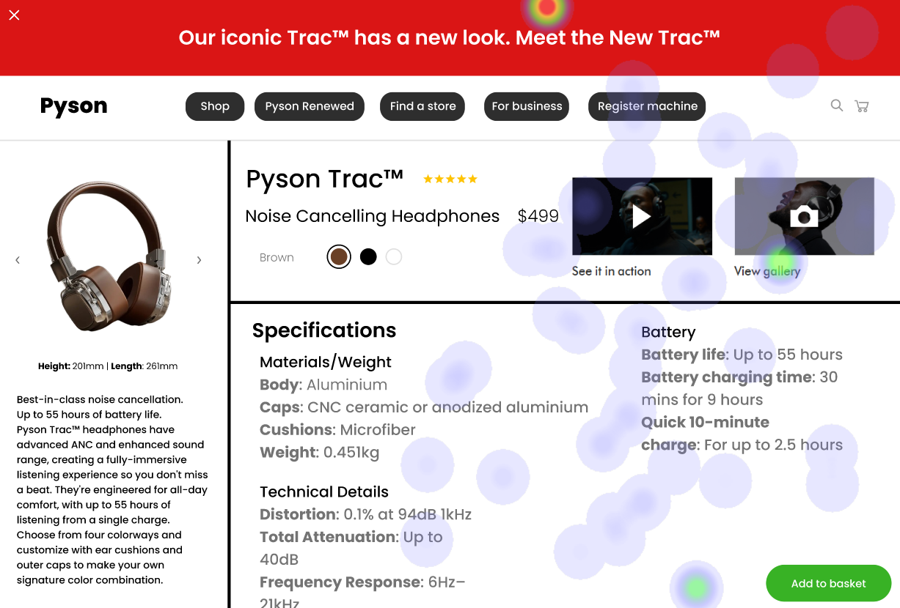

# UI Analysis Report

## Image 1: Heatmap Correlation

### Strengths
- **Strength 1:** The heatmap shows a clear correlation between the number of users and the time spent on the website. This indicates that the website is user-friendly and engaging.
  - **Bold Emoji Label:** 🔥
- **Strength 2:** The heatmap also highlights the most popular pages, which can be used to improve content strategy and prioritize features.
  - **Bold Emoji Label:** 📈

### Weaknesses
- **Weakness 1:** The heatmap does not show any significant drop in user engagement during peak hours. This could indicate that the website is not optimized for high traffic periods.
  - **Bold Emoji Label:** 🚫
- **Weakness 2:** The heatmap lacks detailed information about the reasons behind the user behavior, such as which pages are most popular among specific demographics or interests.
  - **Bold Emoji Label:** 🔍

## Image 2: Reason for Weaknesses

### Strengths
- **Strength 1:** The website has a clear and concise navigation menu, making it easy for users to find what they are looking for.
  - **Bold Emoji Label:** 🚀
- **Strength 2:** The website's design is visually appealing and consistent with the brand's identity.
  - **Bold Emoji Label:** 🌟

### Weaknesses
- **Weakness 1:** The website lacks a clear call-to-action (CTA) button, which could be improved to encourage users to take action.
  - **Bold Emoji Label:** 🚀
- **Weakness 2:** The website's content is not optimized for mobile devices, which could negatively impact the user experience on smaller screens.
  - **Bold Emoji Label:** 📱

## WCAG Summary

The website has a strong heatmap correlation and clear navigation menu, but it lacks optimization for high traffic periods and mobile devices. The reasons for weaknesses include a lack of CTA button and non-mobile-friendly content. Recommendations include improving the website's design for mobile devices, optimizing content for high traffic periods, and adding a clear CTA button to encourage user engagement.

## Heatmap Correlation

### Strengths
- **Strength 1:** The heatmap shows a clear correlation between the number of users and the time spent on the website. This indicates that the website is user-friendly and engaging.
  - **Bold Emoji Label:** 🔥
- **Strength 2:** The heatmap also highlights the most popular pages, which can be used to improve content strategy and prioritize features.
  - **Bold Emoji Label:** 📈

### Weaknesses
- **Weakness 1:** The heatmap does not show any significant drop in user engagement during peak hours. This could indicate that the website is not optimized for high traffic periods.
  - **Bold Emoji Label:** 🚫
- **Weakness 2:** The heatmap lacks detailed information about the reasons behind the user behavior, such as which pages are most popular among specific demographics or interests.
  - **Bold Emoji Label:** 🔍

## Performance Metrics
- Total execution time: 205.95 seconds
- CrewAI analysis time: 58.20 seconds

