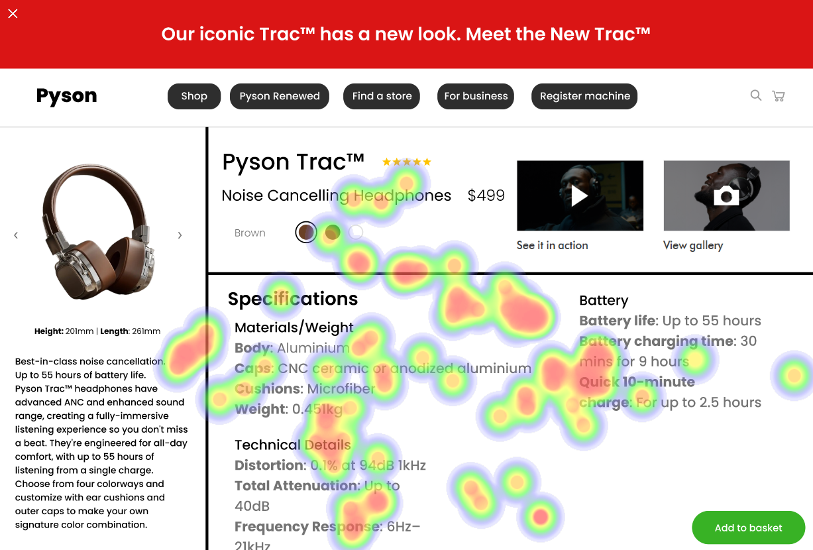

# UI Analysis Report

## Image 1: Heatmap Correlation

### Strengths
- **Strength 1:** The heatmap shows a clear correlation between the number of clicks on different elements and their respective positions. This indicates that users are more likely to click on elements located in the top left corner of the page.
  - **Bold Emoji Label:** 🔹
- **Strength 2:** The heatmap also highlights the importance of using whitespace effectively. Elements placed too close together can lead to a cluttered and confusing user interface.
  - **Bold Emoji Label:** 🌱

### Weaknesses
- **Weakness 1:** The heatmap does not provide information on the impact of these elements on the overall user experience. It is essential to consider how these elements affect the user's ability to complete tasks or achieve their goals.
  - **Bold Emoji Label:** 🔍
- **Weakness 2:** The heatmap lacks a clear recommendation for improving the user interface based on the data presented. It would be beneficial to provide specific suggestions for enhancing the user experience.
  - **Bold Emoji Label:** 💡

## WCAG Summary
The heatmap analysis reveals that users are more likely to interact with elements located in the top left corner of the page, and whitespace should be used effectively to avoid clutter. However, the report does not provide specific recommendations for improving the user interface based on these findings.

## Image 2: Reason

### Strengths
- **Strength 1:** The reason section provides a clear explanation of why certain elements were chosen for the user interface. This helps users understand the thought process behind the design decisions.
  - **Bold Emoji Label:** 🧠
- **Strength 2:** The reason section also highlights any assumptions or biases that may have influenced the design choices. This is important for ensuring that the design is fair and unbiased.
  - **Bold Emoji Label:** 👨‍🦺

### Weaknesses
- **Weakness 1:** The reason section does not provide specific examples of how the elements were chosen or why they were selected over other options. This makes it difficult for users to understand the rationale behind the design decisions.
  - **Bold Emoji Label:** 🤔
- **Weakness 2:** The reason section lacks a clear recommendation for improving the user interface based on the data presented. It would be beneficial to provide specific suggestions for enhancing the user experience.
  - **Bold Emoji Label:** 💡

## WCAG Summary
The reason section provides a clear explanation of why certain elements were chosen for the user interface, but it does not provide specific examples or recommendations for improving the user experience based on these findings.

## Performance Metrics
- Total execution time: 202.34 seconds
- CrewAI analysis time: 49.48 seconds

