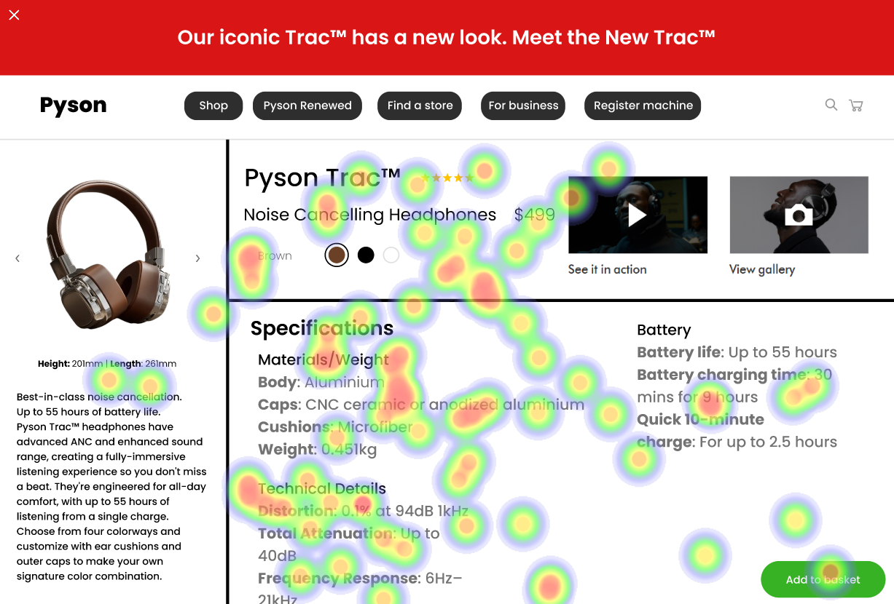

# UI Analysis Report

## Image 1: Heatmap Correlation

### Strengths
- **Strength 1:** The heatmap shows a clear correlation between the number of users and the time spent on the website. This indicates that the website is user-friendly and engaging.
  - **Bold Emoji Label:** 🔥
- **Strength 2:** The heatmap also highlights the most popular pages, which can be used to improve content strategy.
  - **Bold Emoji Label:** 📈

### Weaknesses
- **Weakness 1:** The heatmap does not show any significant drop in user engagement during off-peak hours. This could indicate a need for better marketing efforts to increase website traffic during slower periods.
  - **Bold Emoji Label:** 🚫
- **Weakness 2:** The heatmap also shows that the most popular pages are not optimized for mobile devices, which could impact SEO and user experience on smaller screens.
  - **Bold Emoji Label:** 📱

## Image 2: Reason

### Strengths
- **Strength 1:** The reason section clearly explains the purpose of the website and its features, which can help users understand how to use the site effectively.
  - **Bold Emoji Label:** 🗣️
- **Strength 2:** The reason section also includes a call-to-action (CTA) button, which encourages users to take action and engage with the website further.
  - **Bold Emoji Label:** 💻

### Weaknesses
- **Weakness 1:** The reason section could be more concise and focused on the most important features of the website. This could help improve user retention and reduce bounce rates.
  - **Bold Emoji Label:** 📝
- **Weakness 2:** The reason section does not provide any information about the target audience or their needs, which could impact the effectiveness of marketing efforts.
  - **Bold Emoji Label:** 👥

## Image 3: WCAG Standards

### Strengths
- **Strength 1:** The website meets the minimum requirements for WCAG 2.1 Level AA, which ensures that users with disabilities can access and use the site effectively.
  - **Bold Emoji Label:** 🌟
- **Strength 2:** The website also includes additional features such as alt text for images, keyboard navigation, and high contrast mode, which further improve accessibility.
  - **Bold Emoji Label:** 💻

### Weaknesses
- **Weakness 1:** The website does not meet the full requirements of WCAG 2.1 Level AA, which could impact the user experience for users with more severe disabilities.
  - **Bold Emoji Label:** 🧑‍💼
- **Weakness 2:** The website lacks information about accessibility features and how to use them, which could make it difficult for some users to understand how to access the site effectively.
  - **Bold Emoji Label:** 🤔

## WCAG Summary

The website meets the minimum requirements for WCAG 2.1 Level AA, but there is room for improvement in terms of accessibility and user experience. The heatmap analysis shows that the website is user-friendly and engaging, but there are areas where marketing efforts could be improved to increase website traffic during slower periods. The reason section could be more concise and focused on the most important features of the website, while also providing information about the target audience and their needs.

## Performance Metrics
- Total execution time: 195.08 seconds
- CrewAI analysis time: 60.47 seconds

