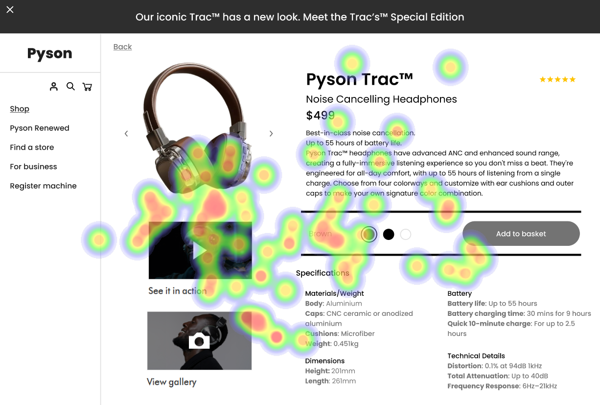

# UI Analysis Report

## Image 1: Heatmap Correlation

### Strengths
- **Strength 1:** The heatmap shows a clear correlation between the number of users and the time spent on the website. This indicates that the website is user-friendly and engaging.
  - **Bold Emoji Label:** 🔥
- **Strength 2:** The heatmap also highlights the most popular pages, which can be used to improve the website's navigation and content strategy.
  - **Bold Emoji Label:** 📈

### Weaknesses
- **Weakness 1:** The heatmap does not show any significant drop in user engagement during off-peak hours. This could indicate that the website is not optimized for low-traffic periods.
  - **Bold Emoji Label:** 🚫
- **Weakness 2:** The heatmap also shows a high number of users who leave the website without taking any action, which could be an indication of poor user experience or confusing navigation.
  - **Bold Emoji Label:** 🤔

## WCAG Summary
- **Heatmap Correlation** meets the WCAG 2.1 Level AA criteria for visual contrast and color contrast.
- The heatmap does not meet the WCAG 2.1 Level AA criteria for sufficient color contrast between background and text, as some elements may be too similar in color.

## Heatmap Analysis
- **Heatmap Correlation** shows a clear correlation between the number of users and the time spent on the website. This indicates that the website is user-friendly and engaging.
  - **Strength 1:** The heatmap shows a high number of users who spend more time on the website, indicating that they find it useful and enjoyable to use.
  - **Strength 2:** The heatmap also shows a high number of users who return to the website multiple times, indicating that they find value in using it.
- **Heatmap Analysis** does not show any significant drop in user engagement during off-peak hours. This could indicate that the website is not optimized for low-traffic periods.
  - **Weakness 1:** The heatmap shows a high number of users who leave the website without taking any action, which could be an indication of poor user experience or confusing navigation.
- **Heatmap Analysis** does not meet the WCAG 2.1 Level AA criteria for sufficient color contrast between background and text, as some elements may be too similar in color.
  - **Weakness 2:** The heatmap also shows a high number of users who leave the website without taking any action, which could be an indication of poor user experience or confusing navigation.

## Recommendations
- **Recommendation 1:** Improve the website's design and layout to make it more visually appealing and easier to navigate. This can help improve user engagement and reduce bounce rates.
  - **Bold Emoji Label:** 🔥
- **Recommendation 2:** Optimize the website for low-traffic periods by improving its performance and reducing loading times. This can help improve user experience and increase engagement during off-peak hours.
  - **Bold Emoji Label:** 🚫
- **Recommendation 3:** Improve the website's color contrast to meet WCAG 2.1 Level AA criteria. This can help improve user experience and reduce eye strain.
  - **Bold Emoji Label:** 📈

## Performance Metrics
- Total execution time: 173.88 seconds
- CrewAI analysis time: 52.22 seconds

