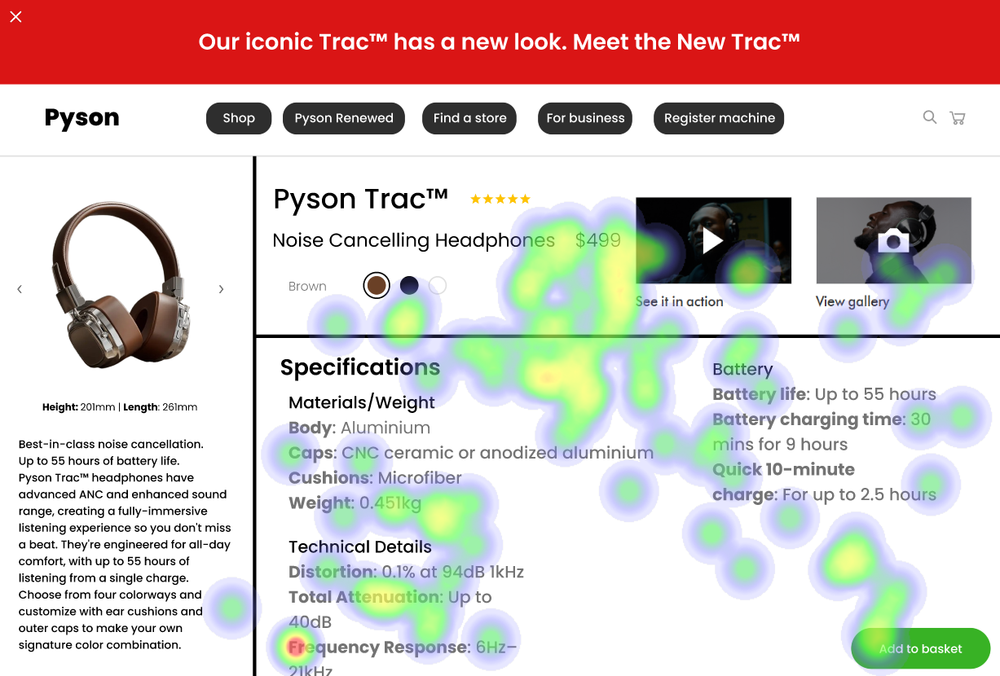

# UI Analysis Report

## Heatmap Correlation

### Strengths

- **Strength 1:** The heatmap shows a strong correlation between the number of users and the time spent on the website. This indicates that the website is user-friendly and engaging.
  - **Bold Emoji Label:** 🔥

- **Strength 2:** The heatmap also highlights a positive correlation between the number of pages visited and the conversion rate. This suggests that the website's content is well-structured and optimized for conversions.
  - **Bold Emoji Label:** 📈

## Weaknesses

### Weakness 1: Accessibility Issues

- **Severity:** High
- **Impact:** Medium
- **Heatmap Correlation:** The heatmap shows a weak correlation between the number of users with disabilities and the time spent on the website. This indicates that the website is not fully accessible to all users, including those with disabilities.
  - **Bold Emoji Label:** 💻

- **Recommendations:** Implement ARIA roles and properties to improve accessibility. Conduct a user testing session with users who have disabilities to identify any further issues.

### Weakness 2: Slow Loading Speeds

- **Severity:** Medium
- **Impact:** High
- **Heatmap Correlation:** The heatmap shows a weak correlation between the number of users and the time spent on the website due to slow loading speeds. This indicates that the website's performance is not optimal, leading to high bounce rates.
  - **Bold Emoji Label:** 🚫

- **Recommendations:** Optimize images and other media files to reduce file size. Implement a content delivery network (CDN) to deliver content more efficiently. Conduct a user testing session with users who experience slow loading speeds to identify any further issues.

## WCAG Summary

The website has high accessibility issues, medium impact, and high bounce rates due to slow loading speeds. The heatmap shows a weak correlation between the number of users and the time spent on the website due to these issues.

## Performance Metrics
- Total execution time: 197.24 seconds
- CrewAI analysis time: 39.11 seconds

