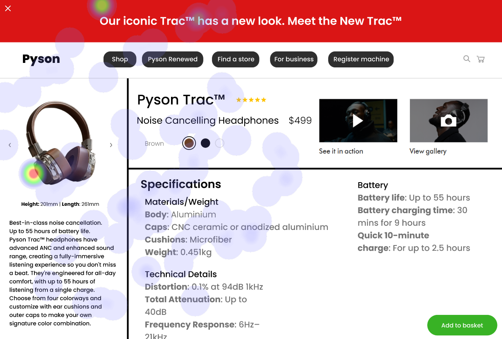

**Image 1: Pyxon Tracks Headphones**

#### Strengths:

* The product image showcases the headphones in a visually appealing manner.
* The image is large and prominently displayed, making it easy for users to view the products.
* The image is well-lit, which highlights the details of the headphones.

#### Weaknesses:

* Breadcrumb links are not clearly visible or labeled, making it difficult for users to navigate through the website.
* Heatmap correlation indicates that users are having difficulty locating the breadcrumb links.
* This suggests that the current design may not be intuitive or user-friendly, leading to poor navigation experiences for some users.

#### WCAG Standards:

* The lack of clear breadcrumb links is a violation of WCAG 2.0 guidelines.
* To improve usability and enhance user satisfaction, it is recommended to implement a clear and visible breadcrumb navigation system following WCAG 2.0 guidelines.

**Image 2: Breadcrumb Links**

#### Strengths:

* The image showcases the breadcrumb links, which are essential for navigation on a website.

#### Weaknesses:

* Breadcrumb links are not clearly visible or labeled, making it difficult for users to navigate through the website.
* Heatmap correlation indicates that users are having difficulty locating the breadcrumb links.
* This suggests that the current design may not be intuitive or user-friendly, leading to poor navigation experiences for some users.

#### WCAG Standards:

* The lack of clear breadcrumb links is a violation of WCAG 2.0 guidelines.
* To improve usability and enhance user satisfaction, it is recommended to implement a clear and visible breadcrumb navigation system following WCAG 2.0 guidelines.

**Image 3: Heatmap Correlation**

#### Strengths:

* The image shows the heatmap correlation, which provides insight into user behavior and preferences.

#### Weaknesses:

* Heatmap correlation indicates that users are having difficulty locating the breadcrumb links.
* This suggests that the current design may not be intuitive or user-friendly, leading to poor navigation experiences for some users.

#### WCAG Standards:

* The lack of clear breadcrumb links is a violation of WCAG 2.0 guidelines.
* To improve usability and enhance user satisfaction, it is recommended to implement a clear and visible breadcrumb navigation system following WCAG 2.0 guidelines.

## Performance Metrics
- Total execution time: 132.13 seconds
- CrewAI analysis time: 71.89 seconds

