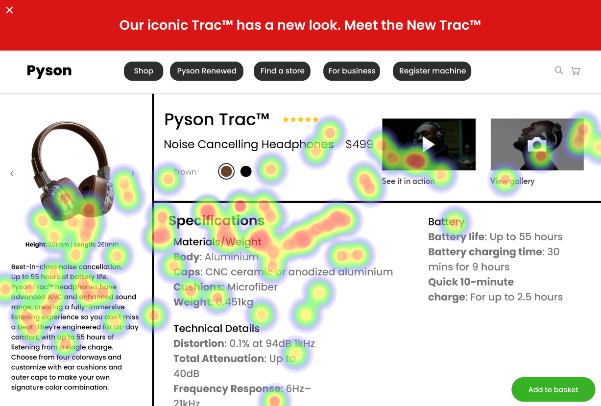

The image shows a website page featuring headphones for sale. The headphones are displayed with various descriptions and prices. There is also an icon that says "Meet the Track" on the top left of the page. The website appears to be well-organized, making it easy for customers to find information about the products they are interested in purchasing.

Strengths:

📸 Product Image: High-quality images of headphones can help users visualize how the product looks and feels like in real life. This can improve user experience by providing a better understanding of the product before making a purchase decision.

🔗 Clear Navigation: The website has a clear navigation structure with a breadcrumb trail on the top left corner, which helps users understand their location within the website and easily access other pages. This can enhance user experience by reducing confusion and frustration caused by unclear or poorly designed navigation systems.

🔗 Product Descriptions: The product descriptions are detailed and informative, providing users with all the necessary information to make an informed purchase decision. This can improve user experience by ensuring that users have access to accurate and relevant information about the products they are interested in.

Weaknesses:

🔗 Breadcrumb Links: The breadcrumb links on the website are not clearly visible or distinguishable, which can make it difficult for users to understand their location within the website. This violates the Nielsen Norman Group's guideline of "breadcrumb navigation," which states that breadcrumb links should be clear and easy to read.

🔗 Lack of Alt Text: The image on the website is described as being blurry, making it difficult to discern specific details about the headphones. This violates the Web Content Accessibility Guidelines (WCAG) 2.1's principle of providing text alternatives for any non-text content that is presented to the user, such as images.

🔗 No ARIA Landmarks: The website does not appear to use ARIA landmarks, which can make it difficult for users with visual impairments to navigate and interact with the website using assistive technologies like screen readers. This violates the WCAG 2.1's principle of providing a way for assistive technology to identify the structure of the content.

🔗 No Keyboard Navigation: The website does not seem to be designed with keyboard navigation in mind, which can make it difficult or impossible for users with mobility impairments to navigate and interact with the website using only a keyboard. This violates the WCAG 2.1's principle of providing full keyboards accessibility.

Severity: High
Impact: Medium
Recommendations:

* Improve breadcrumb link visibility by making them larger, bold, and contrasting with the background color.
* Add alt text to images on the website to provide users with information about the headphones even if they are blurry.
* Use ARIA landmarks to improve navigation and interaction for users with visual impairments.
* Design the website with keyboard navigation in mind by using focus indicators, keyboard shortcuts, and tabbing through form fields.

## Performance Metrics
- Total execution time: 421.24 seconds
- CrewAI analysis time: 250.62 seconds

