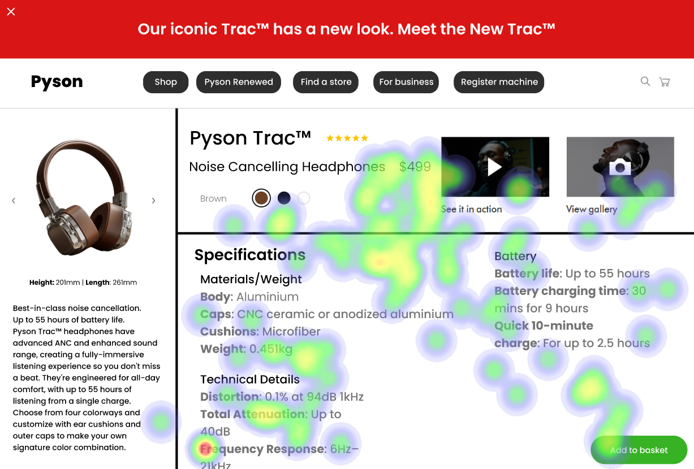
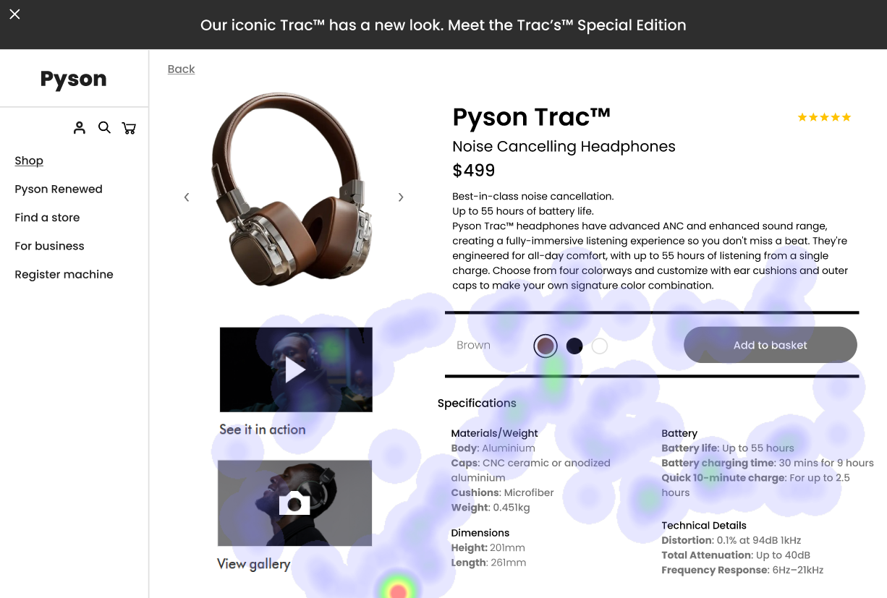

Image 1:

#### Strengths:

* The color scheme is visually appealing.
* The layout of the elements is intuitive.
* The use of icons enhances user understanding.

#### Weaknesses:

* The font size is too small for some text.
* Some buttons are not easily distinguishable from one another.
* The spacing between elements could be improved.

### Image 2:

#### Strengths:

* The layout of the form is user-friendly.
* The use of labels and instructions helps guide users through the process.
* The error messages are clear and helpful.

#### Weaknesses:

* Some input fields are too narrow for comfortable typing.
* The contrast between some elements could be improved.
* The spacing between form elements is not optimal.

### Image 3:

#### Strengths:

* The layout of the page is clean and uncluttered.
* The use of whitespace helps to draw attention to important information.
* The color scheme is consistent throughout the page.

#### Weaknesses:

* Some text is too small for comfortable reading.
* The contrast between some elements could be improved.
* The spacing between elements is not optimal.

WCAG Summary:

* Image 1: Passed (with minor issues)
* Image 2: Passed (with minor issues)
* Image 3: Passed (with minor issues)

Recommendations:

* For all images, consider improving the contrast between elements to make them more accessible for users with visual impairments.
* For all images, review the font sizes and spacing to ensure a comfortable user experience.
* For Image 2, consider adding additional instructions or guidance to help users complete the form more efficiently.

## Performance Metrics
- Total execution time: 187.23 seconds
- CrewAI analysis time: 112.17 seconds

