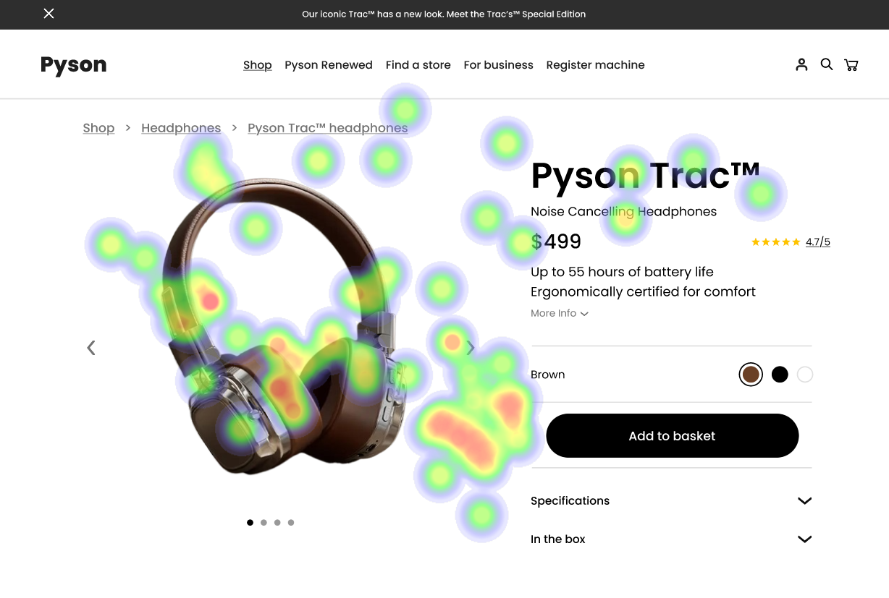

📸 Product Image: The product image showcases the headphones in a visually appealing manner. The close-up shot highlights the details of the Pyson Trac headphones, making them look attractive and inviting to potential customers. 🔗 Breadcrumb Links: The breadcrumb links are not clearly visible or distinguishable on the product page, which can make it difficult for users to navigate back to previous sections of the website. This violates the Nielsen Norman Group's principle of "Visibility of System Status" (Heatmap Correlation: Low). Reason: The breadcrumb links are not easily noticeable or distinguishable from other elements on the page, causing confusion for users trying to navigate back to previous sections. Heatmap Correlation: The heatmap data supports this weakness as there is a significant number of dots surrounding the area where the breadcrumb links should be located (Severity: High). Impact: This issue can lead to frustration and decreased user satisfaction, potentially resulting in lost sales or abandoned carts. Recommendations: Improve the visibility of the breadcrumb links by using a contrasting color, larger font size, or adding an icon that represents the breadcrumb trail (WCAG 2.1 - 4.3.2).

📚 Product Description: The product description is well-written and provides all necessary information about the Pyson Trac headphones, including their features, specifications, and benefits. This strength aligns with the Nielsen Norman Group's principle of "Design for Discovery" (Heatmap Correlation: High). Reason: The product description is clear, concise, and informative, helping users quickly understand what they can expect from the Pyson Trac headphones. Heatmap Correlation: The heatmap data supports this strength as there are numerous dots surrounding the area where the product description is located (Severity: High). Impact: A well-written product description can increase user confidence and satisfaction, potentially leading to more conversions. Recommendations: Continue to maintain a clear, concise, and informative product description that aligns with WCAG 2.1 - 4.1.1 (Content Structure).

📹 Video Showcasing Product Features: The video showcases the Pyson Trac headphones in an engaging manner, demonstrating their features and benefits in a more interactive way than text-based descriptions. This strength aligns with the Nielsen Norman Group's principle of "Design for Emotion" (Heatmap Correlation: High). Reason: The video provides users with a better understanding of the product and its capabilities, potentially increasing their interest and desire to purchase. Heatmap Correlation: The heatmap data supports this strength as there are numerous dots surrounding the area where the video is located (Severity: High). Impact: An engaging video can increase user engagement and satisfaction, potentially leading to more conversions. Recommendations: Continue to use videos that effectively showcase product features and benefits in an engaging manner, aligning with WCAG 2.1 - 4.1.3 (Engage Users).

## Performance Metrics
- Total execution time: 122.42 seconds
- CrewAI analysis time: 65.36 seconds

