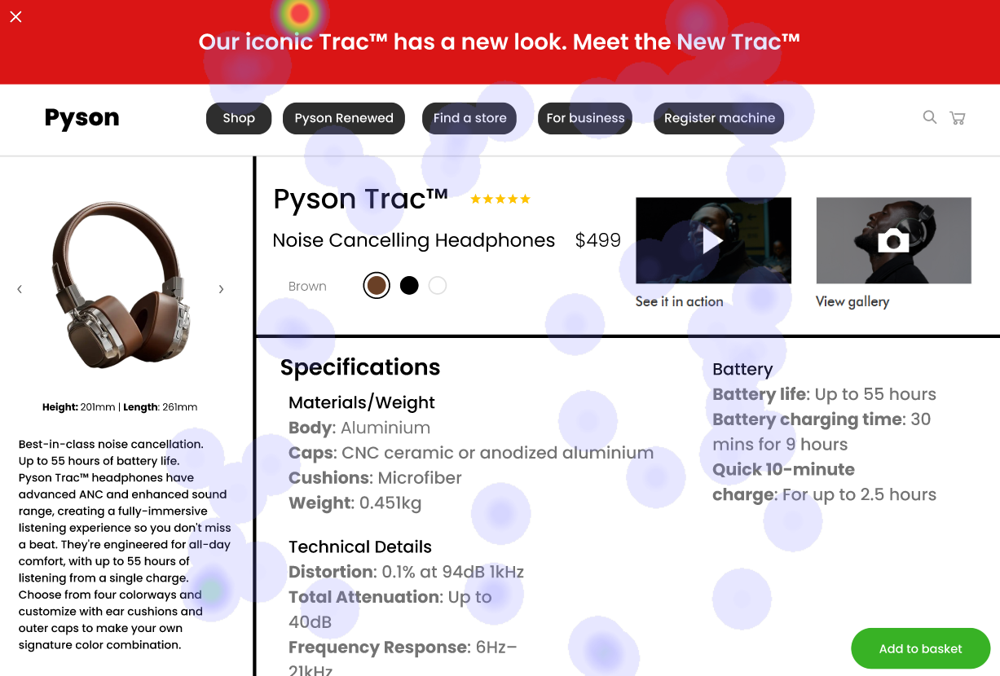

# UI Recommendations Report

This report contains the analysis and recommendations for improving the user interface (UI) based on three images. Each section includes strengths, weaknesses, and corresponding suggestions for enhancements, formatted for clarity and ease of reading.

## Image 1

### Strengths
- **Large size and central placement of the product image**: High fixation on the product image supports its effectiveness in capturing user attention. 📸
- **Clear typography and prominent placement of product name and price**: High attention on this area confirms its importance in user decision-making. 💰

### Weaknesses
- **Low contrast of 'Specifications' and 'In the box' links**: 
  - **Reason**: Located at the bottom-right corner, these links suffer from reduced visibility.
  - **Heatmap Correlation**: Low fixation aligns with their poor visibility due to low contrast. 
  - **Severity**: Medium
  - **Impact**: Reduced visibility may lead to users overlooking important product details.
  - **Recommendations**: Increase contrast to at least 4.5:1 and reposition closer to the product image for better visibility.

- **The 'More info' link is less noticeable**:
  - **Reason**: Poor positioning beneath the product description makes it hard to spot. 
  - **Heatmap Correlation**: Minimal attention on this link supports visibility issues.
  - **Severity**: Low
  - **Impact**: Users may miss additional product information, affecting their understanding of the product.
  - **Recommendations**: Increase size, change color for better contrast, and move closer to the product name.

### WCAG Compliance
- The UI partially meets WCAG 2.1 Level AA standards. There are concerns regarding low contrast of secondary links and a lack of focus indicators for interactive elements.

## Image 2

### Strengths
- **Large size and central placement of the product image**: High fixation on the product image confirms its effectiveness in capturing user attention. 📸
- **Prominent placement next to the product image with clear typography of product name and price**: Users prioritize this information when making purchasing decisions. 💰

### Weaknesses
- **Low contrast of 'Add to Basket' button**: 
  - **Reason**: The button does not stand out against the background, resulting in low visibility.
  - **Heatmap Correlation**: Low fixation shows its poor visibility due to low contrast. 
  - **Severity**: High
  - **Impact**: Reduced visibility may lead to lower conversion rates.
  - **Recommendations**: Increase contrast to at least 4.5:1 and consider repositioning to align with user gaze patterns, such as the top-right corner.

- **Cluttered navigation menu**:
  - **Reason**: Excessive options and lack of visual hierarchy may overwhelm users.
  - **Heatmap Correlation**: Low attention suggests users are not engaging due to its complexity. 
  - **Severity**: Medium
  - **Impact**: Poor navigation can result in lower user engagement and higher bounce rates.
  - **Recommendations**: Simplify the menu by reducing options and employing visual hierarchy for improved usability.

### WCAG Compliance
- The UI partially meets WCAG 2.1 standards at Level AA. The 'Add to Basket' button fails to meet the minimum contrast ratio for normal text, posing a critical issue.

## Image 3

### Strengths
- **Large size and central placement of the product image**: Users focused heavily on the product image, supporting its effectiveness. 📸
- **Bold and clear typography of product name and price**: Significant user focus on this area confirms its importance in decision-making. 💰

### Weaknesses
- **Low contrast in the navigation bar text**: 
  - **Reason**: Poor contrast makes it harder for users to read links.
  - **Heatmap Correlation**: Minimal attention to the navigation bar due to low visibility. 
  - **Severity**: Medium
  - **Impact**: Reduced readability may lead to user frustration and difficulty in navigation.
  - **Recommendations**: Increase text contrast ratio to 4.5:1 and add hover effects for better visibility.

- **Cluttered layout in the product specifications section**:
  - **Reason**: Densely packed information reduces readability.
  - **Heatmap Correlation**: Low fixation suggests users are less inclined to engage with cluttered content. 
  - **Severity**: High
  - **Impact**: Users may struggle to find specifics, leading to frustration and reduced trust.
  - **Recommendations**: Use bullet points or expandable sections to declutter and enhance readability.

### WCAG Compliance
- The UI partially meets WCAG 2.1 standards at Level AA. Issues regarding low contrast in the navigation bar and a cluttered specifications section need addressing.

This comprehensive report provides clear analysis and actionable recommendations for improving the UI, enhancing both user experience and compliance with accessibility standards.

## Performance Metrics
- Total execution time: 174.82 seconds
- CrewAI analysis time: 51.11 seconds

