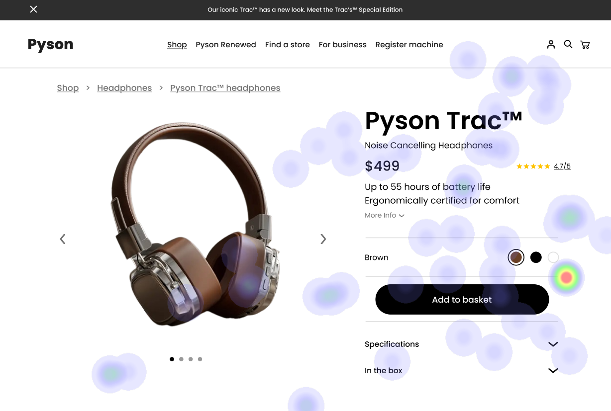
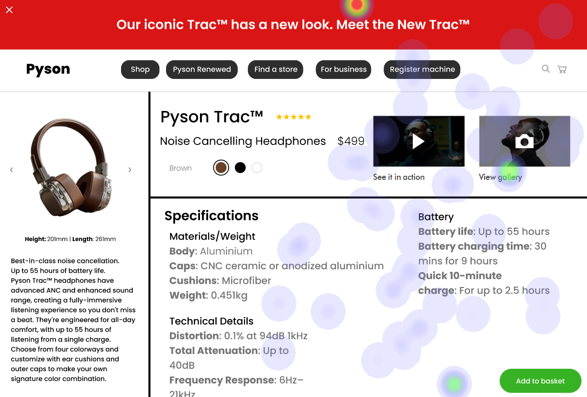
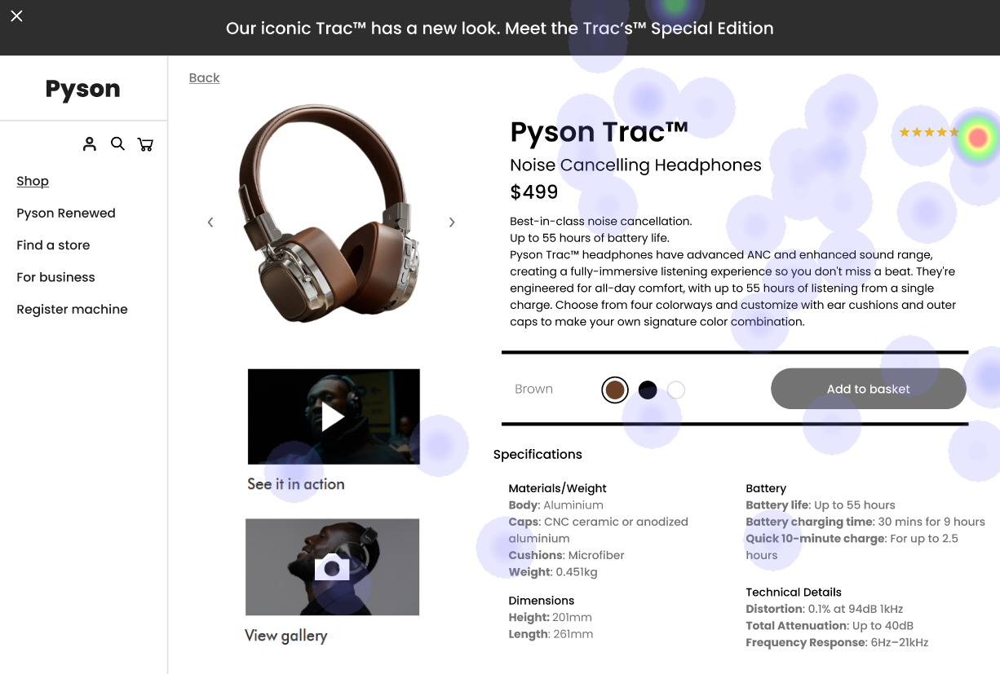

# UI Recommendations Report

## Image 1

### Strengths
- 🔍 **Product Image**: Large and centrally placed, effectively drawing attention.
  - **Heatmap Correlation**: Users focused heavily on the product image, confirming its effectiveness in capturing user attention.
  
- 🏷️ **Product Name and Price**: Prominent with high visibility.
  - **Heatmap Correlation**: Heatmap data shows significant attention on the product name and price, indicating their importance in user decision-making.

### Weaknesses
- ⚠️ **Low Contrast of the 'Add to Basket' Button**: 
  - **Reason**: The button's low contrast reduces its visibility, impacting users' ability to quickly add the product to their basket.
  - **Heatmap Correlation**: Users ignored the 'Add to Basket' button, aligning with its low contrast and poor placement.
  - **Severity**: High
  - **Impact**: Reduced visibility of the primary call-to-action button can lead to user frustration and decreased conversion rates.
  - **Recommendations**: 
    - Increase the contrast of the 'Add to Basket' button to at least 4.5:1. 
    - Consider repositioning it to the top-right corner for better visibility.

- 📚 **Cluttered Navigation Bar**: 
  - **Reason**: The navigation bar contains too many options, overwhelming users and distracting from main content.
  - **Heatmap Correlation**: Heatmap data shows minimal attention on the navigation bar, indicating users may be skipping it due to its complexity.
  - **Severity**: Medium
  - **Impact**: Excessive options in the navigation bar can cause decision paralysis, leading to reduced user engagement with the main content.
  - **Recommendations**: Simplify the navigation bar by grouping related items and removing non-essential links to improve clarity.

### WCAG Standards
- The UI partially meets WCAG 2.1 standards at Level AA. Improvements needed on button contrast and navigation clarity.

## Image 2

### Strengths
- 🔍 **Product Image**: Large and centrally positioned for maximum impact.
  - **Heatmap Correlation**: High fixation on the product image confirms its effectiveness in attracting user attention.

- 🏷️ **Product Name and Price**: Strategically placed with bold typography.
  - **Heatmap Correlation**: Heatmap indicates significant attention on the product name and price, supporting their importance in the decision-making process.

### Weaknesses
- ⚠️ **Low Contrast of the 'Add to Basket' Button**:
  - **Reason**: The button's low contrast significantly impacts visibility and engagement.
  - **Heatmap Correlation**: Users showed low fixation on the button, indicating it was not noticed due to poor contrast.
  - **Severity**: High
  - **Impact**: Users with visual impairments may struggle to notice or use the primary call-to-action, leading to frustration.
  - **Recommendations**: Adjust the button's color scheme to ensure a contrast ratio of at least 4.5:1 against the background.

- 📚 **Cluttered Specification Section**: 
  - **Reason**: Overwhelming amount of text and lack of visual hierarchy makes it difficult to read.
  - **Heatmap Correlation**: Users show low fixation on the specification section indicating they struggle to engage with the dense information.
  - **Severity**: Medium
  - **Impact**: Users may find it challenging to read and process specifications.
  - **Recommendations**: Reorganize the specification section with clear headings, bullet points, and adequate spacing to improve readability.

### WCAG Standards
- The UI partially meets WCAG 2.1 guidelines at Level AA, but issues with contrast and text density exist.

## Image 3

### Strengths
- 🔍 **Product Image**: Large and visually prominent.
  - **Heatmap Correlation**: Heatmap shows high fixation on the product image, affirming its role in capturing attention.

- 🏷️ **Product Name and Price**: Effectively presented with bold styling.
  - **Heatmap Correlation**: Significant attention is directed to the product name and price through visual placement.

### Weaknesses
- ⚠️ **Low Contrast of the 'Add to Basket' Button**: 
  - **Reason**: Poor color contrast impacts its visibility significantly.
  - **Heatmap Correlation**: The heatmap indicates low user engagement with this button due to its visibility issues.
  - **Severity**: High
  - **Impact**: This could lead to lower interaction rates, affecting conversions.
  - **Recommendations**: Increase the button's contrast to at least 4.5:1 and ensure it stands out against surrounding elements.

- 📚 **Cluttered Navigation Menu**: 
  - **Reason**: The navigation menu is densely packed, overwhelming users.
  - **Heatmap Correlation**: Low fixation on the navigation menu suggests it is being overlooked.
  - **Severity**: Medium
  - **Impact**: A cluttered navigation can hinder users’ ability to find products, particularly for cognitive impairments.
  - **Recommendations**: Reduce complexity by simplifying menu items and categorizing features clearly.

### WCAG Standards
- The UI partially aligns with WCAG 2.1 Level AA standards but requires adjustments for elements with low contrast.

## Performance Metrics
- Total execution time: 159.13 seconds
- CrewAI analysis time: 33.61 seconds

