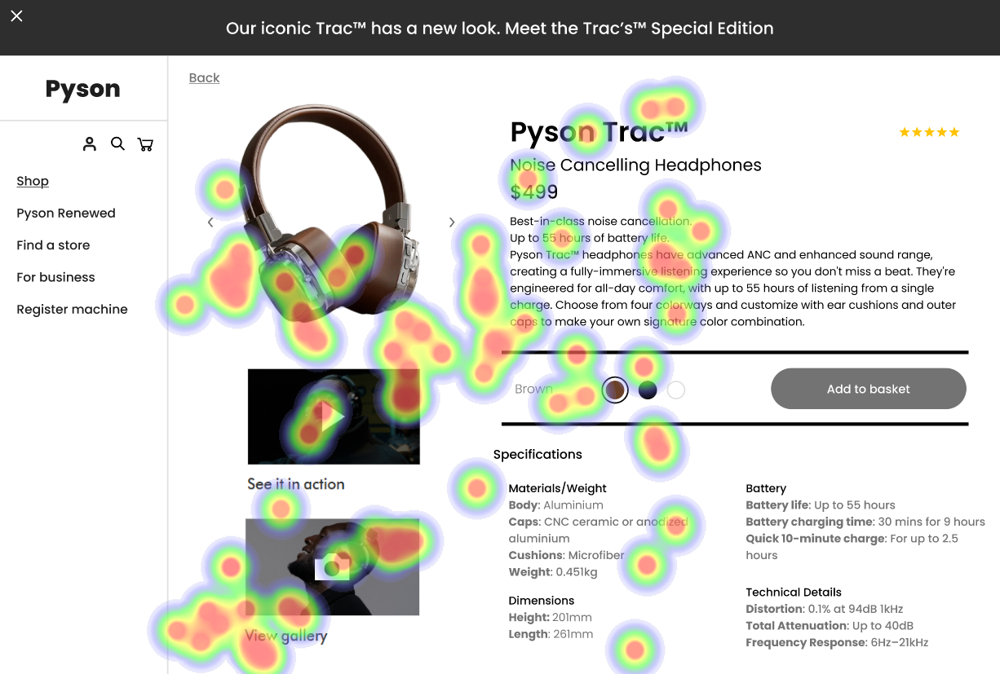

# UI Recommendations Report

## Image 1

### Strengths
- **Large Product Image**: The product image is large, centrally placed, and visually appealing, aligning with the F-pattern and natural gaze behavior.  
  🔍 Heatmap data shows high fixation on the product image, confirming its effectiveness in capturing user attention.
  
- **Prominent Product Name and Price**: The product name and price are prominently displayed near the image, making them easily noticeable.  
  🔍 High attention on these elements supports their importance in user decision-making.

### Weaknesses
- **Low Contrast of 'Register machine' Button**: 
  - **Reason**: The button does not stand out against the background, making it easy for users to overlook.  
  - 🔍 Heatmap data shows low fixation on this button, supporting its poor visibility.  
  - **Severity**: High  
  - **Impact**: Users may miss the opportunity to register their machines for warranty and support, leading to lower engagement.
  - **Recommendations**: Increase the contrast of the 'Register machine' button to at least 4.5:1. Consider repositioning it within the natural gaze path, possibly near the top of the product image to increase visibility.

- **Cluttered Layout in Specifications Section**: 
  - **Reason**: The densely packed information makes it challenging for users to quickly scan for critical features.  
  - 🔍 Moderate fixation on this section indicates users are attempting to read it but are deterred by its complexity.  
  - **Severity**: Medium  
  - **Impact**: This can lead to user frustration and disengagement, as users may not find the needed information quickly.
  - **Recommendations**: Simplify the layout by breaking down specifications into bullet points and using headings to categorize sections. Use whitespace effectively to enhance readability.

### WCAG Compliance
The UI partially meets WCAG 2.1 Level AA standards. Issues such as low contrast in the 'Register machine' button and cluttered specifications section require improvement to fully comply.

## Image 2

### Strengths
- **Large and Prominent Product Image**: The product image is large, centrally placed, and visually prominent, aligning with the F-pattern of user attention.  
  🔍 The heatmap shows high fixation on the product image, confirming its effectiveness in capturing user attention.
  
- **Bold and Contrasting Product Name and Price**: The product name and price are bold, contrasting, and positioned near the product image.  
  🔍 The heatmap shows significant attention on these elements, supporting their importance in the user's decision-making process.

### Weaknesses
- **Low Contrast of 'Add to basket' Button**: 
  - **Reason**: The button’s visibility is compromised due to low contrast against the background.  
  - 🔍 The heatmap shows low fixation on the button, indicating that users may not notice it.  
  - **Severity**: High  
  - **Impact**: This can lead to reduced conversions as users may overlook this critical call-to-action element.
  - **Recommendations**: Increase the 'Add to basket' button's contrast to meet a minimum ratio of 4.5:1. Consider repositioning it closer to the product image to draw more attention.

- **Cluttered Layout in Specifications Section**: 
  - **Reason**: The dense text hinders user's ability to quickly scan for product features.  
  - 🔍 The heatmap shows scattered attention, with users potentially struggling to focus on any single detail.  
  - **Severity**: Medium  
  - **Impact**: This can lead to frustration and lower user engagement, as important information is hard to digest.
  - **Recommendations**: Streamline the specifications layout by using clearer typography and visual hierarchy. Implement bullet points and section breaks to enhance scannability.

### WCAG Compliance
The UI meets WCAG 2.1 Level AA standards in most areas, but the 'Add to basket' button fails to meet the required contrast ratio. Recommendations include enhancing button contrast and improving the specifications section layout.

## Image 3

### Strengths
- **Large and Visually Appealing Product Image**: The product image is large, centrally placed, and visually appealing, naturally attracting user attention.  
  🔍 The heatmap data shows high fixation on the product image, confirming its effectiveness in capturing user attention.
  
- **Prominently Displayed Product Name and Price**: The product name and price are prominently displayed near the image with clear contrast.  
  🔍 The heatmap shows significant attention on the product name and price, validating their importance in the user's decision-making process.

### Weaknesses
- **Low Contrast of 'Add to Basket' Button**: 
  - **Reason**: The button's lack of contrast makes it less visible and potentially reduces user interaction.  
  - 🔍 The heatmap data shows low fixation on the 'Add to Basket' button, confirming its poor visibility.  
  - **Severity**: High  
  - **Impact**: This can lead to lower interaction rates, adversely affecting conversion rates.
  - **Recommendations**: Enhance the 'Add to Basket' button contrast to a minimum of 4.5:1 and consider moving it to a more prominent location, such as near the product image.

- **Cluttered Navigation Bar**: 
  - **Reason**: The navigation bar contains too many elements, increasing cognitive load and distracting from the core content.  
  - 🔍 The heatmap shows scattered attention across the navigation bar, indicating users struggle to focus.  
  - **Severity**: Medium  
  - **Impact**: Overwhelmed users may find navigation challenging, which can discourage them from exploring further.
  - **Recommendations**: Simplify the navigation bar by reducing the number of links and utilizing dropdown menus to categorize less critical links.

### WCAG Compliance
The UI partially meets WCAG 2.1 standards, with the need for improvements in button contrast and navigation clarity.

## Performance Metrics
- Total execution time: 185.11 seconds
- CrewAI analysis time: 50.20 seconds

