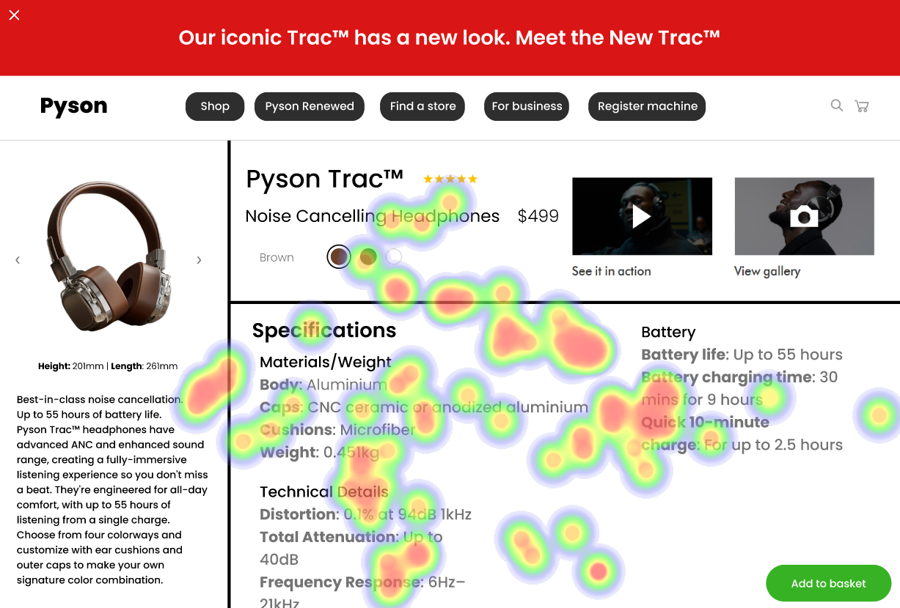
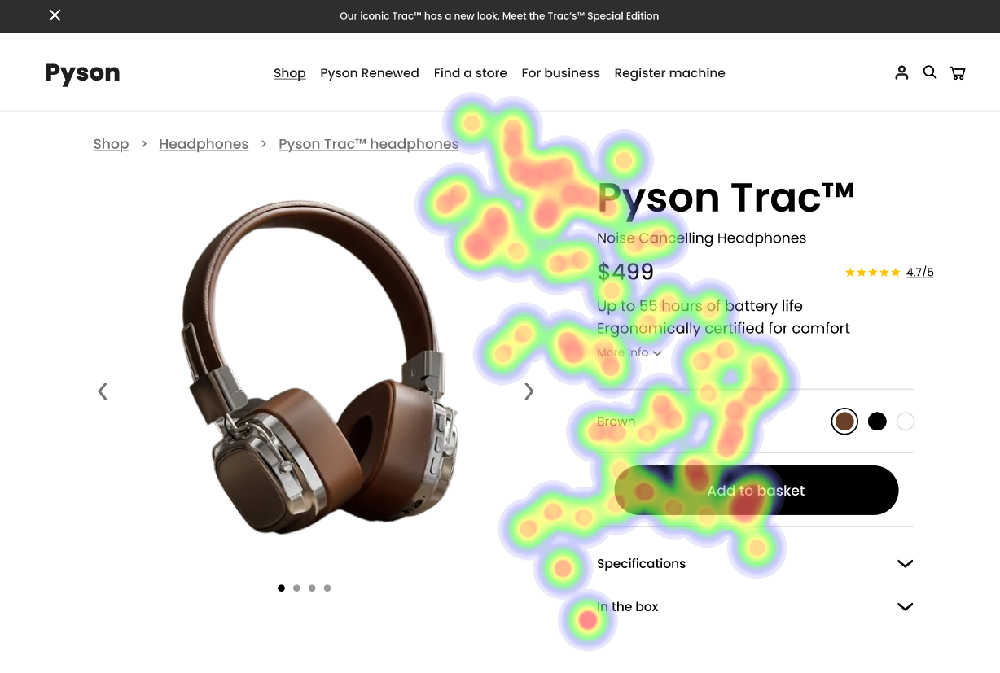
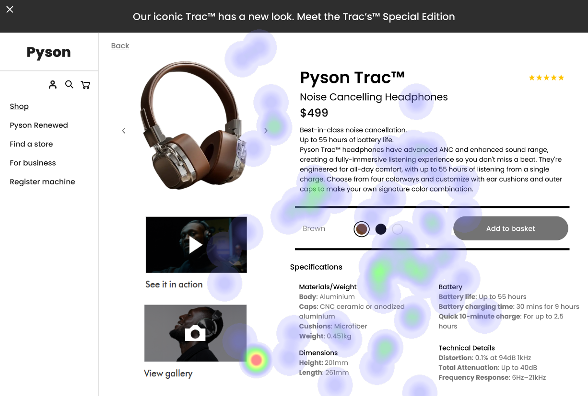

# UI Recommendations Report

## Image 1

### Strengths
- The product image is prominently placed and of high quality, which naturally draws user attention. 📸
  - **Heatmap Correlation:** High fixation on the product image confirms its effectiveness in capturing user attention.
  
- The product name and price are placed near the product image and are in a larger, bold font. 💰
  - **Heatmap Correlation:** Significant attention on the product name and price supports their importance in user decision-making.

### Weaknesses
- **Low Contrast in Specifications Section**
  - **Reason:** Low contrast between text and background makes it difficult for users to read important details about the product.
  - **Heatmap Correlation:** Minimal fixation on the specifications section indicates users may skip over this information due to poor visibility.
  - **Severity:** High
  - **Impact:** Users may experience frustration and potentially abandon the page due to readability issues.
  - **Recommendations:**
    - Increase text contrast to meet a ratio of at least 4.5:1 against the background. 
    - Use larger font sizes and clearer typefaces for better readability.

- **Cluttered Layout in Battery Information**
  - **Reason:** The battery information is densely packed and lacks clear separation from other elements.
  - **Heatmap Correlation:** Scattered fixation suggests users struggle to focus due to layout issues.
  - **Severity:** Medium
  - **Impact:** Reduced user engagement and increased cognitive load may lead to users overlooking beneficial information.
  - **Recommendations:**
    - Revise the design to include more visual breaks between sections (spacing/dividers).
    - Consider using bullet points for easier digestion of information.

### WCAG Standards
- The UI partially meets WCAG 2.1 Level AA standards. Critical improvements are necessary to enhance readability and accessibility of the specifications section.

## Image 2

### Strengths
- The product image is large, centrally placed, and visually appealing. 🌟
  - **Heatmap Correlation:** High fixation on the product image confirms its effectiveness in capturing user attention.
  
- The product name and price are prominently displayed next to the image. 
  - **Heatmap Correlation:** Significant heatmap activity indicates users focus on these elements.

### Weaknesses
- **Low Visibility of 'Specifications' and 'In the Box' Sections**
  - **Reason:** Users may miss important product details due to poor visibility.
  - **Heatmap Correlation:** Minimal attention in these areas confirms their poor visibility.
  - **Severity:** Medium
  - **Impact:** Users may struggle to gain a complete understanding of the product, affecting purchasing decisions.
  - **Recommendations:**
    - Increase font size and contrast in these sections.
    - Reposition them for better visibility—consider using headings to distinguish different information categories.

- **Low Contrast of 'Add to Basket' Button Text**
  - **Reason:** Reduced readability may lower conversion rates.
  - **Heatmap Correlation:** Moderate attention, but not as high as expected for a primary CTA.
  - **Severity:** High
  - **Impact:** Users might struggle to notice or interact with the CTA, leading to missed conversion opportunities.
  - **Recommendations:**
    - Increase button contrast to at least 4.5:1 against the background.
    - Consider altering the button's position to a more prominent area, such as the top-right corner.

### WCAG Standards
- The UI partially meets WCAG 2.1 Level AA standards, with specific issues identified in contrast levels and text visibility.

## Image 3

### Strengths
- The large, high-quality product image is centrally placed. 👍
  - **Heatmap Correlation:** High fixation on the product image confirms its effectiveness in capturing user attention.
  
- The bold, contrasting text for the product name and price is positioned prominently. 
  - **Heatmap Correlation:** Significant attention on the product name and price validates their importance.

### Weaknesses
- **Low Contrast in 'Add to Basket' Button**
  - **Reason:** Low contrast reduces its visibility.
  - **Heatmap Correlation:** Minimal fixation on the button supports its issue of poor visibility.
  - **Severity:** High
  - **Impact:** Users may overlook the button, impacting conversions.
  - **Recommendations:**
    - Increase the button's contrast to 4.5:1.
    - Consider modifying its design (size increase, distinctive colors) that stand out from the background.

- **Cluttered Navigation Menu**
  - **Reason:** It contains too many options, overwhelming users.
  - **Heatmap Correlation:** Low attention on the navigation menu suggests users may ignore it due to complexity.
  - **Severity:** Medium
  - **Impact:** Users may find it difficult to navigate, reducing overall usability.
  - **Recommendations:**
    - Simplify the navigation menu by reducing the number of options presented.
    - Group related information and use clear labels to guide users.

### WCAG Standards
- The UI partially meets WCAG 2.1 standards at the AA level, primarily due to low contrast issues and navigation complexity.

## Performance Metrics
- Total execution time: 176.40 seconds
- CrewAI analysis time: 46.07 seconds

